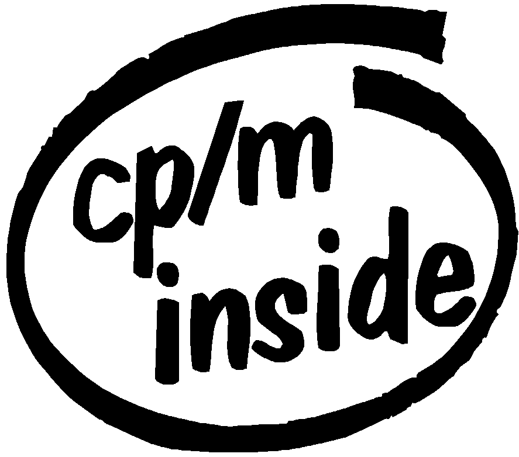

# ZCN


		ZCN v1.4 - (c) 1994-2022 Russell Marks

 A free CP/M-like operating system for the Amstrad NC100/NC150/NC200.



# Licence

This program is free software; you can redistribute it and/or modify
it under the terms of the GNU General Public License as published by
the Free Software Foundation; either version 2 of the License, or (at
your option) any later version.

This program is distributed in the hope that it will be useful, but
WITHOUT ANY WARRANTY; without even the implied warranty of
MERCHANTABILITY or FITNESS FOR A PARTICULAR PURPOSE.  See the GNU
General Public License for more details.

You should have received a copy of the GNU General Public License
along with this program.  If not, see <https://www.gnu.org/licenses/>.

[The GNU GPL is in the file `COPYING'. Some of the programs in the
`support' directory, also included in `images', have more restrictive
licences - for any GPL-only distribution, it might be simplest to
remove these directories entirely. See `support/README' for details.]


# About ZCN

ZCN is an alternative operating system for the NC100, NC150, and
NC200. Features include:

- a high level of CP/M compatibility
- fast switching between ZCN and the ROM software, and file transfer
  between the two (requires memory card)
- can run BBC Basic (from ROM)
- command processor (shell) with many internal commands
- many external commands and third-party programs
- optional help (using `man')
- 46k free for programs to run in
- text resolution of 120x10 (120x21 on NC200)
- support for various keyboard layouts
- context saving while power is off
- support for the serial port at speeds up to 19200 bps
- printer support (via parallel port)
- auto power-off after a given idle time
- warnings when main, backup, or memory card batteries are low
- console redirection to serial port or printer
- optional internal ramdisk on NC200 and NC150
- washes whiter than other powders

ZCN is (externally) modelled quite closely on the CP/M operating
system common on 8080 and Z80 machines in the late 70s and early 80s.
I decided to do this as there is a great deal of public domain and
other zero cost software for CP/M, including text editors, simple C
compilers, Z80 assemblers, a few games, etc. CP/M is also, in my
opinion, well suited to running on small Z80 systems. ZCN's CP/M
compatibility is sufficient to run most CP/M 2.2 programs.


## Should I use ZCN?

You should probably consider using ZCN if you like the idea of a
portable CP/M box, or want to use the NC as something a bit closer to
a `real computer'. These are the two reasons I originally started
writing ZCN, back in 1994.


## Warning!

If you want to still be able to use the builtin ROM software without
losing any of your current data, you *MUST* transfer and run the
`rrinit' program before trying to run ZCN. If you don't, you'll lose
any data held in the 64k/128k of internal memory! (This means losing
not only any files in both the upper and lower memory, but also any
configuration.)

If you don't care about the ROM software, or don't care about losing
currently-held data, you needn't bother with `rrinit'. Either way, I
suggest making a backup of any existing files.

Note that you must have a memory card of at least 256k for `rrinit'.

(There's more on `rrinit' at the appropriate point below.)


## Requirements

ZCN needs the following to install and run successfully:

- An Amstrad NC100/NC150 Notepad, or NC200 Notebook.

  (The NC200 support remains limited, and the NC150 support also has
  some issues.)

- On the NC100 you require at least one PCMCIA Type I memory card,
  which will need to be reformatted in ZCN's format. It must be
  RAM-based, not a Flash device, and must be no more than 1024k (1MB).

  On the NC200 and NC150, you can use ZCN without a memory card, using
  just a small internal ramdisk - but it really is small, and using a
  memory card is still preferable.

- A computer with a serial link to the NC (perhaps by using a
  USB-to-serial converter), and the capability to send files using the
  XMODEM protocol and as a plain ASCII file.

  On the NC200, you can boot ZCN from a floppy disk instead, which
  loads complete with a preinstalled ramdisk image. But this is quite
  limited, and it won't always be possible if you're using batteries.
  So a serial link will usually be the better option.

If you want to save the data currently in the internal memory before
installing ZCN, the memory card must be at least 256k (up to 128k of
which will be used to save the memory).

To use ZCN you will need a basic knowledge of using CP/M, though a
reasonably capable MS-DOS or Unix/Linux user should be able to manage.
(Hey, it worked for me... :-))


### Memory card? Where am I supposed to get the memory card!?

The kind of memory cards needed for the NC computers aren't terribly
easy to get hold of nowadays, true, and those that are available are
more expensive than you might have expected. (Though to be fair,
they still seem to be cheaper than they were at the time.)

If you have an NC200 or NC150, you can try using ZCN with just the
small internal ramdisk. This is more difficult than using a memory
card, but can be a fairly workable option in certain circumstances,
especially on the NC150. It's certainly good enough to try ZCN out.

Another way to try ZCN out before committing to such a purchase is to
run it in an NC100 emulator - this is mostly how I run it myself
nowadays. My `nc100em' is an NC100/NC150/NC200 emulator for
Unix/Linux:

  https://zgedneil.nfshost.com/nc100em.html


# Installing ZCN

The installation guide below tends to assume you are installing from a
Unix/Linux system, which these days can include things like the
Raspberry Pi, Mac systems, or in theory even Android phones. It should
be clear what to do on other machines though; you just need to know
how to XMODEM a file across, and how to send a plain ASCII file.
Normally the easiest way is to use a serial comms program of some
sort...

## An elegant port, for a more civilised age

...yes, serial communications. Using a serial port. RS232? No?

Well, luckily it's not too hard to get USB-to-serial converters (he
said with fingers crossed), and support for these remains pretty
widespread (he said crossing them tighter). Just watch out for
possibly needing a null-modem cable for a direct computer-to-computer
connection, and as obvious as this sounds, make sure any cable has the
right connectors - though it's still possible to get serial adapters
if you get this wrong.

(Inevitably, at the time of writing I recently managed to make both of
those mistakes. Fun stuff.)

As for the serial comms program, as I say, you need something that can
do XMODEM file transfers, and send a plain ASCII file - ideally it
should also act like a terminal program, letting you send/receive a
few characters to initially test that the link is working.

On Linux I use Minicom, and C-Kermit should remain a good option too,
though it's probably harder to get used to. Note that behind the
scenes, these both use e.g. lrzsz to provide XMODEM. Most decent Linux
distros should have all of these available to install.

For Windows, one open source option which seems generally reasonable
is Tera Term, available from here at the time of writing:

  https://osdn.net/projects/ttssh2/releases/

It defaults to TCP/IP connections, but Serial is easily selectable.


## Getting ZCN up and running for the first time

### Make a backup of any existing files

I recommend making a backup of any existing files on your NC before
doing any of this. This should be possible using that serial comms
program, for example.


### Choose your own adventure

With the various options possible for installation etc., there's going
to be a lot of "if something, skip ahead to this section" happening
here. Hopefully it doesn't get too confusing, but if it does you might
want to reroll your stats and start again. :-)


### A quick note for emulator and NC200 users

Emulator users might prefer to skip this whole section for now, and
just use a preinstalled memory card image (though you should still
read this section later for reference). If so, skip ahead to "Memory
card images for emulators" - but also note the warnings in
"Installation epilogue" just above that.

Similarly, if you're using the NC200 and want to try booting from
floppy disk instead, skip ahead to "NC200 floppy disk boot". And
again, make sure to check the warnings in "Installation epilogue".


### An initial note about keyboard layouts and terminology

The detailed installation instructions below generally assume you're
using the UK layout NC100/NC200 or the FR layout NC150. Three versions
each of two possible installations is already quite a lot to deal
with, so some level of improvisation will be required for DE/DK/IT/SE
users. :-)

Below, I use "Enter" to mean the carriage-return key, two keys above
the blue key in the bottom-right. I use "<-Del" for the key above
that, "Menu" for the key to the left of the red key (the red key being
the Cursor Left key), and "Function" for the yellow key in the
bottom-left.


### Saving your existing data

[If you don't care about using the ROM software, or don't mind losing
all the data in the internal memory, skip ahead to the next section,
"Booting ZCN via a Serial Link".]

ZCN mostly uses the NC's RAM as more normal computers generally use
RAM - as an area to load programs into, and an area to use for
temporary workspace, etc. Unfortunately, this is not compatible with
the way the builtin software works, so you'll lose all your existing
data in memory unless you save it first. `rrinit' is a program which
lets you save your data like this. (You'll be able to restore it later
using `runrom'. More on that later on.)

To run `rrinit', you need a memory card of at least 256k in size. It
should probably be the card you intend to copy ZCN onto, but it
doesn't have to be. Bear in mind that the card will be reformatted in
ZCN's format, and any data currently on it will be lost!

On the NC100 at least, you must also have at least one file stored in
memory, as the ROM software doesn't let you do serial file transfers
otherwise. If you're bothering to run `rrinit', presumably you already
have at least one file you want to save - but if not, just create a
small file with the word processor. It doesn't matter what's in it or
what it's called, just that it's there.

First you need to setup the serial link. You should set the speed to
2400 bps on the `remote' computer, as transfers seem to be a bit
unreliable (for the ROM software at least) at higher speeds.
Technically you want 2400 8N1 - 8 bits, no parity, 1 stop bit, and
preferably with no flow control.

The instructions below assume your NC is currently set to use the ROM
default of 9600 bps, which is why they say how to change it to 2400.
Just make sure you select 2400 at that point, using the cursor keys.

Now you should continue to one of the following sections, depending on
which NC computer you have - NC100, NC150, or NC200.

The `rrinit.bin' file to send is in the `bin' subdirectory.


#### NC100 instructions for `rrinit'

These instructions are for the NC100's UK keyboard layout only. But
hopefully this gives you the general idea for the DE/DK/SE layouts.

(If you're using an NC150 or NC200, skip ahead.)
```
Key				Reason
---				------
Function + S			go to terminal program
Menu, down*3, left*2, Stop	set speed to 2400 bps
<type a few characters on the NC and `remote' computer to check the
 link is working ok>
<start XMODEM send/upload of `rrinit.bin' on `remote' computer>
Stop				quit terminal program
Function + L			load document screen
Menu, T, M, rrinit, Enter	XMODEM receive `rrinit'
<wait for transfer to finish>
Stop				return to file selector
<now insert the memory card>
Menu, F, <possibly Y>, Stop	format card (answer `Y' if it prompts you)
<make sure the `rrinit' file is the currently-highlighted one>
Menu, T, P, Stop		write rrinit to memory card
Stop				exit file selector
Function + X			run rrinit
```
You should now skip ahead to "`rrinit' epilogue".


#### NC150 instructions for `rrinit'

These instructions are for the NC150's FR keyboard layout only. But
hopefully this gives you the general idea for the IT layout.

(If you're using an NC200, skip ahead.)
```
Key				Reason
---				------
Function + S			go to terminal program
Menu, P, N, left*2, Stop	set speed to 2400 bps
<type a few characters on the NC and `remote' computer to check the
 link is working ok>
<start XMODEM send/upload of `rrinit.bin' on `remote' computer>
Menu, R, Enter, rrinit, Enter	XMODEM receive `rrinit'
<wait for transfer to finish>
Stop				return to terminal
<now insert the memory card>
Function + L			load document screen
Menu, F, <possibly O>, Stop	format card (answer `O' if it prompts you)
<make sure the `rrinit' file is the currently-highlighted one>
Menu, T, P, Stop		write rrinit to memory card
Stop				exit file selector
Function + X			run rrinit
```
Note that the ROM terminal program will only wait maybe 15-20 seconds
before abandoning a transfer if it doesn't start within that time.

You should now skip ahead to "`rrinit' epilogue".


#### NC200 instructions for `rrinit'

These instructions are for the NC200, for which I believe only a UK
keyboard layout exists.
```
Key				Reason
---				------
Function + S			go to terminal program
Menu, C, N, left*2, Stop	set speed to 2400 bps
<type a few characters on the NC and `remote' computer to check the
 link is working ok>
<start XMODEM send/upload of `rrinit.bin' on `remote' computer>
Menu, R, Enter, rrinit, Enter	XMODEM receive `rrinit'
<wait for transfer to finish>
Stop				return to terminal
<now insert the memory card>
Function + L			load document screen
Menu, F, M, <possibly Y>, Stop	format card (answer `Y' if it prompts you)
<make sure the `rrinit' file is the currently-highlighted one>
Menu, T, P, Stop		write rrinit to memory card
Stop				exit file selector
Function + X			run rrinit
```
Note that the ROM terminal program will only wait maybe 15-20 seconds
before abandoning a transfer if it doesn't start within that time.


#### `rrinit' epilogue

Almost immediately after you did the Function-X above, rrinit should
have said "Snapshot written - press Stop" (you might notice some
slight screen corruption, this is normal). This means the internal
memory's contents have been saved to the memory card, and can be
restored later on. Pressing Stop will then return you to the main
menu.

Now you should be ready to install and run ZCN, so here goes...


### Booting ZCN via a Serial Link

[If you are upgrading an existing version of ZCN, skip ahead to
"Installing a new version using an old one", which will be rather more
appropriate.]

First you need to setup the serial link on the `remote' computer. You
should set the speed to 2400 bps on the `remote' computer, as
transfers seem to be a bit unreliable (for the ROM software at least)
at higher speeds. (ZCN itself can cope with file transfers at up to
19200, but that doesn't help here.) Specifically you want 2400 8N1 - 8
bits, no parity, 1 stop bit, and preferably with no flow control.

Now you should cold-boot the NC. Do this by turning it off and, while
holding down Function, Stop and `<-Del', turning it back on.

(Alas, this is excessively fiddly on the NC200. You have to do three
of the four things with one hand in a very contorted way.)

Next you should continue to one of the following sections, depending
on which NC computer you have - NC100, NC150, or NC200.

Be sure to pick the right instructions for your model! It is important
you transfer `zcn.bin' for NC100, `zcn150.bin' for NC150, or
`zcn200.bin' for NC200, as the hardware differs. Also, some programs
like `runrom' will rely on you running the correct "kernel" to
determine which NC you are running on, and may lose data or crash if
it's the wrong one.

The `zcn.bin', `zcn150.bin', and `zcn200.bin' files are in the `bin'
directory.


#### NC100 instructions for `zcn.bin'

These instructions are for the NC100's UK keyboard layout only. But
hopefully this gives you the general idea for DE/DK/SE layouts.

(If you're using an NC150 or NC200, skip ahead.)
```
Key				Reason
---				------
Function + S			go to terminal program
Menu, down*3, left*2, Stop	set speed to 2400 bps
<type a few characters on the NC and `remote' computer to check the
 link is working ok>
<start XMODEM send/upload of `zcn.bin' on `remote' computer>
Stop				quit terminal program
Function + N, x, Enter		create junk document
x				put junk in it
Function + L			load document screen
Menu, T, M, tmp, Enter		XMODEM receive `tmp'
<wait for transfer to finish>
Function + B			enter Basic
"*LOAD TMP 6000"		load system (omit the quotes :-))
"CALL &6000"			start ZCN   (ditto)
```
(It was necessary to create the junk file above so that Function-L
would work; there's no way to get the menu which lets you XMODEM
receive a file without any files in memory. Yuck.)

You should now skip ahead to "After ZCN boots".


#### NC150 instructions for `zcn150.bin'

These instructions are for both NC150 keyboard layouts, FR and IT.

(If you're using an NC200, skip ahead.)
```
Key				Reason
---				------
Function + S			go to terminal program
Menu, P, N, left*2, Stop	set speed to 2400 bps
<type a few characters on the NC and `remote' computer to check the
 link is working ok>
<start XMODEM send/upload of `zcn150.bin' on `remote' computer>
Menu, R, Enter, tmp, Enter	XMODEM receive `tmp'
<wait for transfer to finish>
Function + B			enter Basic
"*LOAD TMP 6000"		load system (omit the quotes :-))
"CALL &6000"			start ZCN   (ditto)
```
Note that the ROM terminal program will only wait maybe 15-20 seconds
before abandoning a transfer if it doesn't start within that time.

You should now skip ahead to "After ZCN boots".


#### NC200 instructions for `zcn200.bin'

These instructions are for the NC200, for which I believe only a UK
keyboard layout exists.
```
Key				Reason
---				------
Function + S			go to terminal program
Menu, C, N, left*2, Stop	set speed to 2400 bps
<type a few characters on the NC and `remote' computer to check the
 link is working ok>
<start XMODEM send/upload of `zcn200.bin' on `remote' computer>
Menu, R, Enter, tmp, Enter	XMODEM receive `tmp'
<wait for transfer to finish>
Function + B			enter Basic
"*LOAD TMP 6000"		load system (omit the quotes :-))
"CALL &6000"			start ZCN   (ditto)
```
Note that the ROM terminal program will only wait maybe 15-20 seconds
before abandoning a transfer if it doesn't start within that time.


#### After ZCN boots

You should then end up with a screen looking something like:

	ZCN v1.4 (2022-09-26 20:58) ROM v1.06

	A>
	A>

(The version numbers and date/time of assembly may vary - don't worry,
that's because I don't often update the above `screenshot'. :-))

The initial "ZCN" part shows which .bin file you transferred. It's
worth double-checking the *ROM* version reported against that - for a
ROM version lower than 1.1 (like 1.00 or 1.06) you want it to say just
ZCN, for version 2.0 or higher ZCN200, and for other versions ZCN150.

The `A>' above is the ZCN command processor's prompt. It'll probably
be there twice because you pressed Enter at the end of "CALL &6000"
and it was still pressed the first time ZCN prompted for a command
line, so it just prompted again. (ZCN didn't know that it was pressed
before - it wasn't running then.)


Bear in mind that ZCN as distributed uses the UK keyboard layout, so
other layouts will respond like a UK keyboard would.

If you'd normally be using a non-UK layout, you're stuck with the UK
layout for now, until you can run the `keyb' command to change it. You
can see the UK layout if you search for "* UK mapping" below -
alternatively, it might be useful to know how to type "format a:",
"sys a:", "ramd 1", and "rexec k.com" on various layouts at this
point.

In all cases below, for ":" (colon) use the key to the right of the L
key together with a shift key, and for "." (full stop) use the key two
keys to the left of the smaller shift key (using it unshifted).
```
UK/DE/DK/IT/SE = format a:
FR = formqt qM

UK/DK/IT/SE = sys a:
DE = szs a:
FR = sys qM

UK/DE/DK/IT/SE = ramd 1
FR = rqmd &

UK/DE/DK/FR/IT/SE = rexec k.com
```

If you're running on the NC200 or NC150 and don't have a PCMCIA memory
card, skip ahead to the "Using the internal ramdisk" section below.

If you ran `rrinit' before booting ZCN, skip the next paragraph. Let
me put that another way - IF YOU RAN `rrinit', DO *NOT* DO `format a:'
OR YOU WILL LOSE THE DATA IT SAVED. (`format b:' etc. is fine,
though.)

Those of you who didn't run `rrinit' should now make sure you have
your PCMCIA card in the card slot, and type `format a:'. If it prompts
you asking if you want to reformat it, press `y'. You should see the
message `Formatting complete' almost immediately (formatting memory
cards is a very simple operation).

If the card you're using is 512k or 1024k (1MB), type `format b:',
which formats the 2nd logical drive (the 2nd 256k of the card).

If the card is 1024k, follow this by typing `format c:' and finally
`format d:'.

(Cards larger than 1024k should not be used - I think the NC hardware
can't address these properly, which would cause major problems.)

Now you should make the card bootable. Do this by typing `sys a:'.

If you ever want to add a new version of ZCN to the card, you can just
boot it via the serial link as you did here and then do `sys a:'
again. In fact, you can also do it without ever leaving ZCN - see the
section `Installing a new version using an old one' below.

When the message `copying...done.' appears, the card is bootable.

You may have noticed, if you formatted any drives, that there were
curious small black bars appearing at the bottom-left of the screen.
These are `drive lights' for the logical drives, from A: up to at most
D:. Whenever bars appear here, part of the card's memory is paged in
that belongs to that logical drive, i.e. the `disk' is being accessed.
They won't usually be `on' as much in general as during the `format'
command(s); don't worry about this, it's perfectly normal.

(Note that if the internal ramdisk is being used, no drive lights will
appear at all.)


### Using the internal ramdisk

You should skip this section if you're using a memory card.

On the NC200 and NC150, it's possible to use ZCN without a memory
card, using just the extra RAM these models have as a small internal
ramdisk. It's probably only sensible to use this if you lack a memory
card.

To enable this after booting ZCN, you can use the "ramd 1" then
"format a:" commands. (The "ramd 1" command causes ZCN to use internal
rather than external RAM for the drives it provides.)

If after that you run "df", you should see on the NC200 that you have
45k available, or on the NC150 that you have 61k available. Be under
no illusions here, even in the context of a CP/M-like OS these are
exceptionally small storage devices. And if the computer crashes, or
if all power sources fail, you'll lose it all. Something to bear in
mind.

Doing anything useful with such a small amount of storage is
undeniably a challenge, though not impossible. For now at least, it
means you have enough storage to carry on with the rest of these
initial instructions.


### Rebooting to test a bootable card, or after a crash

(This only applies if you have a bootable memory card, of course - if
you don't, you'd have to transfer the .bin file again.)

ZCN remembers what you were doing when you turn the NC off, so you
should only ever need to reboot the system from scratch to check
bootable cards, reboot after a crash, or reboot after changing the
lithium backup battery. (When you change the main batteries, there's
no need to reboot - the backup battery keeps the contents of memory
intact.)

There should be no need to do this right now, and you definitely
shouldn't if you're using the internal ramdisk. But if you ever do
want to, here's how.

Starting from when the NC is still on:

1. Press the on/off button to turn the computer off. If it didn't turn
   off, remove the main batteries (not the lithium one) and disconnect
   from the mains adaptor, and then reinstall/reconnect. (The on/off
   button will work fine usually, but sometimes when an NC crashes it
   stops working due to memory corruption.)

2. Hold down the Function, Stop, and `<-Del' keys and press the on/off
   button. This restarts the machine from scratch.

Assuming you're now at the `enter time' screen or the main menu, it
doesn't matter which:

3. Make sure your bootable ZCN card is in the slot, and press
   `Function' and `X'. This should boot ZCN and leave you at the `A>'
   prompt.

An alternative rebooting method (for testing a bootable card) is to
use ZCN's `cboot' command.


### Getting the first program across

So you've got your shiny new operating system across, and it's there,
and... it's not doing very much really, is it? To fix that, you'll
need to get some interesting programs across to your ZCN system. But
in order to do that, you first need to get a reasonable comms program
across which will make serial transfer easier.

This implies that getting the first program across is hard. :-)

Well, it's harder, at any rate. ZCN has a simple `internal command' (a
program already in memory, which doesn't need to be loaded from
storage) called `rexec' which reads a uuencoded file from the serial
port and writes it to the memory card under the filename given. A
uuencoded file is a binary file, such as a program, converted to
`normal' readable ASCII characters by a program called, reasonably
enough, `uuencode'. :-) But the details aren't really important - you
just need to know that already-uuencoded versions with filenames
ending in `.uue' are included, for the few files you might usually
want to send this way.


Note that if your NC has a non-UK keyboard layout, you might want to
do "rexec k.com" then "k fr" or "k de" etc. BEFORE transferring QTERM
as below, to make the keyboard more sensible to use. The `keyb.uue'
file you should `ASCII upload' to do this is in the `bin' directory.
(Transferring `keyb' as "k.com" here helps avoid initial problems when
e.g. using the French AZERTY layout.) If you're using a memory card,
you can do "sys a:" after that to ensure that ZCN will boot with your
layout selected in future.

(If you're using a UK keyboard layout though, you can skip that and
just go straight for transferring QTERM, as below.)


One of the best `first programs' in my experience is QTERM. A version
patched for use under ZCN is in the `support' directory, and there is
a uuencoded copy of this called `qterm.uue'.

(You might actually prefer to use the smaller, compressed version in
the `support/zx0alt' directory. It's a bit quicker to transfer and
saves 5k of disk space.)

What you should do to send the program is to first type `rexec
qterm.com' on the NC, then `ASCII upload' (or similar) the `qterm.uue'
file.

(It's best and easiest to again do this transfer at 2400 bps on your
`remote' computer, as ZCN defaults to that - it should only take a
couple of minutes. After this transfer, you can use `stty' to change
speed, e.g. `stty 19200' sets the speed to 19200 bps. Just make sure
to change the speed at both ends if you do.)

If it works, you should get a dot printed as each line is processed -
you should end up with three-and-a-bit lines of them, for the larger
version - then a short delay at the end while the file is written.

If it doesn't work, try pressing both Control and C (i.e. ^C) to abort
the `rexec' and start again.

(Alternatively, another possible approach to the above is to send
`zrx.uue' in the `bin' directory instead. `zrx' is a very small XMODEM
receive program, which you could use with `zrx qterm.com' to transfer
QTERM across that way, using an XMODEM transfer. `zrx' can be
unnerving to use though, as it gives no indication of how the transfer
is going.)


Once you get QTERM across, you can run it by giving the command
`qterm'. You'll need to read the QTERM documentation in
`support/qterm' to learn about all its features, but here's the bare
minimum for transferring things to/from the NC:

You can type Control+\ followed by Q to quit QTERM. More usefully, you
can type Control+\ then R to receive a file (this is what you'll want
first off) and type something like `x wibble.com' in answer to the
prompt `Mode?'. Control+\ then S sends a file and works the same way.

Control+\ can be a bit interesting to get at on non-UK keyboard
layouts, even after running `keyb'. If the backslash appears on the
top-right of the key cap, you'll need to use both Control and Symbol
with the key. (I suggest actually using Function rather than Control
here, as holding Control and Symbol causes ZCN to pause the screen
output... :-))

If you used `rrinit' to save your data, now would be a good time to
make a backup copy of the `runrom.ram' file it created, by sending it
to your main machine using QTERM. Even if done at 2400 bps, this
should take no more than 5 or 10 minutes.

You can (still) find many free CP/M programs like QTERM online - the
"CP/M-related archives" section below suggests some options for this.
Just bear in mind that some CP/M programs, most notably those that use
BIOS disk routines, may not work under ZCN.


## Installing a new version using an old one

I noted earlier that you could actually install a new version of ZCN
using an old one - i.e. without ever leaving ZCN. Here's how to do
that.

First, you need to get the `zcn.bin' file across (or `zcn200.bin' or
`zcn150.bin', if you're using those versions). You can do this with
`rexec' or (better) `qterm', as described above. On the NC you should
give it a filename ending in .com - `zcn.com' is a good name, for
example.

Then after getting `zcn.com' (or whatever) across, you simply run it,
in this case by typing `zcn'. When the new version boots, test it out
a bit to make sure it's working ok; you can then delete the `.com'
file and install it on the card with `era zcn.com' and `sys a:'.


## Installation epilogue

(Warning: If you're using an NC200 and haven't read nc200.txt yet, *do
that now*. A few ZCN programs don't work on an NC200. Similarly, NC150
users should read nc150.txt for the same reason.)

By now, you should have a running ZCN system with some file transfer
program. (You may also have `keyb' (as "k.com"), and/or a bootable
memory card.) You may now want to transfer other programs in the `bin'
and `support' directories, which together make what I would consider a
fully functional ZCN system. None of the programs are strictly
necessary, but you're likely to find many useful:

- If you're using a memory card, programs you should probably transfer
  if at all possible are `ls', `optdir', `ted' (or `ted200' for
  NC200), `pipe', `submit', `bbcbas', `runrom', and `rrxfer'.

- If you're using only the internal ramdisk, maybe do just `ls' and
  `bbcmin', to leave as much room as possible for other programs and
  data.

  You could also use e.g. `popcom' (see below) to compress COM files
  you transfer where possible (ideally not on the NC itself, but you
  can do it that way if required). Using `zx0com.bin' is a less
  user-friendly option which may give slightly better compression, but
  bear in mind that the compression side needs a relatively modern
  computer by comparison - see the section about `zx0com.bin' below
  for details.

  (For more details on using the ramdisk, see the `Using the ramdisk'
  section.)

- If you want help available from the command line, which is probably
  better than you might think, you'll want `man' - but be sure to
  transfer `manpages.dat' as well or it won't work, see the `MAN'
  section under `External Commands' for details. This does take quite
  a bit of disk space, about 50k at the time of writing.

- `zselx' is a simple file manager of sorts. (Quite slow on NC200.)

- `rogue' can be a nice time-waster - oh sorry, "game" - especially
  for D&D fans. :-)

- `cpmtris' is a puzzle game clearly not inspired by any other puzzle
  game you might be familiar with.

- `zcsoli' is a Solitaire/Patience/Klondike card game.

- `bigv' is a viewer designed for more comfortable reading of large
  text files (e.g. `etexts').

- And, somewhat inevitably, there are many more.

The programs in `bin' are described later on in `External Commands';
the programs in `support' are described in the README there.

If you feel like taking an absurdly maximal approach, you could even
gradually replicate one of ZCN's preinstalled card images intended for
emulators; the contents of these are listed in the accompanying text
files in the `images' directory. But that... would probably be
overdoing things. :-)


A note on some programs previously in `support' which were removed,
and how to get them:

- `pmarc'/`pmext' were removed due to the licence, which was much more
  restrictive than I'd realised (at least based on machine translation
  of the documentation from the original Japanese releases). Still,
  they remain useful compression/decompression tools. They're
  available from here at the time of writing (you'd mostly want
  `pmext222.com' and `pmarc200.pma'):

    https://www.asahi-net.or.jp/~am9y-mn/fswlist.htm

  (You may want to rename the extracted `pmarc2.com' to `pmarc.com',
  if you're used to how ZCN had it previously.)

  `pmext222.com' will self-extract, after which `pmext' can be used to
  extract .pma files. Also available there is `popcom' (see above), as
  `popcom10.pma'.

- VDE was removed due to having what I personally consider to be
  fairly questionable origins. For more on downloading and configuring
  that, see `support/README'. Again, it remains a good text editor
  despite the possible issues, and it does have features which TED
  lacks.


Those of you who ran `rrinit' to save your data and are now beginning
to panic because I've said so little about how you get it back into
memory (!) should probably skip ahead to the section `Running the ROM
software from ZCN' and read that before reading the manual proper.


The rest of the documentation in this file covers using ZCN and (to
some extent) programming for it, as well as details of some of the
internals.

As such, while I've tried to assume little previous experience or
knowledge throughout this section of the documentation, the rest of
this file will assume varying amounts. It should be possible for
anyone with experience of CP/M to follow most of the ZCN Manual, but
some is intended for programmers or simply for whoever is interested.

If you're a Z80 programmer new to CP/M and/or ZCN, you may want to
look at `zcnprog.txt', my guide to programming CP/M and ZCN. It
documents all the CP/M 2.2 BDOS calls, and all the `zcnlib' routines.

If you have any problems, feel free to email me - address at the end
of this file.

Finally, if you're not using an emulator or booting from a floppy, you
should probably skip ahead to "CP/M-related archives" below - which
covers where to find further programs (for CP/M). ZCN should be able
to run most CP/M programs if you have enough disk space, though the
small screen size and limited BIOS can be an issue.


## Memory card images for emulators

When using an emulator, a simpler alternative to doing the usual ZCN
installation is to just use a preinstalled memory card image, from the
`images' directory. These are 1024k (1MB) card images which should
have all the included programs usable on each model already installed,
and they're named `nc100.card', `nc150.card', and `nc200.card'. It's
important to use a card image which matches the NC model you are
emulating, and I recommend making a copy of that card image file
rather than directly using the existing file.

How you arrange for the emulator to see your card image depends on the
emulator. For nc100em the default card image is `~/nc100/nc100.card'
or similar. For MAME at the time of writing there is no default, you
have to enable UI controls with e.g. Insert (this may vary) then press
e.g. Tab, select File Manager, then "cart", then select the card image
(note that this appears to reset the emulated machine, and also that
any modifications to the card are apparently never saved (!)).

To boot the image from the usual ROM software, use Function-X. You'll
have to check how to press the NC's Function key in your emulator -
nc100em uses e.g. Insert, while MAME seems to use Alt.

As for which NC model to emulate, the NC200 is generally easier to use
due to the larger screen - and in MAME, it appears to be the only
usable option despite the warning. But a few programs in ZCN do still
require the original NC100, so it can be limiting, and having a larger
screen makes it slower (most obviously when scrolling the screen).

If you're using nc100em, you can actually run ZCN on an emulated NC
without needing a real ROM image at all. In this case you will
initially need to boot with e.g. `dnc100em -p zcn.bin', but you can
still make use of the preinstalled card images.

The card images use ZCN's default UK keyboard layout. An extra copy of
`keyb' is installed as `k.com' as mentioned above, so you can change
this with just `k fr', `k de', and the like. You can then do `sys a:'
to ensure this change persists after a reboot.

Even so, keyboard layouts may be a particular issue on emulators - you
have the emulator layer itself to worry about, as well as the OS the
emulator is running under, and the physical keyboard you happen to be
using... if you're using one at all. nc100em's SDL2 version `dnc100em'
should pass keypresses through relatively unscathed letting you
effectively ignore that layer, but if the host keyboard layout isn't a
close match for the ZCN one, that may be confusing. MAME is at least
configurable, but it might be quite a hassle to remap everything, and
that's tackling just one of the layers. There are so many possible
combinations here that all I can really do is wish you good luck. :-)

You should now skip ahead to "CP/M-related archives" below.


## NC200 disk boot

You can freely skip this if you don't have an NC200, or already have
ZCN running.

If you somehow have an NC200 with a working floppy disk drive - which
at this point probably means either the drive belt or the whole drive
was replaced :-) - it's possible to boot ZCN using that. This loads
ZCN itself and a small preinstalled ramdisk, which you can either use
(after doing "ramd 1"), or happily ignore if you'll be using a memory
card.

A few things to bear in mind:

- You will lose all data saved in the NC200's RAM if you boot from
  floppy, there is no floppy-based `rrinit' option.

- The NC200 only supports 720k DS/DD disks, which decades later seem
  even harder to get hold of than the 1440k ones. You might be limited
  to reusing some ancient Amiga/ST disks and hoping for the best.

- If you're using batteries, the ROM will mostly prevent you from
  using the floppy. And even it doesn't, power consumption will be far
  higher than usual. (Though to be fair, booting doesn't take long,
  and will probably only drain the batteries by the equivalent of
  10-15 minutes of non-backlit use.)

- You need another computer with a 3.5" floppy disk drive to write the
  floppy disk image to an actual floppy disk.

- The boot process makes heavy use of the ROM, and probably requires
  ROM v2.01. But you're likely to have this - I'm not sure any other
  version was even released.

Personally, I think the serial install described previously is a much
more sensible option. But this section is about booting from floppy,
which is useful because (checks notes) "well maybe the other computer
doesn't have a serial port or USB but does have a floppy drive and
internet access". Uh... sure, why not. :-)

The raw floppy image to write with that other computer is
`nc200fd.raw', in the `images' directory. It uses the usual
alternating-sides ordering. Only a fraction of the disk is actually
used (less than 100k), but a full-size image is provided.

From Linux you could write this to a formatted floppy with `dd', e.g.
`dd if=images/nc200fd.raw bs=9k of=/dev/fd0'. That assumes a very old
PC with an internal floppy drive, but for a USB floppy drive it should
just be a matter of substituting the correct device name after "of=".
(That said, do bear in mind that some USB floppy drives apparently
don't support 720k disks.) Something similar may be possible on a Mac
with the right hardware. For Windows, I'm not sure what to suggest -
the options I looked at all seemed to have floppy-related issues, in
one way or another.

(If you want to use the floppy image with nc100em instead, you'll want
to use libdsk's dskconv to make a .dsk file with e.g. `dskconv -format
pcw720 -itype raw images/nc200fd.raw -otype dsk ~/nc100/nc200.dsk'.
See the nc100em man page for details.)

Anyway, once you have the image written to a 720k disk, you can insert
it in the NC200's drive and try booting it. With the NC200 turned on,
you can do this from the ROM software by doing Function-R. Again, be
warned that this will wipe all the data in memory.

(If the NC200 says it doesn't have enough memory to use the disk, you
may need to do a cold boot first, by turning it off and, while holding
down Function, Stop, and `<-Del', turning it back on.)

After a few loading messages, you should end up at the ZCN A> prompt.
At this point you can eject the floppy disk, it isn't needed - ZCN
itself does not support the floppy drive, and will only use the drives
on a memory card, or the internal ramdisk.

If you have a memory card you want to use, you can refer back to
"After ZCN boots" above for how to deal with that.

Otherwise, you should use the command `ramd 1' to enable the ramdisk.
(And since a ramdisk image was loaded during boot, it's best to avoid
using the `format' command in this case.) You can see what's available
with `dir' or `ls'. It won't be much, but it should include `ls',
QTERM, and TED, and it'll have a small amount of free space remaining.


### Using the disk-boot ramdisk

On the NC200, the ramdisk in ZCN has a usable capacity of just 45k. To
make any real use of this, you may want to keep just one or two
programs from the initial ramdisk contents, and delete the rest to
make room to transfer other programs and to save data.

The only means of saving files from a ramdisk, so that they survive a
reboot or power loss, is to use serial file transfer, e.g. with QTERM.
So in practice, QTERM is the one thing on the ramdisk you probably
shouldn't delete.

(For more details on using the ramdisk, see the `Using the ramdisk'
section.)


# CP/M-related archives

ZCN can run most CP/M programs, and there are a lot of them. So where
do you get those? Good question. Various CP/M-related archives have
come and gone, but usually copies of the old archives do stick around.

So, here's a link or two for CP/M software, as of 2022. They might
still work, they might not. But I'd bet on the Walnut Creek CP/M CD
being possible to get somewhere in some form for a very long time, if
nothing else.

The Humongous CP/M archive is notable, if a bit overwhelming:

  http://cpmarchives.classiccmp.org/

It covers a lot of the old CP/M ftp sites, like Oakland:

  http://cpmarchives.classiccmp.org/cpm/mirrors/oak.oakland.edu/pub/

The Walnut Creek CP/M CD is also on there:

  http://cpmarchives.classiccmp.org/cpm/Software/WalnutCD/

If Humongous disappears at some point, there's a take on many things
here dating from 2020:

  https://archive.org/details/Humongous_CPM_Archive_Collection

If the Internet Archive at archive.org disappears, having been around
for decades, then things start getting interesting. :-)

Now, if you start digging in these archives, you're going to end up
seeing a lot of LBR and ARK archive files in particular. Although
these can be extracted on ZCN with the right programs, it's usually
faster and easier to extract them on the computer you're using to do
serial transfers. On Unix/Linux, you could use my old `lbrate' and
`nomarch' programs for this - there are links to those here:

  https://www.svgalib.org/rus/

Though any future versions might end up here instead:

  https://zgedneil.nfshost.com/


# The ZCN Manual

## Introduction

I don't expect many people will read this whole file - I know I've
found proofreading it a daunting enough prospect, and I wrote the
thing. :-) If you want to keep things to a minimum, I suggest taking
the following approach:

- Read the "Q&A" section below, which is fairly short and covers some
  notable issues (and admittedly also some trivia).

- Check `index.txt' to see an outline of what's in this file. Each
  line starting with "*" in that index is a heading here, so you can
  just search for the text here to find any section you want to read.

- Read `manindex.txt', which gives one-line summaries of ZCN's
  commands and the third-party programs included (like you get from
  `man index').

Now, there is obviously a whole lot of ground covered in this file if
you do want to go digging. ZCN is quite an oddball mix of ideas and
programs, so there will almost certainly be something there that's new
to you.

This manual tends to concentrate on differences from normal CP/M in
everyday use. I've tried to cover some of how CP/M itself works, but
not all that much. Parts of it may be in a rather confusing and
messed-up order, as to a certain extent I've just scrawled down
documentation for commands etc. as I've added them.

The writing style is more than a little informal, as you might already
http://cpmarchives.classiccmp.org/have noticed. In my humble opinion, far too many manuals are stuffy
and unreadable. In stark contrast, the ZCN manual is chatty and
unreadable. Much better. :-)


## Q&A

This section attempts to cover various bits of strangeness in ZCN.


### Why is there no list of programs ZCN can/can't run?

This is a reasonable question - why say ZCN can run most CP/M
programs? Why not just name them, in a nice long compatibility list?

The answer is also reasonable - I lack the multiple spare lifetimes
necessary to test everything. :-) There are thousands of programs for
CP/M, for me it's one of the things that makes CP/M interesting.

The closest things to a compatibility list I have here are:

- The contents of the `support' directory (which should all work,
  though some programs have differing NC100/NC150 and NC200 versions);

- The "Tips on using certain programs with ZCN" section names some
  programs which work;

- The "Non-working Programs" section names some programs which don't.


### Why is zcn.txt just one big mass of text?

It isn't really, it's an Emacs outline. In most browsers or viewers
you should be able to search for the section headings, as listed in
`index.txt'.


### Why do some programs show the file FOO.TXT as FOO.T?T or FOO.TwT?

(The most obvious example of this is probably the filename shown in
VDE's header line, but it affects TED and QTERM too.)

This is to do with, and yes I know this sounds bizarre, ZCN's support
for the power on/off button. Turning the machine off is actually done
under software control, and the way it needs to work, combined with
the way CP/M works, means that with some programs you may see
filenames with `w' as the second character of the extension. A few
programs may even force the actual files to have a `w' there (this is
very unlikely, but there might be one or two programs that do it).

For technical reasons, there's little I can do to prevent either of
the problems. The NC100 simply wasn't designed to run CP/M, and ZCN
just does the best it can with what it's got. For a more technical
explanation of why this happens, see the section `The Power On/off
Button' near the end of this file.

(In theory, this should be avoidable on the NC200, but at this point
it would be difficult to do so without breaking anything.)


### Why do I get rubbish from the serial port?

Whenever you turn on the NC100 under ZCN (assuming the serial line
driver is on), the serial port is enabled. During this process, a
spurious `serial input' interrupt is generated which is difficult to
filter out for various reasons. This usually ends up putting a random
character in the serial input buffer. This is harmless and can be
ignored. (Also, in my experience this doesn't seem to happen on the
NC200.)

If you get a whole load of rubbish chars, you probably either have
parity enabled at the other end or are using the wrong speed.


### Why are the letters so SMALL!?

I wanted to get as many lines as possible. I think it's worth the
smaller characters to get 10 lines rather than 8 with the ROM
software. (The NC200 case is more debatable.) I hope the characters
are readable; I (still) think they are, but I'm obviously rather
biased. They're narrow to keep the aspect ratio as `normal' as
possible, and because 4-bit wide characters are easier and faster to
draw than 6-bit wide ones such as the ROM software uses.


### Why does zero look round, and O rectangular?

Before ZCN v1.1, you simply couldn't tell zero and the letter O apart
in ZCN's font (both were round). Since, unfortunately, the characters
were too small to:

- put a slash through the zero;
- put a dot in the centre of the zero (it makes it look like an 8!);
- make the zero more diamond-like;
- make the zero narrower;

...I decided to make the (letter) O rectangular instead. (This is an
unusual approach, but isn't entirely without precedent.) It's not
ideal, but at least you can tell which is which.

If you really can't stand this, and you'd rather they were both round,
do this, but be careful to type it in correctly!

	poke ebda 44
	poke ebde 44

(Note that this causes problems with the copy cursor in `bbcbas'
though - it'll think both 0 and O are zeroes. And it'll affect
`dmp2txt' in much the same way.)

You could put these commands in your `autoexec.sub' if you wanted this
all the time (more on SUB files later), or you could just rewrite ZCN
with the altered font using `sys a:'.


### Why do some characters look like random blotches?

ZCN only natively has character bitmaps for characters in the range
32-126, the so-called `printable characters' of ASCII. If a character
outside this range is displayed which is not a control code (or F7h),
an effectively random collection of pixels may be shown.

This sometimes happens when a character was displayed which had the
high bit set. If the offending character was received from the serial
port, try disabling parity on the other machine.

Note that you can install some extra font data into memory by using
`keyb' (which does this when it sets any keyboard layout). This covers
a small part of the old DOS code page 850 - mostly accented chars.

Of course, given the size of the font used, some might argue that all
characters in ZCN look like random blotches. :-)


### It says `Disk Full', but I've got plenty of room left!

This probably means that the drive's directory table is full. Usually
under ZCN there's a maximum of 64 files per drive (but see below).
When you run out of directory space, it's often interpreted by
programs as `disk full'. It does have the same effect, as in order to
write any more you'll have to move or delete one or more files.

You may, in fact, be allowed less than 64 files. If a file is larger
than 16k, it will take up more than one directory space - it'll use
one for each 16k of the file.


### Why is QTERM's display when sending/receiving files messed up?

QTERM's file transfer display is designed for a terminal with 12 lines
or more. ZCN only has 10 (on NC100/NC150), so the line which shows the
number of errors sometimes overprints the line showing the number of
packets done so far. I'm afraid there isn't much that can be done
about this without patching QTERM - but hopefully it's not that much
of a problem.

(The display is fine on the NC200, for obvious reasons. :-))


### How can I patch programs without DDT/SID?

Unfortunately, the copies of DDT and SID I tried years ago didn't work
on ZCN; or rather, they worked to a certain extent, but they seemed to
overwrite the call at 0030h, which is a Bad Thing on ZCN.

Personally, I don't think this is that much of a problem. I use `wade'
instead (look in the `support' directory for a copy) which is, dare I
say it, rather nicer than DDT and SID. :-)


### Why does the ROM ask me to set the time when I turn the NC on?

NC100s with ROM v1.00 (or v1.02) seem to be quite pedantic about
having the time set. (I think this problem may also affect the NC150.)
If the time *isn't* set, the ROM demands you set it, which loses you
any saved context - and if ZCN was running, it resets the machine into
the bargain. :-( This is a bug in the original ROM, and although it
was fixed in the later v1.06, this doesn't help you if you have a
machine with the earlier ROM (you can check which ROM you have with
ZCN's `ver' command).

The only way to `fix' it is to set the time, as you might imagine; in
this situation, it's usually best to do that using the ROM's time
setting screen (as doing this will leave the time unset for the
shortest time possible). Fortunately, once the time is set it tends to
stay that way. :-)


### Why do the batteries run down more quickly on ZCN?

ZCN has different defaults to those the ROM OS uses. In particular,
the serial line driver is always enabled, and (on the NC200) the
backlight is always on. The former probably drains the batteries a
fair bit, and the latter certainly does.

To change these settings, you can use the `serial 0' and `light 0'
commands respectively - you may want to put the command(s) in your
`autoexec.sub' to have this happen when ZCN boots (the settings will
persist when you turn off, it's only rebooting you have to worry
about).

Remember, if you normally run in the `serial 0' mode, you'll have to
do a `serial 1' before running anything which wants to use the serial
port (e.g. QTERM), or you won't be able to do any serial I/O.


### Why is the writing style so variable?

Whether this is in a general sense for ZCN or just for this zcn.txt,
there are many possible answers here. But the key one is that I mostly
wrote ZCN in my early 20s, while as I write this particular paragraph
I'm nearing 50. :-) Just this file alone is 50k words or so - it's
simply not realistic to redo everything the way I would now, even if I
wanted to. So there will certainly be stylistic inconsistencies.


## Running the ROM software from ZCN

[This is deliberately early on in the manual (earlier than it might
otherwise make sense for it to be) so that it isn't too hard to find
for anyone skipping ahead from `Installation epilogue'.]

### About `runrom'

(Note that `runrom' requires a memory card, and will not work from an
internal ramdisk.)

To run the ROM software from ZCN, you can use the `runrom' program -
i.e. do `runrom' and it boots the ROM software. If you have an
existing `runrom.ram' file - this file is a snapshot of an
already-booted machine, usually with files in memory etc. - be sure to
start with that in the current drive and user area. If no `runrom.ram'
file is found in the current drive/user, or if the file is the wrong
size (the right size being 64k on the NC100 and 128k on the
NC200/NC150), a new file of the right size is made, the memory zeroed,
and the ROM booted from scratch. It can take a while to create the
file if it doesn't already exist, so don't be surprised if the program
takes some time to get the ROM running the first time.

Note that you can only run `runrom' from a bootable memory card.
(It'll exit with an error if you don't.) It's complicated to fully
explain why, but the basic reason it's necessary is so that there's a
safe way back to ZCN from the ROM software.

You also need either an existing `runrom.ram' snapshot file, or 64k
free on the current drive in order to create one (128k on NC200 and
NC150). The reason for this latter requirement is much easier to
explain - a snapshot is always saved when you return to ZCN, and the
disk space for it is allocated in advance.

When the ROM software is started, you can use it exactly as you
normally would.

(If you used `rrinit' to save your existing memory, the `rrinit.bin'
file will still be there when you do `runrom'. Feel free to delete it;
it's not needed any more.)

When you want to return to ZCN, *make sure the card you ran `runrom'
from is in the card slot*, then press `Function' and `X'. (It's
probably best to leave this card in the slot throughout so you don't
need to worry about whether it's in or not - but you may find this
inconvenient. It's up to you.)

When you return to ZCN (or technically just before), a snapshot of the
memory is saved in `runrom.ram'. After that, ZCN is rebooted.

So in summary, it's:

- `runrom' on a bootable card to go from ZCN to the ROM software.

- Function-X *with the same card in the slot* to return to ZCN.

By the way, you may notice that the screen is corrupted for a short
while when switching between ZCN and the ROM or vice versa. This is
meant to happen, and is nothing to worry about.

There is one extra detail to cover. Imagine this situation - when
using the ROM software, something terrible happens and you manage to
make it crash. (This isn't that difficult if you're messing about with
machine code in BBC Basic; also, there are one or two bugs in the ROM
which can lead to crashes in certain obscure situations.) The only way
out, as usual with a crash, is to reboot. Obviously, in this situation
you're not going to want a snapshot to be saved when you do
function-X! No problem. Just make sure you're holding both shift keys
when you do function-X - i.e. while holding down both shifts and the
function key, press X - and no snapshot will be saved. So the next
time you do `runrom', your previous data will still be intact.


Now you know how to switch between ZCN and the ROM software, you may
be wondering how useful this really is without the ability to copy
files between the two. That's where `rrxfer' comes in.


### About `rrxfer'

`rrxfer' lets you copy files to/from a `runrom.ram' snapshot file, and
thus to effectively copy files to/from your ROM software setup.

Rrxfer uses an 80-column-friendly layout and no inverse video if the
console output is going to the serial port or printer.


#### How to use it

The program is relatively straightforward to use. You start it up with
plain `rrxfer', then when the menu line comes up (it'll take a little
while as it has to load quite a bit of the snapshot first), press one
of these keys:

- `r' to list the ROM files (i.e. the files in the snapshot). Files in
  both the ROM's `upper' and `lower' memory areas are listed.

- `z' to list the ZCN files (i.e. the files in the current
  drive/user). I'm afraid there's no way to transfer files to/from a
  different drive or user area than the one the snapshot is in. (You
  can probably get around this, though, by copying files or using
  `umv' before/after running rrxfer, as appropriate.)

- `g' to get a file - to copy a ROM file to ZCN. Note that any
  existing ZCN file with the same name will be overwritten. The
  filename you type must exactly match the ROM file's name - case is
  significant in ROM filenames. The copy made is automatically given a
  reasonable ZCN name; non-printable ASCII chars, spaces, colons,
  asterisks and question marks are all converted to underscores. If
  you choose `g' then change your mind, just type in an empty filename
  (that is, just press Enter) to abort.

  If the ROM file isn't found, or there isn't enough room on the ZCN
  drive to write the copy, you'll get an error message saying so.

- `p' to put a file - to copy a ZCN file to the ROM's file area. Note
  that any existing ROM file with the same name will be overwritten
  (more precisely, the existing file is deleted first, whether in
  upper or lower memory). The copy is always written in lower memory.
  (Again, you can enter an empty filename to abort.) The copy made is
  given a ROM filename which matches how you typed the ZCN file's
  name, which means you have a degree of control over the ROM file's
  name.

  Here's an example of what that means - say you have a file
  `foo.txt'. If you type the name as `foo.txt', the ROM file written
  is `foo.txt'. Simple enough. But you could also type it as
  `Foo.txt', as that still refers to the same ZCN file, and the ROM
  file will then be called that. (As I mentioned above, case is
  significant for ROM files.) `FOO.TXT', `fOo.TxT', and `foo     .txt'
  are other possibilities.

  If the real-time clock has been set (either via the ROM or with
  ZCN's `timeset'), the file is written with the current time/date. If
  the clock isn't set, however, they're written with a `zero'
  time/date. The ROM interprets this as midnight on "90-00-00".

  If the ZCN file isn't found, or there isn't enough room in the
  snapshot's lower memory to write the copy, you'll get an error
  message saying so.

- Finally, `q' quits rrxfer. This may take a little while if you wrote
  any files to the lower memory (i.e. used `put'), as the lower memory
  part of the snapshot has to be rewritten.

The menu line lists these keys with a (very) brief description of what
they do.


#### Problems

There's one main problem when transferring files between the ROM
software and ZCN - the ROM software stores file sizes exactly, while
ZCN (being CP/M-like) only stores them to the nearest 128-byte
`record'.

For file tranfers in the ROM -> ZCN direction, this is usually not a
problem. Rrxfer always makes sure an extra ^Z is added to end of any
files transferred, so text files are ok. (This can cause some
difficulties for binary files assumed to be of a given size though -
screen dumps are one example, and how to deal with those is covered in
the `Hints and tips' section below.)

The problem is in the ZCN -> ROM direction. Now, if you think about
it, this doesn't seem like it should be a problem for the ROM stuff -
XMODEM file transfers work with 128-byte records too, and it has no
problems dealing with those! Unfortunately, it seems to be the XMODEM
receive routine which deals with them (probably by stripping trailing
^Z's), rather than being some general capacity of the file I/O.

This means that we need to check each of the ROM software's programs
in turn to see how it copes with it. Now, for the NC100 at least, the
only ones with which you can get at files written by rrxfer are the
word processor and BBC Basic. The word processor shows any trailing
^Z's literally, as a series of little right-arrows. These are then
easily deleted. As for BBC Basic, it seems to simply ignore junk at
the end of its Basic files. If you *EXEC a file, it'll leave
right-arrows on the screen, but as with the word processor these are
easy enough to delete (in Basic pressing Stop is probably easiest).
Note also that BBC Basic can be run from ZCN, so running it under the
ROM software probably isn't that useful anyway.

Text files written by some CP/M programs may cause more problems than
others. For example, since you need only one ^Z to end a CP/M text
file, some programs only write one, and don't worry about whatever
junk may be in the rest of the record. If you have this problem, and
the junk causes difficulties, there is a possible solution - load the
file up into VDE (see `support/README' for more on VDE) and save it
before transferring with rrxfer. (VDE always fills up the remainder of
the last record with ^Z's. By the way, it'll prompt you because the
file is unchanged - just press `Y'.)


#### An example session

Here's an example of an rrxfer session:
```
rus@amnesia:/b/0>rrxfer
Reading lower memory from snapshot...
 [R]OM files, [Z]CN files, [G]et (ROM->ZCN), [P]ut (ZCN->ROM), [Q]uit 
ADDRESS BOOK   1k  foobar         1k  new2           1k  new6           1k
autoexec.sub   1k  HELLO.BAS      1k  new3           1k  new7           1k
COPY.BAS       1k  hello.bas      1k  new4           1k  sw.txt         2k
FILLER         9k  new1           1k  new5           1k  TRY.BAS        1k
 36k free in lower memory
 [R]OM files, [Z]CN files, [G]et (ROM->ZCN), [P]ut (ZCN->ROM), [Q]uit 
radfreq.txt    1k  runrom.ram    64k  sw.txt         2k
 13k free on drive
 [R]OM files, [Z]CN files, [G]et (ROM->ZCN), [P]ut (ZCN->ROM), [Q]uit 
Get which ROM file? hello.bas
File copied OK.
 [R]OM files, [Z]CN files, [G]et (ROM->ZCN), [P]ut (ZCN->ROM), [Q]uit 
Get which ROM file? flurgle
Error writing ZCN file! (ROM file not found, or ZCN disk full)
 [R]OM files, [Z]CN files, [G]et (ROM->ZCN), [P]ut (ZCN->ROM), [Q]uit 
Put which ZCN file? radfreq.txt
File copied OK.
 [R]OM files, [Z]CN files, [G]et (ROM->ZCN), [P]ut (ZCN->ROM), [Q]uit 
Put which ZCN file? wibble
Error writing file! (ZCN file not found, or not enough low memory)
 [R]OM files, [Z]CN files, [G]et (ROM->ZCN), [P]ut (ZCN->ROM), [Q]uit 
ADDRESS BOOK   1k  HELLO.BAS      1k  new4           1k  sw.txt         2k
autoexec.sub   1k  hello.bas      1k  new5           1k  TRY.BAS        1k
COPY.BAS       1k  new1           1k  new6           1k
FILLER         9k  new2           1k  new7           1k
foobar         1k  new3           1k  radfreq.txt    1k
 35k free in lower memory
 [R]OM files, [Z]CN files, [G]et (ROM->ZCN), [P]ut (ZCN->ROM), [Q]uit 
hello.bas      1k  radfreq.txt    1k  runrom.ram    64k  sw.txt         2k
 12k free on drive
 [R]OM files, [Z]CN files, [G]et (ROM->ZCN), [P]ut (ZCN->ROM), [Q]uit 
Writing lower memory to snapshot...
done.
```

#### Bugs

Rrxfer has these known bugs:

- You can only transfer files to/from the current drive/user.

- You can't `put' an address book (due to the filename required).

- Diary files aren't listed on NC100/NC150, but are on NC200. You
  can't `put' them in either case.

- If you have more than 255 files some/all may not be shown. This
  seems unlikely to happen in practice (they'd have to be tiny), and
  would be harmless in any case.

To make a backup of an address book or any diary files despite the
above, make a backup of `runrom.ram'. There'd be no way to restore the
backup without restoring all other ROM files though.


### Hints and tips

`runrom.ram' is just a normal file. If you make a backup of this file,
you're backing up your ROM software setup and all the files it has in
memory. Backing up all your files has rarely been *this* easy... :-)

Equally, because it's a normal file, you can save space if (like me)
you don't use the ROM software much by compressing the snapshot with
e.g. `pmarc' (really pmarc2, using something like `pmarc snap
runrom.ram'). You'd have to decompress it again (with pmext) before
using `runrom', of course, but it could save you quite a bit of disk
space in the meantime.

ROM software screen dumps can't be viewed as-is on ZCN, because rrxfer
adds an extra record to the ZCN copy to allow for the ^Z it always
adds. (This means that trying to view it the usual `get f000' way will
crash the machine!) So the full sequence for getting a ROM software
screen dump and loading it on ZCN goes like this:

- Make sure you have at least 9k free on the ZCN drive with
  `runrom.ram' on.
- On ZCN, do `runrom' to start the ROM stuff.
- Make sure there's at least 4608 bytes free in the upper memory.
- Do whatever it is you need to, to get the screen right for the dump.
- Do Ctrl-Shift-S. This saves `s.a' and `s.b'.
- Do Function-X to return to ZCN.
- Start up rrxfer.
- Get `s.b', and quit. (`s.a' isn't of interest.)
- Do `get 100 s.b', then `save 16 dump'.
- `get f000 dump' now loads the screen dump.
- Delete `s.b' if you want, you don't need it any more.

(NB: The above screendump stuff is NC100-specific. Don't try to `get
f000' an NC200 screendump, it's a guaranteed crash... :-))


### Using the NC200 floppy disk drive via the ROM software

ZCN itself doesn't support the NC200's floppy disk drive at all. But
you can use it from the ROM software for e.g. making backups of ZCN
files by using rrxfer/runrom. You will doubtless be delighted to hear
that this is both awkward and limited.

The idea is to use the ROM's own floppy support for copying files
between a floppy and the internal memory (and for formatting disks if
necessary). Then back on ZCN, use rrxfer to copy files between
runrom.ram and ZCN. Or vice versa.

Aside from the general awkwardness, there are all kinds of fun
problems with this one:

- The NC200 has a limited amount of internal memory spare for storing
  any files - probably around 90k in total on the ROM OS.

- Files stored by the ROM OS have a maximum file size of 65535 bytes,
  roughly 64k.

- rrxfer will always write ZCN files to lower memory, limiting the
  maximum file size even further in that direction - 32k is probably
  close to the limit for this.

- If you want to copy files to the floppy, the ROM OS needs to
  allocate some memory to do this, limiting things even further! In my
  testing, the largest single file you can actually copy to the floppy
  from lower memory seems to be 28k. And this is the combined limit
  for all files in lower memory - so if e.g. there's already a 16k
  file there, you'd have 12k left, or possibly even slightly less.

- The ROM OS has file types, meaning for example that most files saved
  by (ROM) BBC Basic will not be listed by the word processor - and
  with the disk menu essentially being part of the WP, it only lists
  files with the WP file type. (In practice, since rrxfer always uses
  the WP file type, this shouldn't be an issue for files coming from
  ZCN.)

- rrxfer's habit of adding a ^Z for a file "get" is unhelpful when a
  file from ZCN gets copied back and forth; the file will gradually
  grow due to this, and even CP/M programs (which have to be able to
  deal with inexact file sizes) aren't always tolerant of that sort of
  thing.

(Transferring only .pma files, as made with `pmarc' (pmarc2), can help
with the 28k size limit and the ^Z issue.)

In addition to the software-related problems above, you get some bonus
hardware-related issues to enjoy:

- The NC200 only supports 720k DS/DD disks, which decades later seem
  even harder to get hold of than the 1440k ones. You might be limited
  to reusing some ancient Amiga/ST disks and hoping for the best.

- The drive belt will probably be unusable if it wasn't ever replaced.

- If you're using batteries, the ROM will mostly prevent you from
  using the floppy. And even it does let you use it, the NC200's power
  consumption when using the floppy is increased *massively*.

Frankly, doing serial file transfers with e.g. QTERM seems like a much
more sensible option. :-) But in case you do still want to try this...


Here's how to copy a file from ZCN to a floppy, assuming you have a
runrom.ram file already:

- Use `rrxfer' to `put' a ZCN file of up to 28k. Ideally it should be
  a .pma file, but anything small enough should work. (Obviously
  you'll need to have enough space in lower memory to do this - if you
  don't, use `runrom' beforehand and make room for it.)

- Use `runrom' to run the ROM software.

- Do Function-L to show the word processor's list of files. Then press
  Menu to get the menu.

  (If you need to format the floppy first, you could do that now. But
  don't do a format unless you need to, and even then, be sure to
  format the disk and not the memory card.)

- Move the cursor to the file you want to copy, tag it with Space,
  then press C. When it asks, confirm that you want to copy the file
  to the disk.

- If you don't want the file to remain on your ROM OS setup, you can
  now delete it. (Be careful doing this as the cursor will currently
  be pointing to the next file, unless the file you copied was the
  last/only one.)

- Make sure the disk has stopped spinning, then do Function-X to
  return to ZCN.


Here's how to copy a file the other way, from a floppy to ZCN:

- Use `runrom' to run the ROM software.

- Do Function-F to show the list of files on the floppy disk.

- Move the cursor to the file you want to copy, tag it with Space,
  then press C. When it asks, confirm that you want to copy the file
  from the disk.

- Make sure the disk has stopped spinning, then do Function-X to
  return to ZCN.

- Use `rrxfer' to `get' the file.

- If it was a .pma file, you could now use `pmext' to test it, or
  extract it.

(Whenever you return to the ROM OS, you could of course then delete
the file you copied.)


You might have noticed that in both cases above I said "Make sure the
disk has stopped spinning", and for good reason. If the disk motor is
still running when you boot ZCN, it won't touch it, and the disk will
just keep on spinning. So, make sure it's stopped beforehand. (But if
you do forget, it ought to be fixable by running `runrom' again and
waiting for the disk to stop.)


## Command Prompt

When ZCN is waiting for you to type a command, it gives a short prompt
ending in `>'. This prompt tells you which drive is the default drive,
the drive which files are assumed to be on unless you explicitly
specify another.

If drive A is current the prompt would normally be `A>'. This may not
always be the case however - there may be a number or `*' displayed
between the drive letter and the `>'. See `User Numbers' for more
details.

If you like, you can redefine the prompt ZCN uses to suit your own
tastes. See the description of the `%' command (listed as
`%prompt_string') in the `Internal Commands' section for details.


## Wildcards

Wildcards in ZCN (and CP/M, and even MS-DOS) have a curious quirk that
you may not be aware of. When you specify part of a filename or
extension then use a wildcard, it matches even files that have no more
characters after the part you specified.

This is fine for wildcards like `foo*.txt', which matches `foo.txt',
`foo2.txt' and `foobar.txt'. Where it gets weird is for `foo?.txt',
which obviously matches `foo2.txt' but (perhaps unexpectedly) also
matches `foo.txt'! The reason for this is that the file isn't really
called `foo.txt' as far as the system is concerned; it sees it as
`foo_____txt' (I'm using underscores to represent spaces for clarity).
The wildcard `foo?.txt', or `foo?____txt', matches this as the `?' by
definition matches any character.

Rational or not, having `foo?.txt' match `foo.txt' is bound to confuse
anyone who's used to Unix, where it wouldn't match, and might even
confuse some MS-DOS or CP/M users who haven't noticed it before. I
thought it was a bug the first time I noticed it. :-)


## The Keyboard

The NC's keyboard is a bit odd in some ways. Certainly some keys are
in the `wrong' place when compared with other keyboards.

The way ZCN fixes this and maps the non-obvious keys is shown below:
```
Key		Acts like	ASCII code	Reason
---		---------	----------	------

Function	Control		<none>		Nice big key
Stop		Escape		27		In the right place
<-Del		Delete		127		In the right place
Del->		^G		7		Wordstar-like
Menu		`		96		No real backquote key
Cursor Up	^E		5		Wordstar-like
Cursor Left	^S		19		Wordstar-like
Cursor Right	^D		4		Wordstar-like
Cursor Down	^X		24		Wordstar-like
```

On a UK keyboard, the `Symbol' key mostly acts as a Meta key - it sets
bit 7 of any key pressed. The one exception is Symbol-4, which returns
213 (which is euro sign in the old DOS code page 858).

On most other keyboard layouts, Symbol will act as Meta for rather
fewer keys, at least after running `keyb'. See the documentation for
that command for details.

Ctrl+Space returns ASCII 0 (i.e. NUL). Note that some serial comms
programs may not send this correctly (though QTERM seems to be ok).
The builtin command `sertest' does send it, so you could always use
that.

It is possible to make the `Caps Lock' key act like a control key, if
you like that - see `CAPSCTRL' in the `Internal Commands' section for
details.

You cannot stop a program's output by using ^S. However, you can pause
a program's output at any time by holding both the `Control' and
`Symbol' keys simultaneously. The output starts again when you let go.

You can get a dump of the current screen at any time on the NC100/150
by pressing Control-LeftShift-S (you must use the real Control key for
this). The middle 60 pixel lines of the screen memory are simply saved
to the file `screen.dmp', including the `wasted' bytes, giving 64
bytes per line. The top two and the last-but-one pixel lines are used
as temporary storage during the screen dump, so don't worry if they
appear corrupted for a second or two. You'll get a screen flash (or
beep) when the dump has been written, and you can then carry on with
whatever you were doing.

Screen dumps are not currently supported on the NC200 in ZCN.

On a Unix/Linux box with `netpbm' installed, you can convert a
`screen.dmp' file to a PBM file with something like this:

(echo P4;echo 512 60;cat screen.dmp) | pnmcut 0 0 480 60 >foo.pbm

You can then convert to other formats with things like ppmtogif, etc.


## The Screen

The NC100's screen has a pixel resolution of 480x64. ZCN provides a
character screen of 120x10 with 4x6 character cells, leaving two pixel
lines at the top and bottom free. The leftmost 32 pixels on the bottom
pixel line are used by the `drive lights' (see `Logical Drives').

On the NC200 the pixel resolution is 480x128 and ZCN's character
screen is 120x21, leaving (only) two pixel lines at the bottom free.
The `drive lights' are unchanged.


## The Terminal Driver

### Control Codes

Programs often have patch areas (or installation programs) which need
to know which sequences to send to do cursor movement, etc. For that
reason, and for programmers of course :-), the console control codes
are listed here. Those listed as `(reserved)' have no effect.
```
Code	Hex	Dec	Description

^@	00	 0	(ignored)
^A	01	 1	clear screen, home cursor
^B	02	 2	bold off
^C	03	 3	cursor on
^D	04	 4	cursor off
^E	05	 5	bold on
^F	06	 6	clear to end of screen
^G	07	 7	bell (by default, this flashes the screen)
^H	08	 8	backspace
^I	09	 9	tab (8 chars wide, i.e. 1,9,17,25,33,...)
^J	0A	10	linefeed
^K	0B	11	(reserved)
^L	0C	12	(ignored)
^M	0D	13	carriage return
^N	0E	14	italics ("underline") off
^O	0F	15	italics ("underline") on
^P	10	16	move cursor - 10h, then 20h+y, then 20h+x (see below)
^Q	11	17	(ignored)
^R	12	18	insert line
^S	13	19	(ignored)
^T	14	20	delete line
^U	15	21	scroll up
^V	16	22	(reserved)
^W	17	23	scroll down
^X	18	24	true video (i.e. turn off reverse video)
^Y	19	25	reverse video
^Z	1A	26	move cursor right one column
^[	1B	27	VT52 escape code prefix (see below)
^\	1C	28	(reserved)
^]	1D	29	move cursor up one line
^^	1E	30	home cursor without clearing screen
^_	1F	31	clear to end of line
```
In pre-v1.2 versions of ZCN, the y location for ^P was 46h+y. This is
still supported, but is deprecated and may not be supported by a
future version of ZCN - you should switch to using 20h+y instead.

Some VT52-like escape codes are supported, mostly so that Mallard
Basic will work comfortably on ZCN. These all start with ^[ (ESC).
Those supported are ESC-D to backspace, ESC-C to move the cursor right
one column, and ESC-K to clear to the end of the current line. (In
fact, ESC followed by anything other than `D' or `C' acts like ESC-K.)
No other VT52 escape codes are implemented.

However, one extra feature of ESC is that it counteracts any CR/LF
output immediately after. So if you're writing a program where you
want to avoid the CR/LF which ZCN normally outputs when a program
exits, you can easily do this by just outputting an ESC before you
exit. (Be warned that this doesn't work on ZCN versions earlier than
v1.2, though, and obviously it won't work if console output is
redirected to the serial port.)

While I'm on the subject, here's another brief aside for programmery
types. :-) If for some reason you need to know the current cursor
location, you can use this bit of Z80 to read it (it reads the x
position into B and the y pos. into C):

	ld ix,(1)
	ld b,(ix-5)
	ld c,(ix-4)

Using this isn't a great idea in general, and it won't work on very
old (pre-v1.1) versions of ZCN, but it's there if you need it.


### Unix/Linux termcap/terminfo entries

Skip this if you don't use any version of Unix/Linux.

Since the NC100 can be used as a convenient and portable terminal to
Unix systems, it's a good idea to have a termcap/terminfo entry to
hand so you can run full-screen programs on it. Note that they will
have to be able to cope with using such a small number of lines -
Emacs and Nethack can, for example (though Nethack isn't too happy
about it).

Here's a termcap entry for an NC100/NC150 running ZCN:
```
zcn|amstrad nc100 running zcn:\
	:cl=^A:co#120:li#10:cm=^P%+ %+ :le=^H:bs:am:sf=^U:sb=^W:sr=^W:\
	:ce=^_:so=^Y:mr=^Y:se=^X:us=^O:ue=^N:me=^X^N:al=^R:dl=^T:it#8:\
	:cr=^M:do=^J:nl=^J:ms:vi=^D:ve=^C:ta=^I:up=^]:nd=^Z:cd=^F:

Usually you'll want a terminfo entry to use with e.g. `tic' instead:

zcn|amstrad nc100 running zcn,
	cols#120, lines#10, am, clear=^A, cr=^M, bel=^G,
	cub1=^H, cuf1=^Z, cuu1=^], cud1=^J, ind=^U, ri=^W,
	cup=^P%p1%' '%+%c%p2%' '%+%c, home=^^,
	el=^_, ed=^F, il1=^R, dl1=^T,
	smso=^Y, rmso=^X, smul=^O, rmul=^N, bold=^E, rev=^Y,
	sgr0=^B^N^X, msgr, civis=^D, cnorm=^C,
	ht=^I, it#8, km, 
```
(You can use these with the NC200 too - you could either modify 10 to
21 above, which would give you the added advantage of "nc210" support,
or (perhaps more sensibly) you could just do "stty rows 21".)

You may have problems using Emacs, for a couple of reasons. The common
problem with XON/XOFF flow control doesn't apply since ZCN avoids it
like the plague; instead, there are two other problems.

Because of the way the direct console I/O BDOS function works, some
CP/M terminal programs may not send ^@ (ASCII 0, or NUL). This'd be a
real pain when using Emacs. The simplest solution is to use the
builtin command `sertest', which has the added advantage of being
faster than most other terminal programs since it really is very
simple indeed, and can call functions in ZCN directly rather than
having to use the BDOS entry point. (My tests indicate that `sertest'
is nearly twice as fast as QTERM.)

You may also have problems getting the Symbol key to work as a Meta
key. There shouldn't be a problem if Emacs is using terminfo - the
terminfo entry above specifies `km' which should get it working. But
if for whatever reason it doesn't work, you might want to try putting
this in your ~/.emacs file to fix it:

	(if (equal (getenv "TERM") "zcn")
	    (set-input-mode nil nil t))

(If that doesn't work, it could be down to the stty settings `cs8'
and/or `-istrip' not being used.)

You should also bear in mind that any non-UK key mappings will take
priority over Symbol acting as Meta. And of course, non-ASCII
characters will conflict with the whole Meta idea to some extent in
any case.

Another "problem" you will probably encounter is that Unicode and more
specifically UTF-8 are generally the norm now. That leaves us in the
amusing position where widespread adoption of Unicode might actually
make it easier in this case to just stick to ASCII. :-)


## Rebooting

(The "Rebooting to test a bootable card, or after a crash" section
above also covers some of this, but not all.)

There are two main rebooting possibilities available when switching on
the NC100/NC150/NC200 running ZCN. They are:

1. Cold boot of the ROM software. Do this by holding down Function,
   Stop and `<-Del' while turning the computer on. (This can be quite
   difficult to do on the NC200.) You should only need to do this if a
   program crashes, etc. You should then use Function-X to boot ZCN
   from your bootable card, or reinstall ZCN if you don't have one, or
   if booting from the card fails.

2. Cold boot of ZCN. (This isn't fully `cold', as it just restarts the
   copy of ZCN in memory.) Do this by holding down both shift keys
   while turning the computer on. This is primarily useful if a
   program stops responding but *doesn't* actually crash
   (unfortunately it can be hard to tell the difference), especially
   if you're running ZCN without a memory card.

You can also, from the ZCN command-line, use `cboot' to do a fully
`cold' boot of ZCN from the memory card.

The safest option is "1" above, as the ROM can't be overwritten, and
the memory card is *usually* not corrupted after a crash (though it
can certainly happen). Option "2" can fail if e.g. memory has been
corrupted.

If the computer crashes in such a way that you can't even turn it off
in the first place, remove main batteries and disconnect the mains
adaptor, then try "1" above.


## Non-working Programs

While most programs for CP/M should work on ZCN, some do not, and some
are actually best avoided. This section lists the specific cases I'm
aware of.

Programs which need disk BIOS functions won't work, nor will those
using BDOS functions 27 or 31 which the CP/M 2.2 manual describes as
e.g. "not normally used by application programs". This included (the
last time I tested) superdir, `dr24.com', and zx 3.1, but there are
surely more. This will mostly affect low-level disk utilities, and
programs which show free space on a drive (unless they can be made to
use the more sensible CP/M 3 method to determine this).

Generally you should not run the CP/M commands distributed as part of
CP/M 2.2 itself - as you would imagine, some CP/M commands expect to
be able to do low-level disk-related things that ZCN does not support,
but there are other issues too. `pip' tries to use the IOBYTE feature
missing from ZCN, for example. And even `ed', which you might
reasonably expect to work, has problems (see below).

Similarly, the programs distributed with CP/M 3 (`plus') should
probably not be used. In this case, these may require features not
present in CP/M 2.2 and ZCN.

Another possible problem is the issue with 0066h (for details see the
"Zero Page etc." section) - usually this just results in the odd
spurious `w' being printed :-) but it can cause real problems with
some programs. The ones I've found so far that are affected are `ed'
from CP/M 2.2, kermit, and nulu. It can also (very rarely, but it
happens) affect filenames generated when batch-sending files in YMODEM
mode from QTERM.


## Tips on using certain programs with ZCN

### Turbo Pascal

Turbo Pascal runs pretty well on ZCN, but memory can be a bit tight.
For larger programs you won't be able to compile to memory.


### Wordstar 4

Wordstar is a bulky old program to squeeze onto a ZCN box :-), but you
can run it as long as you're prepared to do some configuration (though
you won't easily be able to print from it). Here's what to do:

- Copy Wordstar 4 across to an empty drive. Or rather, you should copy
  all the files *except* `wsprint.ovr' and `wsreadme.txt', to save
  space.

- Copy ws4patch (in ZCN's `support' dir) across too.

- Run `wschange'. This is difficult to use on a display with less than
  24 lines, so if possible run it via a terminal program on a PC or
  something after doing `|s' at the ZCN prompt. But if you just follow
  the instructions here, you should be ok on the `console'.

- It prompts for two filenames; the first is `wsu', the second `ws'.

- From the main menu you then get, press `e' then `a' to get to the
  auto-patcher, then type `ws4patch'. Patching takes a while.

- Press the any key :-), then do `x', `x', `y'.

You should end up with a ws.com suitable for running on ZCN. You can
now delete wsch*.com and wsu.com to save space.

There are various limitations when running WS4 on ZCN:

- if you run it normally, you can only edit files in nondocument mode
  (i.e. as plain text files). To edit files in document mode, you need
  to reduce memory use even further - and that's despite the patch
  already using the `minimize memory requirements' option!

  But, here's what you need to do. In wschange, go `c', `c' from the
  main menu to get to "Memory usage", choose `b' (EDSIZE), and specify
  8 (records) as the size. This forces WS to use the `disk' more, but
  since that's still pretty quick, it doesn't hurt too much.

- there's no directory listing on the main menu, as there's no room to
  show it.

- When editing large files, Wordstar eats disk space for breakfast.
  Not a ZCN-specific problem, but it deserves mention. :-)

Now, I know I said above that printing wasn't easy. But in truth, it's
just a matter of selecting a driver with wschange, and making a
smaller printer overlay (or `library') from the 150k-or-so
wsprint.ovr. wschange has an option which lets you do this, so as long
as you can temporarily scrape up the disk space to do so, it's not all
that hard.


### Hitech C

#### Getting Hitech C

Native CP/M Hitech C is free. It's very slow and memory/disk hungry
and Z80-specific and the optimisation is quite awful, but it's very
ANSI-compatible (well, for a CP/M C compiler ;-)) and excellent for
compiling short (maybe <2000 line) C programs. It's available from
Oakland's /pub/cpm/hitech-c (see my earlier note on where to find a
copy of the Oakland archive), or alternatively a version with
third-party updates is available from here at the time of writing:

  https://github.com/agn453/HI-TECH-Z80-C

If you're prepared to use a less standard C in order to have something
which doesn't take forever to compile, you'll probably prefer BDS C,
which is also free. See the "BDS C" section for details.

#### How to run it on ZCN

Simple - don't. Use a CP/M emulator on something else.

Programs compiled with Hitech C (which fit in memory!) work on ZCN
just fine, though any use of any exec() or system() call will fail. A
few of the programs in the `support' dir were compiled with Hitech C
in an emulator.

As for the compiler... well, you can technically run it on the NC100,
if you're feeling particularly masochistic. The compiler driver
`c.com' doesn't seem to work on ZCN for some reason, so you have to
run the passes by hand. Even then, most of the passes need a LOT of
memory to run. You'll need to use `bigrun' to run them. (Be sure to
read the warnings in the `bigrun' section first!) Here's an example
SUB file `hc.sub', designed to run on drive B: with `libc.lib' on
drive A:, which acts as a crude replacement for `c.com':
```
--------------------------- cut here ----------------------------
submit hc.sub *
defrag -q b:
'cpp:
cpp -DCPM -Dz80 -I $1 hctemp1
ifnpeek 3 0 quitsub era hctemp?
'p1:
bigrun p1 hctemp1 hctemp2 hctemp3
ifnpeek 3 0 quitsub era hctemp?
era hctemp3
'cgen:
bigrun cgen hctemp2 hctemp1
ifnpeek 3 0 quitsub era hctemp?
era hctemp2
'zas:
bigrun zas -N hctemp1
ifnpeek 3 0 quitsub semi era hctemp?;era hctemp1.obj
era hctemp1
'link:
link -Z -C100H -o$1om crtcpm.obj hctemp1.obj $2 $3 $4 a:libc.lib
ifnpeek 3 0 quitsub semi era hctemp1.obj;era $1om
era hctemp1.obj
"compiled ok.
--------------------------- cut here ----------------------------
```
All the `ifnpeek's make sure it quits and cleans up temporary files if
any pass fails. The last two `ifnpeek..quitsub' commands need `semi'
to be on your NC - failing that, you could replace them respectively
with `ifnpeek 3 0 quitsub era hctemp?' and `ifnpeek 3 0 quitsub era
$1om' at the cost of possibly leaving a hctemp1.obj file around.

For the SUB file to work, you'll also need much of Hitech C on your
machine (unsurprisingly :-)). Specifically, you need `cgen.com',
`cpp.com', `crtcpm.obj', `link.com', `p1.com', and `zas.com'. You'll
also need `libc.lib' on drive A:, as I mentioned above, and you'll
need any headers you want to use - certainly you'll want `stdio.h',
and probably `stdlib.h' and `string.h'. It may be a good idea to make
a .pma archive of all the header files, so you can get at any you
need. (Such an archive is 9k rather than the 30k the headers take
uncompressed.)

To compile with floating-point support, you'll also need `libf.lib',
and will need to compile with something like `hc foo.c libf.lib'.

You need an awful lot of disk space to run Hitech C. You can't
realistically run it on anything less than a 512k card, and a 1024k
card might be preferable if you want to have enough disk space free to
do other things too. When I last tried it on my 512k card, on the A:
drive I had `headers.pma' and `libc.lib' taking up 69k, and on B: I
had the various required COM files and headers taking up roughly 190k.
Total disk space required, 259k - and that didn't include the 32k
needed for `bigrun' to work, nor did it include the space needed for
Hitech C's temporary files. (Which can be 30 or 40k.) So it
effectively took about 330k.

Oh, and another point - as I've said, it's not exactly fast. On ZCN,
it takes 50 seconds to compile a "hello world" program!

Personally, I dumped it and use `bbcbas' instead when I want to
program on an NC. It's about 50 times smaller ;-), and there's no
waiting for things to compile.

#### Realistic System Requirements for Hitech C

For serious use, I personally wouldn't run the compiler itself on a
CP/M box of less than around 20MHz clock speed, 60k TPA, 1 MB disk -
to run it with less than that you'd have to be pretty patient. A good
CP/M/Z80 emulator is a perfect environment.

(`zxcc' is a portable emulator particularly well-suited to this use,
for example. Some sort of emulation is probably your only sensible
option - not many real CP/M systems could run it at a reasonable
speed.)

#### Bugs in the library

[The version with third-party updates referenced above is a much
better bet re: bugfixes, but I thought I might as well leave this in.]

There's one bug I've noticed in Hitech C's libc library - fgets() will
not read lines longer than the buffer size correctly. I suspect it's
implemented as gets() from a stream, which is not ANSI at all. This
may not worry you, but if it does, here's something you could put
right at the end of stdio.h as a workaround (minus the `cut' lines of
course :-)):
```
--------------------------- cut here ----------------------------
char *myfgets(char *s,int size,FILE *stream)
{
char *ptr=s;
int f,c;

for(f=0;f<size-1;f++)
  {
  c=fgetc(stream);
  if(c==EOF) break;
  *ptr++=c;
  if(c=='\n') break;
  }

 *ptr=0;
if(c==EOF) return(NULL);
return(s);
}

#define fgets myfgets
--------------------------- cut here ----------------------------
```
I think this fits the ANSI standard. Certainly it's a lot better than
the Hitech C implementation, 'cos it works. :-)

If you're feeling adventurous, you could fix the library itself (not
too hard if you use `libr'), but this is left as an exercise for the
reader. :-)


### BDS C

In 2002, the entirety of BDS C was made public domain by its original
author, Leor Zolman. This applies to all versions, in spite of any
copyright notices which may remain (rather like what was done with
`wade'). At the time of writing it's available from Leor's website at:

  https://www.bdsoft.com/resources/bdsc.html

The neat thing about BDS C is that, unlike Hitech C, it's quite usable
on the NC itself. It only takes a couple of seconds to compile a
"hello world" program, for example, and doesn't need anything like as
much disk space. But it certainly can't cope with ANSI C, and even
falls short of K&R C in some respects (e.g. no `static', no
preinitialising variables, no float/double). And the compiled code may
well be slower than with Hitech, as it generates 8080 instructions
rather than using the full Z80 range.

Still, to give you more of an idea of the relative speed of compiling
compared to Hitech C, there's a BDS C port of `fish' in the
`support/fish' directory. It takes about 20 seconds to compile (not
including the link). The virtually identical Hitech C port, using
bigrun to run most stages (as is required on ZCN), takes 3.5 minutes
to do the same. In other words, the BDS C compile is ten times as
fast.

Anyway, the files you need to use BDS C are (for version 1.6 at
least):
```
c.ccc
cc.com
cc2.com
clink.com
deff.crl
deff2.crl
stdio.h
```
(If you're using the copy from the website, these are in the bdsc160
and bdsc160/work dirs.)

That comes to roughly 60k. To compile a single-source-file program in
foo.c, do `cc foo.c' then `clink foo'. I think clink also accepts
`foo.c', which might be useful if you want to set up a SUB file to run
both.


### Mallard Basic

Mallard Basic is, if nothing else, the first commercial program I got
running under ZCN. It's no BBC Basic though. :-)

I added a couple of extra control codes to the terminal driver to cope
with MB's expectation of a VT52 - namely, ESC-C, ESC-D and ESC-K. (I'm
surprised it uses them, really. You can implement all it needs with
straight ASCII codes like BS and CR. It'd be slower, but would work on
everything.)

If you want Basic to use the full width of the screen and correctly
wrap long lines, do `width 120,120' after starting up.

My Spectrum +3 CP/M manual only describes the keys MB uses in terms of
the unusual +3 keyboard, so I'll describe what the keys are on the
NC here:
```
Key       Function

^A        Move back along line being written/edited
^F        Move forward along line
^_        Move up on multi-line line (if you see what I mean)
^^        Move down on multi-line line
<-Del     Delete char to left of cursor
^G        Delete char under cursor (NB: Del-> also sends ^G)
^W <char> Moves forward to specified character
^S <char> Delete all between cursor and specified character
^S Enter  Delete to end of line
^I        Toggle between insert and overstrike (NB: Tab also sends ^I)
Stop      Abandon changes to program line
```
Basic (my copy at least) only has around 16k available on startup.
This is unfortunate, but there isn't much I can do about it. (Also
note that MB *does not* work with `bigrun'.)


### QTERM

Assuming you have QTERM 4.3f patched for ZCN (there's a copy in the
`support' directory), an easy way to take backups is using YMODEM
batch transfers.

For example, when logged into my Linux box I would run `rb' - a YMODEM
batch receive program - then do ^\ s to send, then `xy *.*' to send
all the files on the current drive. At 19200 bps on a full (256k)
drive this takes between 3 and 5 minutes.

(Note that as mentioned elsewhere, files will sometimes (very rarely)
be given the wrong filenames when using YMODEM batch-sending.)


### Infocom adventure games (e.g. Zork, HHGTTG)

The .com file which comes with e.g. Zork is a Z-code interpreter which
assumes a 24-line screen and can be made to run some other Infocom
adventures. To adjust the screen size you can do, for example:

	A>wade zork1.com
	WADE 1.5 - Wagner 85-04-27  (TurboDos & CP/M 2 Version)
	Low=0100   High=227F   Max=227F   Top=86FF 
	
	:s104 a
	:w l h			<-- the middle char is an L, not a one!
	:g0
	
	A>

(On the NC200 you'd want "s104 15" instead.)

The interpreter should be able to run any Z-code-based game written
for a suitable version (for CP/M this means version 3). So any
sufficiently-old games should work; one famous example is (earlier
versions of) the Hitchhiker's Guide To The Galaxy game. I managed to
use the file from my old DOS version this way, but you do have to be
careful to use a compatible version.

Ok then, say you have a suitable file - hitchhik.dat, perhaps. :-)
To alter the program to use that instead of (say) zork1.dat, copy the
.com file to something suitable (like hitchhik.com) and do this:

	A>wade hitchhik.com
	WADE 1.5 - Wagner 85-04-27  (TurboDos & CP/M 2 Version)
	Low=0100   High=227F   Max=227F   Top=86FF 
	
	:s105 'HITCHHIK'	<-- filename minus `.dat', in all-caps
	:w l h			<-- again, it's an L not a one
	:g0
	
	A>


## Logical Drives

Cards of 256k or less have only one drive, drive A:. 512k cards have
two - A: and B:. 1024k cards, the largest allowed, have four, A:, B:,
C: and D:. These logical drives are completely independent of one
another, but drive A: must be formatted for drives B:, C: and D: to be
readable.

You make a drive current by typing its name, e.g. `b:'.


## User Numbers

[Note that I use `user', `user number' and `user area' pretty much
interchangeably. Sorry if this makes it sound more confusing than it
need be. :-)]

ZCN supports CP/M user numbers 0 to 15. You can change user numbers
with the `user' command, but not in the `0a:', `a0:' or `0:' manner.
This gives you something more than just a flat filesystem (or disk).
It's a bit like having 16 different directories - all at the same
level - rather than one, and having them numbered rather than named. 0
is the default `directory', or user area.

For the uninitiated - user numbers were in CP/M to allow different
users of a CP/M machine to keep their files separate. The way it
worked meant that they would have to keep not just data files, but
also any programs they wanted to run, in that single user area.

It gets worse; the way the feature was used in practice meant that you
had a single user wanting to move files across user areas, run
programs from other user areas, etc.

I'll admit now that ZCN doesn't handle user areas as well as it could.
However, this section tells you how what it does differs from generic
CP/M.

(Note that user numbers are separate from drives - i.e. if you do
`a:', `user 1', `dir b:' it will show all files in user area 1 of
drive B:.)


### Prompt

The `A>'-style prompt is actually only used in the default user area
0. In user areas 1 to 15, the user area is printed before the `>', as
in `A1>'. In user area 255, it becomes `A*>', with the `*' meant to
indicate the wildcard-like action of user 255 (see below for more on
this user area).


### Execution

When running a COM or SUB file, ZCN tries the following things:

1. Try current/specified drive and current user.
2. Try current/specified drive and user 0.
3. If no drive was specified, try drive A: and user 0.

This means that user area 0 (and especially user 0 on A:, if you're
using a card larger than 256k) is a good place to put programs.


### User Area 255

[I'm not convinced that it was ever a good idea to implement this, but
it's been a thing for so long that realistically I have to keep it in.
Just please be careful if you use it.]

In addition to the usual 0-15, ZCN allows you to use user area 255.
This isn't a user area as such, but acts like all the files on the
drive are in the current user.

User area 255 is mostly read-only, though it does allow `umv' (see
below), and file deletion. The reasoning behind it being read-only is
that files in different user areas are allowed to have the same name.
If the file is written to, it's not clear which file should be changed
or added to. Having two files with the same name also causes problems
when reading from user area 255. You would get (effectively)
randomly-chosen 16k chunks from any files with the same name.

In general, you should only read files in user area 255 if they only
appear in the directory listing once. The `ls' program will report
`*** WARNING: duplicate files found! ***' if two or more files share
the same filename. (The warning will only appear once, no matter how
many filename conflicts there are.)

This probably all sounds rather worrying, and... it is, frankly. I'd
recommend not using user area 255 unless you feel you have to for some
reason. But if you do:

- Make sure that no filenames occur more than once on each drive, no
  matter which user area they're in.

- If you fail to do the above, you are at risk of files being
  corrupted, either directly or indirectly - do not read the offending
  files from user area 255, and do not use `umv' on them.


### UMV internal command

This command allows you to move files matching a given filespec from
the current user area to another, e.g. `umv *.com 0' would move all
COM files in the current area to user area 0.


## Warning about using the Serial and Parallel ports

There is no timeout when, say, the printer is busy or serial data
cannot be sent. ZCN will simply keep trying. To interrupt this if it
happens, I'm afraid you'll have to do a cold boot of the copy of ZCN
in memory - turn the machine off, then hold down both shift keys while
turning it back on. Apologies for the inconvenience. :-(


## Using the Serial Port or Printer as the Console

Under ZCN it's possible to use the serial port (instead of the
keyboard/screen) for console input and/or output. To use the serial
port for console output you should use the command `>s'. For serial
input do `<s'. To use the serial port for both input and output, use
`|s' (that's a pipe character, as given by shift-\, then an `s').

To redirect console input/output back to the NC itself, just use the
above without the trailing `s', e.g. use `|' (pipe) alone to restore
normality. You can also use `<' and `>' to only restore normal input
or output respectively.

As well as serial redirection, you can direct console output to a
printer connected to the parallel port (presumably it will be a rather
old printer). This is *as well as* output to the screen though, so you
can see what you're doing. :-) For printer output of this kind do
`>p'. You can also use `|p', which has the same effect as doing `|'
then `>p'. (`<p' is also accepted, but simply does the same as `<'.)
Again, you should use `|' to return to normal.

A brief note in case it's not obvious - redirecting to the printer
won't have the desired effect if you're printing to a PostScript
printer. (ZCN's console output doesn't make much sense at the best of
times, but it makes far less sense as a PostScript program, trust
me...)

Using the `semi' external command described later, a crude but
effective way to print a text file is:

	semi >p; cat file.txt; |

ZCN makes the following demands of a terminal (or terminal emulator,
or printer):

- It must use ASCII encoding for characters 32-126 inclusive.

- When a CR (13) is sent, it must move the cursor to the leftmost
  column.

- When an LF (10) is sent, it must move the cursor to the next line.
  Preferably it should do this without moving the cursor to the leftmost
  column, but ZCN itself does not require this.

- For the `buffered line input' function to work (as used for the
  command-line and by many programs), BS (8) must move the cursor back
  one character non-destructively and space (32) must erase any
  character previously shown.

These are pretty minimal requirements. However, the last requirement
means that a printer can't properly implement the BS/space/BS ZCN uses
to backspace destructively - usually the new characters will simply be
printed over the old.

You should also note that the `cls' internal command works by simply
clearing the screen memory and homing the cursor, so it can't clear
the screen of a terminal.


## The Command Shell (CCP)

[CCP really stands for Console Command Processor.]

### Command Line Editing

The only command line editing available is delete-previous-char, and
there is no way to recall previous commands.

You can abort the entered command line without executing it by
pressing ^C.


### Battery level warnings

The low battery level warnings are part of the CCP - if any of the
batteries are low, you get a warning printed before each CCP prompt.
For example, if the main batteries are low, you get something like:

	*** Main batteries low ***
	A>

You can keep using the NC under ZCN while batteries are low, but you
run the risk of losing data etc. in memory should the battery level
get too low.

If you do keep using the computer when batteries are low, you should
note that if you need to use any of the builtin software (to reboot
from a memory card after a crash, for example), it will demand that
you replace the main/backup batteries (whichever is low) before
continuing. (You could just run it off the mains adaptor for a while
instead.)

For some sorts of batteries this may happen even if you're not using
the ROM - what seems to happen is that the voltage goes too low for
the NC to work, so the power flickers off, in response to which the
voltage goes up slightly, enough for the NC to come back on (into the
ROM OS, as it had effectively crashed). This can happen several times.

As far as I know, the ROM software does not check for low memory card
batteries as ZCN does. I suspect that this feature of the NC100, while
documented, was not correctly implemented, and you should not rely on
the NC100 to report when a memory card's battery is low. Instead, you
should replace memory card batteries at the interval suggested by the
manufacturer (often once a year). In my case, my card started randomly
losing data about 6 months after I should have changed the battery.

[The documentation for my old 512k memory card said this:

  The battery condition is output from the card as a signal that some
  computers can read. This signal will indicate one of three states:-

  1. Battery good.
  2. Battery low, should be changed as soon as possible. Data
    maintained.
  3. Battery discharged, data LOST.

It seemed to me that the NC100 treated states 1 and 2 above as
`battery ok' and state 3 as `battery low'.]

No battery level warnings occur at any other time than when displaying
the CCP prompt. If you have been using a program continuously for a
long time and suspect that batteries may be low, you should quit to
the CCP to check.

You can disable battery warning messages by doing `batwarn 0'.

Some notes on battery life - the tests I tried years ago on NiCad
rechargeable batteries with the NC100 suggested that they would give
roughly 8 hours use between rechargings (with some variation depending
on capacity). How long you generally had between the `batteries low'
warning and effectively dead batteries seemed to be something like 30
minutes for those.

NiMH batteries (as you might be expecting to use nowadays) are likely
to have higher capacity and longer battery life. (On the NC200 in
particular with those five substantial C batteries, if you're not
using the floppy, and have the backlight mostly turned off, you can
get dozens of hours of battery life out of them.) Just do bear in mind
that the voltage dropoff can be quite sudden, so any battery warning
will be minimal. I would say don't expect to get much more than a few
minutes.

(For the NC200, using rechargeables for the five main batteries does
mean that you need to use a charger which charges batteries on an
individual basis, rather than in pairs. Such chargers tend to be more
expensive.)


### Internal Commands

ZCN has several of the normal internal commands provided by CP/M's
CCP, such as `dir'. It also provides many extra commands which I found
useful, and modifies the behaviour of others. This section lists the
internal commands (in alphabetical order), what they do, and how to
use them.

Note that a few internal commands which require arguments (a filename,
for example), such as `note' and `ren', will just say "Args?" if
they're used without any.


#### !! [command args]

Jump to 100h, effectively running the previous command again with new
arguments. You must *only* do this if you know the command is
re-entrant, or if you like living dangerously. It can also be used to
run a command previously loaded with `get' (see below).


#### "any text

Echo the text after the double quote (") exactly as it appears (except
that the `$' character will terminate the line, if present). This is
one of the very few commands that does not have its command tail
uppercased before it sees it (the others being ' and `%'). It's
intended for use in SUB files (see the `SUB files' section below for
more on those).

A variant of this command is similar but starts with a single quote
('). This also echoes the text exactly, but omits the CCP's CR/LF
after echoing it, meaning that the cursor stays on the same line.


#### %prompt_string

Set the CCP's prompt. (While you can use this command anywhere, it's
really intended to be used in `autoexec.sub' so that ZCN uses the
specified prompt all the time.) The maximum allowed prompt size is 25
chars - if you try to specify one larger than that, it is silently
truncated.

The text after the initial `%' is printed verbatim apart from these
codes:
```
Code	Translates as...

%a	current user area
%b	current user area, if non-zero (otherwise, prints nothing)
%c	space left on current drive
%d	current drive letter
%e	current drive letter in lowercase
%%	a literal percent sign
```
(The `%c' number takes a little time to appear, so may not be such a
good thing to put into the prompt as you might initially think.
Personally, I find the slight delay distracting.)

Other two-char combinations starting with `%' don't output anything
(though you shouldn't depend on this). A `%' right at the end of the
prompt string is printed as a literal percent sign.

The default prompt string is `%d%b>' (which could be defined with the
command `%%d%b>'). Here's another example prompt string, the prompt I
originally used on my NC100 - `rus@amnesia:/%e/%a>'. It gives a prompt
not dissimilar from the prompt I use on my Linux box, and shows one
way you can get something which looks a bit like a `path' into the
prompt. (Those feeling nostalgic for MS-DOS might like to try
`%d:\%a>' or `%d:\%b>' for a similar effect.)


#### BATWARN <0 or 1>

Disable/re-enable low battery warnings. You should use this like
`batwarn 0' to disable battery warnings if you appreciate that the
main batteries are low (for example), but want to carry on without
getting `*** Main batteries are low ***' in your face all the time. Be
careful when doing this, because it's an inherently risky thing to do,
and be sure to change the relevant batteries as soon as possible.


#### BDOSDBUG <0 or 1>

Enable (or disable) display of which BDOS function is being called as
it is called. The function number is displayed in hex - for example,
`[0A]' would indicate that the program is reading a line of text from
the console. Enabling this output can be useful when debugging
programs. For various reasons, functions 2 (console output) and 46
(get disk free space) are treated slightly differently from other BDOS
functions, and as a result are not reported on.


#### CAT filename

Display a ^Z-terminated text file from beginning to end, without
pausing. (^C quits.)

(This means it's not a true `cat' command - that is, it doesn't
concatenate files - but simply a synonym for `type'. Still, it's handy
for Unix fans like me. :-))


#### CAPSCTRL <0 or 1>

Disable/enable swapping the functions of the `Caps Lock' and `Control'
keys. (It's off by default - i.e. the keys do what they say they do.)
This option may be useful if you like having a control key above the
left shift key (rather than below it). That said, the `Function' key
always acts like a control key no matter what.

Note that this swaps the functions of the keys at quite a low level -
if you've enabled the key-swapping, then whenever ZCN requires you to
press the physical `Control' key (for screen dumps and for pausing
output) you will *have* to use the `Caps Lock' key instead.


#### CBOOT

Card boot - boot ZCN from the memory card. If the card is not
bootable, or there's no card in the slot, ZCN gives an error rather
than booting.


#### CD [n | * | -]

Set current user area to number `n', or to number 255 if `n' is an
asterisk. If `n' is omitted, i.e. if plain `user' or `cd' is used,
then it acts like `user 0'. If `n' is a dash (`-'), then the previous
user area (as set by `user' or `cd') is used.

This alias for `user' should make slightly more sense to Unix users,
though the flat `directory' structure in CP/M makes the `cd' command a
poor analogy, to be honest. Still, at least it's easier to type,
right? :-)


#### CRLF <0 or 1>

Disable (or re-enable) the line-break (CR/LF) after a program exits.
Generally you'll always want this on, but it can be useful to turn it
off temporarily in a SUB file. (An easy way to get a CR/LF should you
need one after `crlf 0' is to use `"' or `vdu 13 10'.) Just make sure
you remember to re-enable it afterwards, or it'll all be a bit
confusing. :-)

Note that this doesn't affect the CR/LF always output after you type
in a command, so the effects of a `crlf 0' may not be immediately
obvious. Doing `ver' should clarify matters.


#### CLS

This clears the screen. (NB: this clears the entire screen, including
the top two and bottom two pixel lines.)


#### DF

Report how much space is free on all available drives. An example of
possible output: `A:=2k B:=43k'. Only drives which exist on the card
or ramdisk are reported on.


#### DIR [filespec]

List the files in the current drive/user. If a filespec is given, it
only shows files matching the filespec. The wildcards `*' and `?' can
be used. If no file is found/matches, then the error `No file' is
given.

`dir' exists primarily for CP/M compatibility, and so that there's
some internal command to list files - see the `LS' external command
for how to get a much better (sorted, and optionally with file sizes)
directory listing.


#### DUMP filename

Give a hex and ASCII dump of the specified file, pausing after every
128 bytes. Bugs: if the file position is greater than 65535, it'll be
shown incorrectly.


#### ERA (or RM) filespec

The CP/M-style delete command. (ERASE and DELETE are not recognised.)
Delete all files matching the filespec. Bugs: does not prompt when
deleting multiple files, which it should really.


#### FORMAT d:

Format the given drive. Cards of 256k or less are formatted as a
single A: drive. Cards larger than that (512k and 1024k) are formatted
as two 256k logical drives A:/B: or four drives A:/B:/C:/D:
respectively. On these larger cards, the A: drive must formatted in
order to format and use any of the others. (The logical drives are
formatted on an individual basis.) You can reformat one of the logical
drives without harming any others.

So to fully format a card of 256k or less, use `format a:'. This also
works for a ramdisk.

For a 512k card, do `format a:' then `format b:'.

And for 1024k cards, do `format a:', `format b:', `format c:', and
`format d:' in turn.

If the drive is already formatted in ZCN format, you will be asked
whether to reformat it.


#### GET hex_address filename

Load a file in at the specified address (in hex). This is useful for a
variety of things:

- Loading a COM file off one card, then executing it with another in
  the slot, e.g. `get 100 foo.com', change cards, then `!!'.

- Patching a COM file after it's loaded. You normally do this by
  loading the COM file, then loading a small patch over some part of it.

- Loading a previously saved screen dump, e.g. `get f080 screen.dmp'
  (NC100/NC150 only!).

This command makes it very easy to crash the machine if you don't know
what you're doing or make a mistake, so be careful, and check your
typing. If you miss out the `1' in `get 100 foo.com', you'll soon know
about it. :-)


#### IFNPEEK addr val command [args]

If byte at (hex) `addr' *does not* equal (hex) `val', run command,
otherwise do nothing. This is primarily of use in SUB files.

See `ifpeek' below for details.


#### IFPEEK addr val command [args]

If byte at (hex) `addr' equals (hex) `val', run command, otherwise do
nothing. This is primarily of use in SUB files.

Note that using a print command (' or ") will result in all-caps text,
since ZCN didn't see the command until after the `ifpeek' took place.
(It also applies to the `%' prompt-setting command, but you're much
less likely to want to use that as the command in an `ifpeek'.)

To abort a SUB file if some command goes wrong, use `ifpeek ...
quitsub'. Obviously there has to be a byte in memory which indicates
if the command worked or not!

To check the value of 80h after the last command finished, use 3 as
the `addr'. This is primarily intended to be used to check the exit
status of programs compiled with Hitech C; however, there's no reason
you couldn't use it to return an exit status from your own programs.
If you want to check if a Hitech C command returned a non-zero exit
status - for C programs this usually means it failed somehow - then
use ifnpeek instead, like this: `ifnpeek 3 0 ...'.

The only command which does not have 80h copied after it exits is
`rem'. (The same applies to a blank command-line, of course, but
that's not really a command as such.) *ALL* other commands and
programs have it copied when they exit, whether they change it or not.


#### K3

Show how many K are free. :-) In other words, show the amount of
memory available for running programs in, or the transient program
area (TPA) as CP/M calls it. At the time of writing, this will be 46k.

For any techies out there who may be interested, the number given is
int((bdos_address-512)/1024). 256 of the 512 subtracted is to discount
the zero page, the other 256 is to allow for stack space, and it
rounds down. So it's a realistic estimate of the maximum program size.


#### LIGHT <0 or 1>	(NC200 only)

Disable/re-enable the NC200's backlight. It's enabled by default, but
disabling it should prolong battery life considerably (actually
tripling it, if the NC200 manual is to be believed). There is no timed
"auto" mode available, it's just on or off.


#### MEMDUMP address

Show 128 bytes of memory, in hex and ASCII, from the address given.
The address should be given in hex.

I consider this command to eliminate the need for a `peek' command,
which you might otherwise expect as a counterpart to `poke'.


#### MORE filename

Essentially, this is `cat' but pausing after every ten lines (every 21
on the NC200). In order to show as much at a time as possible, you
aren't prompted to press a key to continue, as such; instead the
cursor is moved to the bottom-right hand corner of the screen to
indicate that there is more text waiting to be shown. There is no way
of moving back through the file. (^C quits.)


#### NOTE filename

This command lets you type text into a file. (Any existing file will
be overwritten.) There's no editing, and no prompt - it's quite crude,
but being an internal command it is at least always there. You just
keep typing text until you're done, then type in a line consisting
solely of a single `.' (full stop).

Mainly this is handy for those awkward situations where you for some
reason don't have a text editor like TED handy, but need to make a
quick note or something like that.

Don't do a ^C to exit - if you do, the text isn't saved (`note' builds
up the text in memory, and saves when you're finished). That said, you
could salvage the text with `save', as the text starts at 0100h.

Bugs: limited to ASCII input, and does not accept the Tab character.
(These are limitations of the ZCN buffered-input function it uses.) It
also doesn't check for total input being bigger than available memory.


#### POKE addr val

Set the byte at address `addr' to value `val'. The address and value
must be in hex.

I said this in the description of `get', but it applies equally to
`poke', so I'll repeat it: This command makes it very easy to crash
the machine if you don't know what you're doing or make a mistake, so
be careful, and check your typing.

Using the internal commands `get', `poke', `memdump', and `save' is a
bearable way to patch programs and other files if you haven't got a
better way of doing it. (And of course, Real Programmers write all
their programs using `poke'. :-)) However, I recommend using `wade'
for patching programs/files if at all possible.


#### QUITSUB [command [args]]

Abort any currently-running SUB file. This is only useful in SUB
files (of course :-)), and usually only useful in combination with
`ifpeek' or `ifnpeek'. If a command is specified, that command is run
afterwards.


#### RAMD <0 or 1>	(NC200/NC150 only)

Disable/enable ramdisk. This command switches between the usual memory
card on A: to D:, and an internal ramdisk on a replacement A: drive.
The capacity is 61k on the NC150, and 45k on the NC200 due to the
larger screen memory. To simplify the implementation you cannot use
the ramdisk and memory card at the same time, though you can freely
switch between the two modes with RAMD at the command line.

(Unfortunately the original NC100 cannot reasonably support a ramdisk,
as it only has half as much RAM.)

The ramdisk is mostly of interest if you have an NC200 or NC150, but
don't have a memory card. It is obviously exceptionally limiting, but
less limiting than having nothing. :-)


##### Using the ramdisk

If you plan to use the internal ramdisk, note the following:

- Before using the ramdisk after booting, you'll need to do "ramd 1"
  to enable it, and then "format a:". This also applies if you reboot
  to the ROM OS, which you should assume will destroy or at least
  corrupt any existing data on this A: drive.

  (The one case where you should avoid running format is if you boot
  from floppy disk on the NC200 - in that case, the ramdisk is set up
  by the boot loader, and should not be formatted or you'll lose the
  existing contents.)

- Note that it is important to run the "format a:" command *after*
  running "ramd 1", as the ramd command changes what A: means to ZCN.

- "ramd 0" returns to the usual configuration, with A: to D: on the
  memory card. Any existing ramdisk contents remain intact when you do
  this, but cannot be accessed unless/until you do "ramd 1" again.

- The main way to get files to/from the ramdisk is serial transfer.
  You can use the "rexec" command to receive a uuencoded file into
  program memory (the TPA) and also save it as a file - you could use
  this to e.g. send ZCN's `support/zx0alt/qterm.uue' file each time
  you want to run QTERM to send/receive files (perhaps by using "rexec
  c:c" which won't save a file - it gives an error which can be
  ignored - then "!!" straight after that to run the copy in memory).
  
  Another useful option for "rexec" is bin/zrx.uue, which only takes
  1k of disk space and is reasonable to just keep on the drive as
  normal - but it can only receive files, not send them. Still, in my
  experience this is the simplest way to just get some files across.
  (Be sure to read the `ZRX' section below before using it.)

  As for files to transfer with QTERM or zrx, for initially getting a
  number of files across you could consider using a self-extracting
  archive as made with `pmarc' (pmarc2), perhaps made using a CP/M or
  MSX emulator. One possible approach is "pmarc sfx.com=pmsfx2.com
  b:*.*" requiring two different drives to make sfx.com containing
  files from B:, but if you're careful enough you could do something
  similar on a single drive. You could then run this sfx.com after
  transferring it with "get 100 sfx.com", "era sfx.com", and "!!" -
  doing it that way maximises the space available, but if you're using
  the NC150, be careful not to "get 100" too large a file (45k should
  be safe).

- It is technically possible to transfer smaller files (up to 45k)
  between a memory card and the ramdisk by copying them via the main
  memory, but this is a bit fiddly and precarious (e.g. to copy a 1k
  ls.com you could do "get 100 ls.com", "ramd 1", "save 4 ls.com") so
  I don't recommend it. In fact, ideally I'd recommend only using the
  ramdisk if you're never using a memory card at all, simply to avoid
  any confusion.

- You can't boot from the ramdisk, and "sys a:" will fail.

- The `cboot' command bypasses the ramdisk and will still try to boot
  from a memory card.

- If you have B:/C:/D: as the current drive then do "ramd 1", the
  drive is not automatically changed, but any attempt to use that
  drive will fail.

- If the ramdisk is enabled and you do "format b:" (or c: or d:), it
  will act exactly as if you'd done "format a:". This is due to a
  quirk of the implementation.

- `runrom' and `rrxfer' won't work on the ramdisk.


##### Further details

Clearly, it's not ideal to add ramdisk support in this way by
redefining what the A: drive represents (!), but this approach
minimises low-level changes to a decades-old OS, which hopefully makes
it less likely to break everything. :-)

The ramdisk feature has had fairly limited testing on the NC200 (and
very minimal emulator-only testing on the NC150), so although the
principle by which it works is sensible enough - it's nearly the same
as the way I tested very early ZCN versions - I'd suggest treating it
with some caution and keeping backups.


#### REALBEEP <0 or 1>

This disables/enables a real (noisy) beep in place of the `visual'
one. If you like having a real beep you could put `realbeep 1' in
`autoexec.sub' to have it automatically enabled.

The noise it makes is a little odd - I was trying to keep it from
being annoyingly loud, and this was the best `beep' I managed in that
respect. It's been memorably described (by Ian Miller) as "a sound
like someone gagging a piglet while they slammed its tail in the
door". :-)


#### REM (or #) [any text]

This command does exactly nothing. It allows you to put comments in
SUB files.


#### REN file1 file2

Rename file from file1 to file2. Wildcards are not permitted.

Note that this is *not* the way the command works in CP/M - on that,
the syntax is rather strange, effectively `REN file2=file1' (sic).


#### REXEC filename

This reads a uuencoded file from the serial port, decodes it, and
writes the resulting binary file under the filename given. (It outputs
a `.' for each line received.) The name stands for `Remote EXECute',
as the command used to just execute the (command) file after it was
transferred. That dates back to the time when I was running ZCN with a
16k TPA, a 32k ramdisk, no PCMCIA card, and my fingers crossed. :-)
After ZCN stabilised a bit, I changed `rexec' to work as it does now,
which is almost certainly more useful. (In any case, you could get the
old behaviour if you really needed it by removing the card, doing
`rexec foo' (it'll say "No file" but the copy in memory is fine), then
doing `!!'.)

It's intended for getting a real serial transfer program across, such
as QTERM (which I recommend).

Bugs: Doesn't check for the file being bigger than available memory.


#### SAVE n filename

Save `n' pages of memory, starting from 0100h, to file specified. A
page, in the context of this command, is 256 bytes. This is
traditionally used to save COM files after patching, but can be useful
for other things too.


#### SERIAL <0 or 1>

Disable/re-enable the serial line driver, which must be enabled for
RS232 serial I/O to work. It's enabled by default, but disabling it
should prolong battery life.


#### SERTEST

A very simple terminal program. It just echoes serial input, and sends
keyboard input to the serial port. This can actually be very useful if
you're using your NC as a terminal to a Unix/Linux box with a suitable
termcap/terminfo entry as given earlier. You can use ^\ then q (or ^\
then ^C) to quit; ^\ then ^\ sends a literal ^\.


#### STTY speed

Set speed of serial port. The default is 2400 bits per second.
Supported speeds are 150, 300, 600, 1200, 2400, 4800, 9600, and 19200.

Which speed is best to use depends on what equipment you're using,
what you'll be doing, etc. Assuming the `other end' is capable of
anything up to 19200 bps, here are some guidelines:

If you just want to do file transfers, you should be able to do so
without losing any packets even at 19200. (If you get too many errors,
use 9600 instead - that should work. But I've never had any problems
with using 19200.) Just make sure you use a non-streaming protocol
like XMODEM or YMODEM (not ZMODEM), and preferably stick to 128-byte
packets (so a whole packet fits in ZCN's serial input buffer).

If you want to use console output redirected to serial, again, 19200
should generally be fine. Just don't go pasting too much input at
once. :-)

Where it gets more complicated is if you want to use a terminal
emulator on the NC, to use the `other end' interactively. In that
case, you may need to use a lower speed to avoid losing characters.

Now, consider these facts:

- ZCN has a 768-byte serial input buffer.

- The screen driver can only write characters at a speed of between
  about 110 and 800 chars/sec on the NC100, depending on line length,
  i.e. how often it needs to scroll.

  (This is as tested with the builtin `sertest' command; an external
  program like QTERM will be slower due to system call overhead and so
  on. The NC200 will also be slower, mostly due to the larger screen
  meaning slower scrolling.)

- ZCN uses one start bit, 8 data bits, and 1 stop bit which means that
  the maximum number of chars/sec you can transfer at a given speed is
  speed/10.

If you assume a short line length (which slows things down because of
the more frequent scrolling required), you get these results (I
haven't bothered with speeds lower than 1200 bps; using such speeds
makes watching paint dry seem like a exciting spectator sport):
```
speed		chars/sec	time to first lost character (sec)

 1200		 120		768/( 120-110) =	76.80
 2400		 240		768/( 240-110) =	 5.91
 4800		 480		768/( 480-110) =	 2.08
 9600		 960		768/( 960-110) =	 0.90
19200		1920		768/(1920-110) =	 0.42
```
Note that the `time to first lost character' indicates the time to the
first time the buffer is full when a character needs to be added
(which causes a lost character) rather than the time to when the
display catches up and the lost character is noticeable, which may
well be rather longer.

Assuming a more reasonable line length (about 78 chars/line) you end
up with:
```
speed		chars/sec	time to first lost character (sec)

 1200		 120		768/( 120-800) =	(never)
 2400		 240		768/( 240-800) =	(never)
 4800		 480		768/( 480-800) =	(never)
 9600		 960		768/( 960-800) =	 4.80
19200		1920		768/(1920-800) =	 0.69
```
So, what does this all mean? Well, it depends on how you look at it.
In my experience, 2400 is reliable except in extreme cases (the
extreme case being long bursts of short lines - you need about 1500
bytes of short lines continuously to start losing chars at 2400). 4800
can usually keep up too, though it's more prone to buffer overruns.
You can use higher speeds if you want - they'll work, but you'll lose
characters increasingly frequently as the buffer fills up.

If there's no more than a screen full of text transmitted at a time -
for example, if you're just using an editor on the remote host - then
on the NC100/NC150 you can probably get away with using any speed. The
reason is, assuming only 80 columns and 10 lines are used, you get a
max of 800 chars per screen refresh (usually less due to status
line(s) etc.), and a single burst of that size can (just about!) be
dealt with every second or two. This approach doesn't really work on
the 21 lines of the NC200 though.


#### SYS a:

Add the system to a drive and make it bootable. Only the A: drive on a
memory card can be made bootable, and `format' always reserves space
for this.

If `sys a:' says "Too big", this probably means you're using a ramdisk
(which can't be booted from, so no space is ever reserved), or a
non-bootable drive formatted with an old version of ZCN. In the latter
case, you'd need to either make it bootable using that old version
first to reserve the space, or reformat the drive with the current
version (after saving any existing contents).


#### TIMEOUT [mins]

Set the auto-poweroff timeout in minutes. Use `timeout 0' to disable
auto-poweroff. The default setting is 5 minutes. The maximum possible
setting is 10 minutes.


#### TYPE filename

Display a ^Z-terminated text file from beginning to end, without
pausing. (^C quits.)


#### UMV filespec n

Move files matching `filespec' to user number `n'. Wildcards are
permitted. If any files with the same names as those to be moved exist
in user `n', then the error "File exists" is given and *none* of the
files are moved.


#### UNSYS d: (removed in ZCN 1.4)

In versions of ZCN prior to 1.4, `unsys' would make a drive
unbootable, freeing up the disk space previously reserved for system
blocks. This is no longer supported. System blocks are now always
permanently reserved when formatting A: on a memory card.


#### USER [n | * | -]

Set current user area to number `n', or to number 255 if `n' is an
asterisk. (`CD' does the same.) If `n' is omitted, i.e. if plain
`user' or `cd' is used, then it acts like `user 0'. If `n' is a dash
(`-'), then the previous user area (as set by `user' or `cd') is used.


#### VDU char_value [char_value]

Output one or two characters, given their ASCII value. This is
primarily useful for outputting control codes in SUB files.

This command skips the CCP's usual CR/LF output, so multiple `vdu'
commands can be used to build up multi-byte control codes.


#### VER

Report ZCN and ROM version numbers, and the local date/time (in
YYYY-MM-DD HH:MM format) when the running copy of ZCN was assembled.

The ROM version is reported by looking for the text `ROM v' in the
first 16k of ROM, then printing the version number found there. If the
text `ROM v' isn't found, then the ROM version number isn't reported.


#### XYZZY

Traditional. :-)

It displays the message `Nothing happens.' If you want to know *why*
it does that, read on:
```
:xyzzy: /X-Y-Z-Z-Y/, /X-Y-ziz'ee/, /ziz'ee/, or /ik-ziz'ee/, adj.

   [from  the ADVENT game] The {canonical} `magic word'. This comes from
   {ADVENT},  in  which  the idea is to explore an underground cave with
   many  rooms  and to collect the treasures you find there. If you type
   xyzzy  at  the  appropriate  time, you can move instantly between two
   otherwise  distant  points.  If, therefore, you encounter some bit of
   {magic},  you  might remark on this quite succinctly by saying simply
   "Xyzzy!"  "Ordinarily  you  can't look at someone else's screen if he
   has  protected  it,  but if you type quadruple-bucky-clear the system
   will let you do it anyway." "Xyzzy!" It's traditional for xyzzy to be
   an {Easter egg} in games with text interfaces.

   Xyzzy  has actually been implemented as an undocumented no-op command
   on  several  OSes;  in  Data  General's AOS/VS, for example, it would
   typically  respond  "Nothing  happens",  just  as {ADVENT} did if the
   magic  was invoked at the wrong spot or before a player had performed
   the  action that enabled the word. In more recent 32-bit versions, by
   the way, AOS/VS responds "Twice as much happens". ...

	-- The Jargon File, version 4.4.7
```
I hope ZCN broke new ground by being the first OS to *document* an
xyzzy command, but I expect someone else beat me to it somewhere. :-)

(The `Nothing happens' message is even reused by both the `note' and
`save' commands, in slightly dubious fashion, for an error opening the
output file. But this does save memory, and the error message is of
course technically correct - the best kind of correct.)


### External Commands

External commands (i.e. separate programs) are generally much more
useful than the simple internal commands provided. You can run two
different kinds of external commands - COM files or SUB files. Both
are invoked by simply typing the filename (without the `.com' or
`.sub') and any arguments.

To run an external command with the same name as an internal command -
say, for example, you have a `dir.com' you want to run - give an
explicit drive specification (e.g. run it with `a:dir'). This prevents
ZCN from trying to interpret the command name as an internal command.

If you want to get straight to the list of external commands ZCN has,
then skip the next few sections. (You should probably come back to
them later, though.)

#### COM files

These are binary executables loaded in at, and started from, 0100h. If
a program is too big for the transient memory, ZCN gives a `too big'
message. Execution of a program can be aborted after the command is
given, i.e. while it's loading, by pressing ^C. This will be
acknowledged after the COM file has loaded. (ZCN only tests for ^C
once, after it's finishing loading the program, to avoid slowing down
the loading process.) Pressing ^C while the program is loading also
terminates any currently running SUB file.

#### SUB files

These are normal text files which give lists of command lines to
execute. Any commands can be run from a SUB file, including all the
internal commands. Unlike CP/M, ZCN does not display each line as if
it was entered. (It does still print a CR/LF after each command by
default, but you can use `crlf' to disable (and re-enable) this.)

ZCN runs a SUB file called `autoexec.sub' (on drive A: in user 0) on
bootup if it can find it.

#### SUB files with parameters

ZCN itself doesn't allow you to pass any parameters to the commands in
a SUB file. However, you can use the external program `submit' to do
this. Submit translates `$1' in a SUB file to the 1st argument given
to the submit program (after the SUB file's name), `$2' to the 2nd,
etc.

For example, if you did `submit foo bar baz' and the file `foo.sub'
was:

	rem submit demo - guess what happens to $1 and $2 here?
	"This is a demonstration of using submit with $$1=$1 and $$2=$2.
	"I wonder if you have a file called $2...
	ls $2
	"Hmm. How exciting. :-)

...then submit would create a file `$$$.sub' containing:

	rem submit demo - guess what happens to bar and baz here?
	"This is a demonstration of using submit with $1=bar and $2=baz.
	"I wonder if you have a file called baz...
	ls baz
	"Hmm. How exciting. :-)

(Note that the `$' character terminates any string output by the `"'
command, so the above example is actually a bit silly in practice...)

You can get a single `$' character in the output file by using `$$' as
you can see above. Aside from that, `$1' is translated to `bar' and
`$2' to `baz' throughout the file, even in the `rem' statement.

Writing the `$$$.sub' file doesn't seem that useful unless you know
that, after a warm boot (which submit does after writing the file),
ZCN looks for the file `$$$.sub' and runs it if it's readable. After
it's run through all the commands in `$$$.sub', or if the running of
the SUB file is aborted with ^C when `between commands', it deletes
it. As you might imagine, this behaviour means that `submit' can be
quite a useful program.

In fact, you don't have to type out `submit' every time you want to
run, say, `submit foo bar baz' as in the example above. Say we
modified the `foo.sub' file to this:

	submit foo *
	rem submit demo - guess what happens to $1 and $2 here?
	"This is a demonstration of using submit with $$1=$1 and $$2=$2.
	"I wonder if you have a file called $2...
	ls $2
	"Hmm. How exciting. :-)

...that is, we add the line `submit foo *' at the beginning. (You can
also use a `?' instead of the `*', due to the way submit reads the
command-line. It makes no difference which you use.) Now you can
simply run `foo.sub' as `foo bar baz' and the submit program will sort
things out. The `*' is necessary to inform `submit' that we're running
it in this way - specifically, it causes it to skip the first line of
the input file and use the old command line, which is saved in a
temporary buffer by ZCN for this purpose, and also to `find' the SUB
file in the same way ZCN does when it runs a SUB (or COM). (See
`Execution' in the `User Numbers' section above for details.) The
`submit filename *' line must be the first line of the SUB file for
this to work. This `submit filename *' hack is ZCN-specific and won't
work on CP/M.

Here's another, more practical example of a SUB file with parameters:

	submit print *
	rem print.sub, a crude file-print utility
	>p
	cat $1
	|

(You may recognise this as being the same as the `semi' command shown
in the `Using the Serial Port or Printer as the Console' section.)

You could also add a line after the `cat' one to print a formfeed, to
make the util slightly nicer - the line `'^L' (an apostrophe followed
by a literal control-L) would achieve this. This is easily entered
with VDE by typing ' then ^P then ^L.

In CP/M submit, you must specify at least as many arguments as the SUB
file uses, otherwise it'll bomb out with the error `Missing argument'.
In ZCN, unspecified args are replaced with a space, as the CP/M
behaviour is almost always not what you actually want. (Ironically,
the above `print.sub' is a notable exception. :-))

Note that the format of `$$$.sub' is exactly the same as that of
ordinary SUB files - a normal text file with one command per line. I
don't think this is the case with CP/M, so generic CP/M programs which
generate `$$$.sub' files are unlikely to work as intended.


#### ZCN external commands

ZCN comes with several (optional) external commands, described below
in alphabetical order.


##### BBCBAS [-H] [filename]

[This is a *BIG* section - you may want to skip through most/all of it
if you're not interested in BBC Basic.]

Runs BBC Basic from ROM as if it were a ZCN program. None of the
weirdness needed for `runrom' etc. is needed for this, just do
`bbcbas' to run it.

BBC Basic on ZCN is largely the same as it is when running under the
ROM software. However, there are various advantages and disadvantages
to using BBC Basic from ZCN; these are described in the subsections
below.

If you use file I/O, the differences you'll most need to bear in mind
are that you can't write to files with OPENUP (on ZCN it does the same
as OPENIN), and that text files should be referred to as if their
names started with a colon (`:'). See `About text files' below for
more details on the latter point.

If you'd prefer a *truly* native Basic, rather than merely a good
approximation of one :-), you can get the generic CP/M version of BBC
Basic (for free) from:

  http://www.rtrussell.co.uk/bbcbasic/z80basic.html

You'll have less free RAM, won't have graphics or the copy cursor, and
the .com file is bigger, but it's there if you want it - and it does
let you avoid various issues with running the ROM version in ZCN.

There's also a BBC Basic manual available on that site; it's really
for a newer incarnation, but much of it applies equally to the NC and
CP/M ones. That's here:

  http://www.rtrussell.co.uk/products/bbcbasic/manual/


###### Advantages of running BBC Basic in ZCN

- It's in ZCN. :-) This is surely more convenient than having to use
  `runrom'.

- It runs roughly 10% faster. (This is due to an optimisation in my
  emulation of the ROM's testescape routine, which is called by Basic
  very often indeed.)

- It supports a second `copy' cursor like on the BBC (not available on
  the NC200). This is much more useful than `EDIT' and considerably
  more flexible. Essentially it lets you copy text from anywhere on
  the screen, from lots of different lines if you like, and you can
  copy any text, not just pre-existing parts of your program. See the
  section `The copy cursor' below for details.

- You can read/write files of up to 253k, rather than files of less
  than 64k on the ROM software. (However, PTR# and EXT# only work
  correctly for files of less than 64k, due to a restriction imposed
  by the ROM.)

- You consistently get 36k of free memory for Basic programs. (On the
  ROM s/w it varies depending on whether you have files in the low
  memory or not, and if so how big they are.) Though admittedly, this
  is only slightly more than the maximum possible under the ROM
  (35.25k).

- You can automatically load and run a Basic file with any name using
  `bbcbas filename'. (On the ROM only a file called "AUTO" runs
  automatically - and it does so whether you want it to or not.)

- Greater text resolution, as it uses ZCN's 120x10 screen rather than
  the ROM's 80x8. (Or 120x21 vs. 80x16.)

- Builtin help of sorts. Specifically, lists of the PLOT commands and
  VDU codes, and a brief example of how to use the builtin Z80
  assembler. See the section `Builtin help' below for details.

- A more fitting *CAT (a.k.a. *.) command, based on `ls'.

- You can use it via the serial port. (Though graphics commands still
  only work on the NC's screen, of course.) There are various problems
  with this, unfortunately; see the `Bugs' section below.

- When you use EDIT, the cursor starts at the end of the line rather
  than the start, which is more likely to be what you'd want. The copy
  cursor is much better for editing than EDIT though, so it's
  questionable how much use this really is. :-)

- Values of certain keys returned by INKEY make more sense. ^H returns
  8, not 227; ^P returns 16, not 222; and Del-> returns 7, not 33.


###### Disadvantages of running BBC Basic in ZCN

- Keyboard input at the Basic prompt is mostly limited to ASCII only.

- OPENUP does not allow writing to files; it instead acts like OPENIN.
  I think OPENIN/OPENOUT should be sufficient for the majority of file
  operations, but it's still a notable limitation.

- On the NC200, you cannot turn off the NC while Basic is busy, rather
  than while it's using ZCN to e.g. wait for input. (But you can
  always press Esc to return to the Basic prompt, and then turn off.
  I'd recommend not using *ESC OFF.)

- On the NC200, the "drive lights" area in the bottom-left of the
  screen is not really usable and remains mostly blank.

- The "COM:" file (which, when used with OPENIN/OUT/UP under the ROM
  software, accesses the serial port) is not supported. However, you
  can still use the serial port as a printer with e.g. `*PRINTER 1'
  then `VDU 2'. (The default printer is the parallel port one, of
  course.)

- There's no support for text windows. (Graphics windows still work.)

- There's no way to access files in different user areas than the one
  Basic is started in. (Strictly speaking this isn't a disadvantage
  relative to the ROM s/w as that doesn't have user areas :-), but
  it's a problem all the same.)

- A maximum of three files can be open at once, rather than the ROM's
  usual seven. This limit is at the file I/O interface level rather
  than being anything to do with Basic, so e.g. if you do *LOAD or
  *SAVE from a program when three files are already open, the
  *LOAD/SAVE won't work.

- The line-editing facilities (which you use to enter Basic programs)
  don't support the cursor movement ops that the ROM does. Personally
  I don't think this is a problem; the copy cursor is a more than
  capable replacement. (If it's available, at least.) Even if you
  don't think that, you could always write the Basic as a text file in
  TED, then load it with *EXEC. (Neat little bit of buck-passing
  there, don't you think? :-))

- Keyboard `typeahead' is limited. If you press a key while Basic is
  grinding away at some calculation, it won't be buffered, and the
  keypress is ignored (except for Esc, which is dealt with specially).
  In particular, it means that I've had to make `INKEY(0)' take up to
  1/100th-sec to ensure that it doesn't miss any keys. I'd imagine
  this is unlikely to be a problem for most programs, but it could be
  a problem for, say, games.

- *KEY is not supported. Any attempt to use *KEY will give a "Bad key"
  error. (Apart from *KEY0 to *KEY3, which give various help texts.)

- The time cannot be set with the TIME$="..." construction. (Any
  attempt to set it is ignored.) You'll have to use ZCN's `timeset'
  command to do that. However, you can still *read* the time via
  TIME$.

- The values returned by INKEY for the cursor keys are the same as the
  keys generate in ZCN. This means the values vary from those returned
  under the ROM s/w. This is probably a disadvantage, not least
  because you can't tell the difference between e.g. cursor-left and
  control-cursor-left (you can on the ROM s/w).

- ZCN's auto-poweroff timeout may run down very slowly if you leave a
  program running which doesn't do any I/O or use ZCN at all (a simple
  example is REPEAT:UNTIL 0). So if you think that's a problem, don't
  do that. :-) The timeout runs down ok if a program isn't running, or
  if (say) the program is left waiting for input.


###### Other differences and things to note

- *DELETE works for wildcards, too. Be careful!

- In ZCN, you have to use either *BYE or *QUIT to exit. These work
  when running under the ROM s/w too, of course, but they're the
  *only* way to exit in ZCN. (Well, unless you want to reboot... :-))

- BBC Basic's graphics commands normally use the full 480x64 (or
  480x128) screen. ZCN, however, uses a 32x1 area in the bottom-left
  of the screen to show its "drive lights". The way this is dealt with
  is that these are only shown when ZCN is paged in, and the previous
  contents of that area are restored when BBC Basic is in control
  again. (This issue is simply ignored on the NC200.)

- While by default ZCN itself only has character bitmaps for printable
  ASCII chars (those in the range 32 to 126), `bbcbas' contains some
  extra code and character bitmaps so that it provides Basic with the
  same characters in the range 128 to 255 as Basic has when running
  under the ROM software. You can do `FOR F=128 TO 255:VDU F:NEXT' to
  see them all. (The various accented characters can be rather
  indistinct, I'm afraid, but most of the characters are at least
  usable.) You generally can't enter these non-ASCII chars direct from
  the keyboard, so to print the square root symbol for example you'd
  have to use VDU 251 or PRINT CHR$(251).

- If you run BBC Basic after redirecting output to the parallel port
  with ">p" at the ZCN prompt, any characters in the range 128 to 255
  are only sent to the printer, not the screen. (ZCN would ordinarily
  send the character to both.) This is because those characters are
  displayed in a non-standard way, leaving this as the least
  unreasonable option.

- In ZCN, caps lock isn't set when running BBC Basic. Instead what
  happens is that any keys input have their case inverted (upper to
  lower and vice versa). This is generally preferable, as this
  approach even works when running via serial, but I'm just mentioning
  it here in case anyone wondered how it worked.


###### Bugs

- There are various serial port issues:

  - When using BBC Basic via the serial port, it's possible to
    occasionally `hang' the machine. I think what's happening is that
    the serial hardware has got confused (the weird things I have to
    do to get the Basic running seem to cause this every so often) and
    stopped reading from the port, not that the machine has actually
    hung as such; turning the machine off then on again resets the
    serial hardware, and should clear the problem.

    (This workaround doesn't seem to work on the NC200, unfortunately.
    In that case it seems the best you can do is hold both shifts
    while turning on to reboot the ZCN in memory, losing any
    loaded/entered Basic program if you hadn't saved it. In general
    the NC200 seems to have real problems running Basic over serial,
    so the generic CP/M version mentioned above is probably the only
    sensible option in this case.)

  - The check for Esc used while BBC Basic is busy only ever checks the
    physical keyboard, even if you're running via the serial port.

  - When running via the serial port, normal ZCN control codes are
    sent for clear screen, cursor movement, cursor on/off etc., so the
    appropriate commands in Basic won't work. Some of these will be
    blocked on `bbcbas', but on `bbcmin', you may get weird characters
    appearing (most often due to cursor on/off codes) depending on
    your terminal or terminal emulator. (Minicom in particular seems
    to love putting dots everywhere.)

- PTR# and EXT# do not give correct results for text files; this is
  due to CP/M (and ZCN) not storing the length of text files exactly,
  and (for PTR#) due to the CR <-> CR/LF conversion involved.
  *However*, saving a PTR# value to return to later works ok, which
  should cover most uses of it with text files.

- The copy cursor doesn't work for chars in the 128-255 range, such as
  accented chars, line-drawing chars, and the pound sign.

- The copy cursor doesn't flash. This makes it a bit easy to `lose' if
  you're not careful.

- Finally, here's a bug I found in BBC Basic itself, which applies
  equally when running under ZCN or the ROM s/w. In immediate mode,
  i.e. when not running a program, it seems that if you type a string
  of more than a certain length (five chars, I think) after `INPUT A$'
  (or any other string input), you get prompted again. It's quite
  strange. It's probably largely harmless though, as INPUT works ok
  when a program is running.

- Well, one more BBC Basic bug - failing to manually close a *SPOOL
  file (with "*SPOOL" alone) before doing *BYE means the file won't be
  closed properly. In ZCN this "only" loses you the last up-to-127
  bytes of output, while in the ROM s/w you usually seem to lose the
  lot. (!)


###### The copy cursor

(This is not available on the NC200.)

The original BBC Basic - yes, the one on the BBC :-) - had a
remarkable feature which made editing on it easier and more flexible
than on most other Basics at the time, and I think it still stands up
well today. It was the ability to copy text from anywhere on the
screen and insert it as if you'd typed it from the keyboard. This
worked by you moving a second cursor around the screen and pressing
`copy' whenever you wanted to copy a character.

`bbcbas' supports this. It works in exactly the same way, except you
use the tab key as the `copy' key, and you can use ^E/^S/^D/^X instead
of the cursor keys if you prefer.

For those not already familiar with the idea, here's how it works in
detail. Normally when you type text in, you have a cursor which shows
you where new characters will be inserted. Simple enough, and
everyone's used to that. But under this scheme, when you press a
cursor key you get two cursors. One remains where the normal cursor
was (in fact, it *is* the normal cursor :-)), showing you where new
chars will go. But the other, which looks like an underscore and can
be moved around the screen with the cursor keys, shows you where a
char will be copied from if you press `copy' (tab). Both cursors are
advanced when you press this key, and the copy cursor wraps at the
edge of the screen in the same way as the normal one (and even moves
up the screen if it scrolls) meaning you can hold down the key to copy
many chars.

You can move the cursor around as much or as little as you want, and
copy anything. You can copy a bit, type a bit, copy a bit - it all
works in a pretty sane manner and does what you'd expect. The only
limitation is that the text must not have been `corrupted' - for
example, if you draw graphics all over some text, you won't be able to
copy it. (Also, I'm afraid you can't copy italic or bold text and the
like; only normal text works.) If you *do* try to copy corrupted text,
or something which isn't text at all, the character inserted is a
space.

Once enabled with a cursor key, the copy cursor stays visible until
you enter the line (or press Esc).

Now, let me give you a very simple example of how you can take
advantage of this to edit a program. First, enter this program:

	10 PRINT "ZCN SUCKS, MAN"

To edit it, move the copy cursor up to the start of the line. (If the
line weren't already onscreen, you'd first list it with `LIST 10' or
similar.) A single cursor up should do. Then press tab several times
(or hold it down), with the last character you copy being the space
before the `S'. Now type `IS COOL'. You may have noticed that the copy
cursor didn't move when you typed that. (Not too surprising - after
all, we didn't copy those last few chars from it.) To compensate for
that, press cursor right five times (skipping the `SUCKS'), and finish
off by copying the rest of the line by pressing tab a few more times
(or holding it down), then pressing Enter.

So, after the editing, do `LIST' and you should have:

	10 PRINT "ZCN IS COOL, MAN"

Ah yes. Much better. :-)

(An alternative approach would be to (in this case) copy up to just
before the comma, delete the `SUCKS', then type the replacement text
and copy the rest. This approach saves you having to move the copy
cursor on by hand.)

Obviously this is only a simple (and rather 70s-esque) example of what
you can do. You can copy from several lines; use it to correct an
`immediate' statement rather than a program line; use it to copy the
result of a lengthy calculation into a program line as a literal
number; all kinds of things. You can even use it in an INPUT command.

(By the way, as a final note on the copy cursor, I should just point
out that the cursor appearances may be a little odd to someone used to
a BBC. On the beeb, the usual cursor is an underscore-ish one, and
when you press a cursor this becomes the copy cursor, with the usual
cursor being replaced by a block one. With `bbcbas', you still get a
block cursor and an underscore cursor, but the current (block) cursor
stays where it is. I don't know if this makes sense or not, but it was
easier to code that way so that's how I did it. :-))


###### About text files

As you may or may not know, text files in CP/M are stored with a `soft
EOF' marker, ^Z. This is used because files are always a multiple of
128 bytes long in CP/M, and this is inconvenient for text files. Also,
while (on the NC at least) BBC Basic's OPENIN and OPENOUT expect CR as
an end-of-line marker, CP/M uses CR/LF.

Now, BBC Basic itself has no facility for distinguishing between text
and binary files (because it doesn't normally need one), so I had to
use an unusual way of allowing you to read/write a file as text. I had
to use something in the filename.

The way it works is this:

- If you give a normal filename, the file is read/written as binary.
  This is how you should use LOAD, SAVE, *LOAD, and *SAVE.

- If you give a filename starting with colon (`:'), the file specified
  by the rest of the filename is read/written as text. (^Z is treated
  as EOF on reading, one or more ^Z's are written by CLOSE on writing,
  and CR is converted to CR/LF or vice versa as needed.) This is how
  you should use *EXEC and *SPOOL, and is also how you should use
  OPENIN or OPENOUT when the file is a text file.

Here are examples of both. First, some commands using binary files:

	SAVE "FOO"
	*LOAD WIBBLE 4000
	LOAD "B:PROGRAM"

Now examples of some commands using text files:

	*EXEC :BLARG
	*SPOOL :A:TRY.BAS
	FD%=OPENIN ":SOMETEXT.TXT"

It's not absolutely *vitally* important that you read/write text as a
text file, but it's usually a Good Idea. If you didn't, you'd tend to
end up with an effectively random amount of unpredictable junk at the
end of the file, and your text files wouldn't be read correctly by
many CP/M programs. (Also, any normal CP/M text files you read would
appear to have LFs at the start of all lines apart from the first.)

If you write a text file as if it were a binary file by accident (by
mistyping the colon or omitting it, say), you should be able to remove
the junk at the end of the file by loading it into VDE, deleting the
extraneous bytes (if any), and saving. (If there aren't any junk bytes
at the end, which is actually quite likely given how defensively I
wrote the I/O code, just save it. You'll need to answer yes when VDE
reminds you that it's unchanged - it may indeed be unchanged, but VDE
writes it as a CR/LF file with ^Z at EOF, so you *do* want to save
it.)

A final note - I'm afraid you can't explicitly write an LF to a text
file. Disallowing explicit LFs was an unfortunate necessity, mostly
due to the way *SPOOL works.


###### About writing to the printer as "LPT:"

In BBC Basic you can write to the printer using the filename "LPT:".
This works in both ZCN and under the ROM s/w.

However, in both there is a problem with it. Unlike the printout you
get from using `VDU 2', which outputs both CR and LF so you get normal
printer output, "LPT:" outputs only CR (and not LF) at the end of a
line, which on most printers will result in a single line being
overprinted over and over again, which is not very useful and can be a
Bad Thing.

Unfortunately, there's no easy way to fix this. There are two slightly
cumbersome solutions I can think of:

- Use BPUT to output a 10 byte (LF) after every line output, for
  example `PRINT #FD%,A$:BPUT #FD%,10'.

- Use VDU 2 and 3 instead to `open'/`close' the printer, along with a
  combination of VDU codes 1, 6, and 21 to print to it.


###### Builtin help

There's a small amount of builtin help provided. Since BBC Basic is in
ROM and doesn't have a *HELP command nor any way to provide one,
there's no way I could have provided it like that - sorry. Instead,
you get the help using *KEY.

`*KEY' (or `*KEY0') brings up a brief message saying what `*KEY1',
`*KEY2', and `*KEY3' do.

`*KEY1' lists what the various PLOT commands do. It may not come as a
surprise to find that being able to always have this list handy was
the main reason for implementing this builtin help feature. ;-)

`*KEY2' lists what the VDU codes in the range 0 to 31 do.

`*KEY3' gives a brief example of how to use the builtin assembler.

Unfortunately, these help texts are only printed to the console - even
after `VDU 2' they won't appear on the printer, nor are they
susceptible to *SPOOL (which is a pity for the *KEY3 text in
particular).


###### BBC Basic features not covered in the NC100 manual

This section applies both to running it in ZCN and under the ROM
software, and is mostly based on having read the NC100 manual, the
book "NC100 Magic", and the Acorn Electron manual. (The Electron uses
BBC Basic.) A couple of details (e.g. where the CALL parameters are
stored) are based on my own investigation.


- "AUTO"

As mentioned earlier, when run under the ROM, Basic auto-runs a file
called "AUTO" on startup, if present. In ZCN, `bbcbas' uses this
mechanism to load any file you want, but *only* when you want. (That
is, it won't load a file called "AUTO" unless you tell it to.)


- Abbreviations

The NC100 manual completely fails to mention that BBC Basic allows
many abbreviations of commands and functions. It would take a good
deal of space (and effort ;-)) to list them all, but the most useful
ones are probably:

	`*.' for *CAT
	`L.' for LIST
	`P.' for PRINT (*not* `?')
	`CH.' for CHAIN
	`F.' for FOR
	`N.' for NEXT
	`E.' for ENDPROC
	`REP.' for REPEAT
	`UN.' for UNTIL
	`REN.' for RENUMBER
	`DEL.' for DELETE (and `*DEL.' for *DELETE)
	`I.' for INPUT


- Behaviour of multi-statement `IF'

A statement like the following can do different things on different
Basics:

	IF A=1 THEN PRINT "FOO":PRINT "BAR"

All will print "FOO" and "BAR" if A is 1. (Assuming they support
multi-statement program lines, that is. :-)) However, some will print
"BAR" even if A is not 1.

Fortunately, BBC Basic not only does the Right Thing for the above (it
prints "BAR" only if A is 1), but can even accept more flexible use
like the following:

	IF A=1 THEN P."A":P."B" ELSE P."C":P."D"

Here, "A" and "B" are printed only if A=1, and "C" and "D" are printed
only if A<>1.


- Characters returned by INKEY and GET

(GET$ and INKEY$ are (roughly) just like CHR$(GET) and CHR$(INKEY), so
they're not explicitly dealt with here.)

The values of most key codes returned by INKEY and GET are fairly
obvious; for printable ASCII characters, it's the ASCII value, etc.

But some of the values are not quite so obvious, and the most useful
of those are listed here. Some keys return different values under ZCN
and under the ROM software, so the values returned are listed in
separate columns.
```
key		ZCN value	ROM value

Esc		 27		 27	(only after *ESC OFF, of course!)
Tab		  9 (^I)	  9
Menu		 96 (backquote)	134
Del->		  7 (^G)	 33
<-Del		127		127
Cursor up	  5 (^E)	240
Cursor down	 24 (^X)	241
Cursor left	 19 (^S)	242
Cursor right	  4 (^D)	243
Control-Esc	 27		<key is ignored>
Control-Tab	  9 (^I)	225
Control-Menu	  0		212
Control-Del->	  7 (^G)	  5
Control-<-Del	 31 (^_)	212
Control-up	  5 (^E)	248
Control-down	 24 (^X)	249
Control-left	 19 (^S)	250
Control-right	  4 (^D)	251
```
Note that, unfortunately, you can't tell a control+cursor keypress
apart from a normal cursor keypress on ZCN. (Symbol+cursor works
though; that just adds 128.) Also, many control+key keypresses return
strange values in the ROM, and many control+shift+key keypresses are
simply ignored.


- How to pause a LIST (or anything else)

Since the NC100's version of BBC Basic doesn't support the BBC's
page-mode VDU codes, there's a need for an alternative means of
pausing (say) LIST. When running under the ROM software you can press
Esc to pause, then any other key (other than Esc) to continue. When
running under ZCN you can use ZCN's usual ctrl-symbol technique to
pause it - i.e. you can pause the output by holding both the `Control'
and `Symbol' keys simultaneously, and the output starts again when you
let go. ZCN's approach has the advantage that Esc always does the same
as it would on a BBC, and you can pause with Control-Symbol even
during a GET or INKEY (which under the ROM s/w you can't, as in those
situations a single Esc escapes immediately).


- What the values used with `LISTO' mean

The manual mentions LISTO but not what the values mean. Here's a table
showing them:
```
value	space after line no.?  indent FOR..NEXT?  indent REPEAT..UNTIL?

0		no		    no			no
1		yes		    no			no
2		no		    yes			no
3		yes		    yes			no
4		no		    no			yes
5		yes		    no			yes
6		no		    yes			yes
7		yes		    yes			yes
```
The NC's BBC Basic defaults to format 7. I think generally you would
want to use either format 7 or format 1, but obviously it's up to you.

To set the default LISTO setting for `bbcbas', set the byte at offset
4 in the file to your preferred LISTO value. The easiest way is to use
wade, doing something like this:

	A>wade bbcbas.com
	WADE 1.5 - Wagner 85-04-27  (TurboDos & CP/M 2 Version)
	Low=0100   High=1F7F   Max=1F7F   Top=85FF 
	
	:s104 x			<-- replace `x' with your LISTO value
	:w l h			<-- the middle char is an L, not a one!
	:g0
	
	A>

After doing that, you can use `bbcbas -h' to check the default is now
your preferred LISTO value.


- How `RND' *really* works

The manual only describes 3 of the 5 possible ways to use BBC Basic's
terribly nice RND function (that it failed to mention the vitally
important RND(1) is almost beyond belief!), and its description of
what `RND' by itself does is wrong.

Here's a quote from the Electron manual which applies equally to the
NC100 (notes in square brackets are mine):

"RND by itself generates a random whole number between -2147483648 and
2147483647. [i.e. between -(2^31) and (2^31)-1]

RND(-X) gives the value -X and resets the random number generator to a
number based on X. [i.e. sets the seed]

RND(0) repeats the last random number given by RND(1).

RND(1) generates a random number between 0 and 0.999999. [More
strictly, >=0 and <1. Given the limits of Basic's floating-point
accuracy, the maximum possible random number is about
0.99999999976716935635, though this would normally be printed as 1 -
if you set `@%' to &2020, it's printed as 0.9999999996.]

RND(X) generates a random whole number between (and possibly
including) 1 and X."

NB: One important detail not mentioned above is that RND(0) gives an
incorrect value if a different form of RND (other than RND(0)) was
used since the last RND(1). (This is the case on the BBC and Electron
too, by the way.)


- CLOSE#0

CLOSE#0 closes all currently open files. It works even if no files are
open.


- TOP

The manual mentions the variables PAGE, LOMEM, and HIMEM, but not TOP.
To quote the Electron manual, TOP contains "the address of the first
free memory location after the top of the BASIC program. TOP-PAGE will
give the length of your BASIC program in bytes."

TOP usually has the same value as LOMEM.


- COUNT

The manual mentions POS, but not COUNT. While POS is the current
horizontal char position, COUNT is the number of chars output on this
line. (This may differ after a PRINT TAB or whatever.)


- About `ON' and `ON ERROR'

The manual incompletely describes `ON', so let's just fill in the
gaps...

Normal `ON' (which picks a line number to GOTO based on the value of
the expression tested) does not work the way it does on, say,
Microsoft Basic. Here it gives an error if the expression is outside
the range for which line numbers are specified - on most other Basics
it simply `falls through' in that case. However, a more flexible `ON X
GOTO ... ELSE ...' form is allowed by BBC Basic, which can be used
like this:

	ON X GOTO 100,200,300 ELSE 400

...but also for other commands, for example:

	ON X GOTO 100,200,300 ELSE PRINT "Bad option":ENDPROC

To make it `fall through' like on other Basics, you can use:

	ON X GOTO 100,200,300 ELSE

A different form of ON is `ON ERROR', which says what to do when Basic
would normally stop and report an error. The manual describes `ON
ERROR GOTO' and `ON ERROR GOSUB', but says no more than that. Well,
the first thing to say is that you can turn error trapping off with
`ON ERROR OFF'. But probably more important is that the `ON ERROR foo'
form of the statement (for all cases except foo="OFF") is treated a
bit like a hypothetical `IF ERROR THEN foo' statement would be; that
is, you can have *any* statement after the `ON ERROR'. You can even
have multiple statements, like this:

	ON ERROR PRINT "Oh dear...":PROCerrorhandle:END

But the NC100's BBC Basic seems very easy to inexplicably lock up with
exotic forms of `ON ERROR' (it seems to forget to cancel the error) -
in fact, the only form which seems at all reliable in my experience is
`ON ERROR GOTO'...!


- `REPEAT UNTIL FALSE', `CLS PRINT "FOO"', etc.

This is an odd, but kind of useful, feature of BBC Basic which doesn't
usually seem to be very well documented.

If you have a Basic statement which is complete unto itself and could
not possibly be extended, such as arg-less keywords (e.g. `REPEAT',
`CLS') or keywords with a fixed number of args (e.g. `CLOSE#',
`DRAW'), then the colon to separate the statement from one which
follows it can be replaced by a space. Here are some examples:

	REPEAT UNTIL INKEY$="Q"
	MOVE 0,0 DRAW 50,0 DRAW 50,50 DRAW 0,50 DRAW 0,0 REM square

It's not clear whether taking advantage of this is a good idea or not
in general. It seems reasonable to use it for empty loops, but much
more than that would probably be confusing, I think.

By the way - it can, it seems, be extended to *any* context where its
use is unambiguous, e.g.:

	FOR F=1 TO 4500 NEXT REM wait about 3 seconds
	A=TIME FOR F=1 TO 10000 NEXT F PRINT TIME-A REM time the loop

...but I'm pretty sure that's simply *too* confusing, full stop. :-)

Only the uses described in the initial paragraph above seem to work on
other versions of BBC Basic - the looser uses immediately above won't
necessarily work. If this sounds confusing, you may be best off
avoiding this slightly shady area entirely... :-)


- OS commands (e.g. `*ESC OFF') can't be followed by Basic statements

What I mean by that is that this kind of thing won't have the desired
effect:

	*ESC OFF:PRINT "FOO"

If you need a multi-statement line with an OS call somewhere other
than the end, you could use OSCLI instead, e.g.:

	OSCLI("ESC OFF"):PRINT "FOO"


- Integer variables

(Integer variables are mentioned only implicitly and fleetingly in the
manual (blink and you'll miss it), and don't seem to be mentioned at
all in "NC100 Magic".)

Use a `%' suffix on a variable name and the variable referred to is a
32-bit signed integer (variables are floating-point by default). These
are considerably faster than the default FP variables and take up
slightly less memory. (But that extra `%' on every reference means
that, in practice, using integer variables takes *more* memory, not
less.) Note that `FOO%' and `FOO' are different variables.


- `&'

You can prefix a number with `&' to indicate that the number is in
hex. For example, `A=&2A' is the same as `A=42'.

You can print in hex with, say, `PRINT ~A'. This is mentioned in the
NC100 manual, but this is a good place to put a reminder. :-) One
related point which *isn't* mentioned there is that you get a string
with a hex representation in with something like `A$=STR$~A'. Note the
syntax; `STR$(~A)' doesn't work.


- How to do `peek' and `poke'

This is only hinted at in the manual, so here's some examples showing
the various ways you can get directly at memory:

First, the various `poke' operations:

?&4000=42	put the byte 42 at 4000h.
!&4000=A%	write A% (a 32-bit integer) at 4000h
$&4000="FOO"	write "FOO" followed by a CR (0Dh) at 4000h

Now the `peek's:

A%=?&4000	assign to A% the value of the byte at 4000h
A%=!&4000	A% = the 32-bit integer at 4000h
A$=$&4000	A$ = the string at 4000h (must end with a CR (0Dh))

As you might imagine, you can use any expression (as long as it's the
right type; normally numeric, but string on the relevant side of the
`$' ops) with these operators, and the result of the `peek' ops could
be e.g. printed rather than put in a variable, etc.

The `!' ops read/write little-endian (LSB first) signed 32-bit
integers.


- @% (or "How to change the numeric print format" :-))

(Firstly I should say that if all you want to do is get it printing
numbers more like other Basics do, you should prefix any number to
print with a semicolon, even if it isn't after another PRINT item. For
example, `PRINT ;42' prints simply `42', with no leading spaces. What
`@%' does is more like what PRINT USING allows you to do in most other
Basics.)

@% is a variable which controls how numbers are printed. It is
easiest to think of it in hex, as then it breaks down like this:

	@%=&XYYZZ

...where X is the format used, Y is the number of decimal places to
print, and Z is the width of the field it is printed into. X=0 is the
default format (standard form or conventional representation depending
on the size of the number); X=1 uses standard form all the time; X=2
uses conventional representation all the time. The default setting of
@% is 0090Ah.

For those familiar with C's printf(), setting @% makes any subsequent
PRINT of a number into something like what these printf calls would do
(if Y and Z were written in decimal):

	for X=0, printf("%Z.YG",number);
	for X=1, printf("%Z.YE",number);
	for X=2, printf("%Z.Yf",number);

(There are some minor differences, but that gives you the basic idea.)


- DIM without brackets (e.g. DIM FOO 42)

You can reserve an area of memory by using `DIM var size' (note the
lack of brackets) to reserve size+1 (yes, size+1) bytes of memory.
`var' is then set to the start address of this area.

If size is -1, no memory is reserved, and `var' is set to the address
of the last byte of memory used by the variables area (or possibly the
first byte not used by it - it's not entirely clear which).


- Finally, one feature criminally ignored in the manual...

######* The builtin Z80 assembler (and how CALL and USR work)

(Both the NC100 manual and "NC100 Magic" carefully avoid discussing
this area. The Electron manual is far more helpful, and most of what
it says applies to the NC's BBC Basic too.)

The assembler works by you using `[' to switch into assembler mode,
then using fairly conventional assembly syntax, and using `]' to
re-enter normal Basic mode. The assembly is put at P% (which is just a
normal Basic variable, which the assembler modifies as it goes); the
default value of P% is zero, so it's VITAL that you assign it a value
before using the assembler.

The assembler is a one-pass assembler, but due to the interesting way
it works it can be made to work like a normal two-pass assembler with
deft use of the pseudo-op "OPT" and a FOR loop. Before we come to how
that works, here's a description of the options which can be set with
OPT, which is usually used at the start of the assembly (just after
`[' in fact):
```
OPT 0	No errors, no listing.
OPT 1	No errors, listing given.
OPT 2	Errors, no listing.
OPT 3	Errors, listing given.
```
(The default is OPT 3. Unlike the BBC and Electron, the NC doesn't
allow e.g. "OPT3" - it demands a space after "OPT".)

(There are also OPT 4 to OPT 7, which are more complicated and are
covered later.)

Back to how to do two-pass assembly then. The idea is to run through
once with OPT 0, then again with OPT 3 (or OPT 2 if you don't want a
listing).

Here's a simple example of how to do this:
```
 10 Q%=&4000
 20 FOR I=0 TO 3 STEP 3
 30 P%=Q%
 40 [OPT I
 50 \ This is a comment
 60 CALL ROUTINE
 70 RET          \ Return to Basic
 80 :
 90 .ROUTINE
100 \ Not a terribly useful routine;
110 \ it does, however, prove it's making two passes.
120 RET
130 ]
140 NEXT
```
(Notice how you can insert comments, and the somewhat unusual format
of labels.)

Running this gives the following output:
```
4000              OPT I
4000              \ This is a comment
4000 CD 04 40     CALL ROUTINE
4003 C9           RET          \ Return to Basic
4004              .ROUTINE
4004              \ Not a terribly useful routine;
4004              \ it does, however, prove it's making two passes.
4004 C9           RET
```
And to run the (rather useless :-)) program which has been assembled,
call it with `CALL &4000' (`CALL 16384' would work just as well, of
course). Or, you could use something like `A%=USR(&4000)'. This
returns a value; more on that in a moment.

That's the essential basics of how to use the assembler and call your
own m/c routines. You could probably get by if you just knew that
much. But there's a bit more to it than that:

- Since labels are just variables, there's no warning if you define
  one twice, so be careful!

- There's a gotcha relating to the `\' comments - a colon ends the
  current statement, so you have to be careful not to use colons in
  any comments.

- You can use all the usual registers in your code - there's no need
  to save any.

- Basic variables (well, numeric ones, at least) can be used as
  constants in your assembly.

- You can reserve an area of memory in which to assemble (which is
  usually more sensible then just assembling to a specific address) by
  using something like `DIM Q% 500' (note the lack of brackets) to
  reserve 501 (sic) bytes. This was covered in more detail earlier on.

- Labels are, in fact, just ordinary Basic variables which contain the
  relevant address. (They're floating-point though, rather than being
  integers as you might expect.)

- You can put multiple instructions on a single line in the same way
  you can in Basic - so things like "PUSH AF:CALL THINGY:POP AF" are
  possible.

- Like most assemblers, it has data pseudo-ops. These are DEFB (byte),
  DEFW (16-bit word), and DEFM (string).

- When running under ZCN, you can call 0105h to call ZCN's BDOS, and
  you can call 0110h to call a routine at IX with the NC100/NC150
  screen paged in at F000h. (Ordinarily, the BBC Basic ROM is paged in
  at C000h-FFFFh during a CALL or USR, and the screen is not directly
  accessible.) There is no equivalent allowing NC200 screen access.

- You can assemble code at O% as if it were being assembled at P% (a
  bit like using `phase' on some assemblers) by using `OPT 4' and `OPT
  7' (normally by either using `[OPT I+4' at the start of the loop or
  changing the loop itself to `FOR I=4 TO 7 STEP 3'). (OPTs 5&6 also
  work, being like 1&2 respectively.) Be sure to set O% to the
  physical address, and P% to the (for want of a better term) logical
  address - and don't forget that O% needs to be set *for each pass*
  just like P% does!

- There are better (if more complicated) ways of getting numbers etc.
  in and out of your routine than using the peek/poke commands. These
  are described below.

(This is one fair old chunk of text coming up, so I hope you're
sitting comfortably... :-))

The easiest way to get numbers *in* is to use the variables which
preset the registers. A%, F%, B%, C%, D%, E%, H%, L% all exist and set
the value of the corresponding register when a CALL or USR is done.
(I'm afraid there's no BC%, DE% etc. - you have to set all the
registers one by one. Also, there's no IX% or IY%, nor any way to set
the alternate register set.) Unfortunately, they *aren't* set to the
values of the registers when your routine returns. You need a
different way to get numbers out...

The easiest way to get numbers out is to use the return value of USR.
When your routine exits, the return value of USR is HL*65536+HL'. This
is a little awkward, as HL is clearly the most convenient register
pair to use to return a value, but that then makes the value more
awkward to get at from Basic. There are two main ways of dealing with
this:

- use HL' instead. Once you've got the value into HL, use something
  like `PUSH HL:EXX:POP HL:EXX:LD HL,0' to put it in HL'. (The final
  `LD HL,0' makes sure the number is easy to deal with from Basic.)

- use HL, and sort out the number in Basic, with something like:
    ```
	A%=USR(foo)
	HL%=((A% AND &FFFF0000) DIV &10000) AND &FFFF
    ```
  (The `AND &FFFF' looks unnecessary, but isn't.)

  If you want to get at HL' too, add this:

  	ALTHL%=A% AND &FFFF

So I've talked about these "easiest" ways to get numbers in and out,
which implies there's a harder way, right? Exactly. But while it's
undeniably harder to deal with, it's a lot more flexible, not least
because you can use it for both input and output, *and* you can even
deal with strings and (for grade A mad scientists only :-))
floating-point numbers with it.

The way it works is that you add extra arguments after the CALL. A
simple example is `CALL &4000,NUM%'. You can have "any number of
parameters" (according to the Electron manual - however, there's a
practical limit of around 80), and you access them from your m/c via
the `parameter block'. On the NC100 this is located at A100h, and is
in the following format:
```
address		description

A100h		number of args
A101h		1st arg's type		(if there's one or more args)
A102h		1st arg's address	(if there's one or more args)
A104h		1st arg's type		(if there's two or more args)
A105h		1st arg's address	(if there's two or more args)
...and so on.
```
(Anyone used to the way this works on the 6502 should note that this
format is *not* the same as that one. Here, the type comes *before*
the address, not after. Yes, really. No idea why.)

IX is set to A100h when your m/c is called, so it's probably easiest
to use that to get at the parameter block.

The following types are supported:
```
type number	description

  0		a byte (as accessed with `?', e.g. `CALL &4000,?42')
  4		an integer variable (32-bit) (e.g. `A%', `!42')
  5		a floating-point variable (5 bytes) (e.g. `A')
129		a string variable (terminated by a CR) (e.g. `A$')
```
(Again, 6502 types :-) will notice a difference - literal strings are
not supported.)

For integer and floating-point variables, the address is simply the
address of the number itself. (Floating-point variables seem to be
stored as a four-byte mantissa, then a one-byte signed exponent -
that's about as much as I could figure out from a quick
investigation.) For strings, it seems to return the address of a
structure where the first two bytes are *both* the length of the
string (!?), and the second two bytes are the address of the string
itself.


##### BBCMIN [filename]

A cut-down version of `bbcbas', which has a much smaller executable
yet has similar functionality. However, it's much less usable for
program development. Basically (no pun intended) it's good for when
you just want to run existing Basic programs, rather than writing new
ones. The intention is for a kind of `runtime' version of bbcbas, if
that makes sense.

One other advantage is that it provides 39k for Basic, about 3k more
than bbcbas manages, and within 1k of the absolute maximum you could
ever convince the ROM BBC Basic to allow.

Here's a breakdown of what it lacks relative to bbcbas:

- There's no copy cursor.

- The help pages (those obtained with *KEY) are absent.

- *CAT does nothing.

- There's no serial/parallel support. (You can still use it with the
  serial/parallel port with console redirection, but that's all. It
  doesn't treat this redirection specially at all, and will still send
  cursor on/off codes.)

- There are no bitmaps for chars in the 128-255 range; outputting such
  chars doesn't print any useful symbols. It doesn't even allow use of
  any extra font data installed by `keyb'.

- There is no customisable LISTO setting. On startup it defaults to
  LISTO format 7, just like Basic does under the ROM software.

- There is no usage-help option.


##### BIGRUN [d:] command [args]

WARNING: BIGRUN IS AN *EXPERIMENTAL* PROGRAM, AND MAY CRASH YOUR
MACHINE. DON'T RUN IT IF YOU DON'T HAVE A BACKUP!

(At this point, I actually advise just not using `bigrun' at all. Also
note that it will simply refuse to run on an NC200/NC150.)

Run a command in a 62k TPA, using 32k of disk space as extra memory to
achieve this. The drive, if specified, says which drive to allocate
the extra memory on (the default drive is the current one).

Don't run ZCN-specific programs under bigrun - they won't work. In
particular, programs which draw graphics or otherwise modify the
screen directly or use the ROM will almost certainly *crash* if run
with bigrun.

Don't try to turn the machine off when running a program under bigrun;
if you do, it may crash. Also, you mustn't remove the memory card
while it is running. Remember the "my mind is going" scene in 2001?
That's what you'll be doing to the NC100 if you remove the memory card
when bigrun is running. :-)

Bigrun uses the last 32k on a drive as extra memory (it temporarily
creates a file `$$bigrun' in user 15 containing the relevant area of
the drive in order to reserve it) so that it can keep ZCN paged out
most of the time. This is pretty complicated, so there are some
problems with it. There are only two problems which have yet to be
mentioned. Firstly, programs run significantly slower under bigrun,
largely because of the overhead involved in paging ZCN back in (which
involves more work than you might think) for various OS calls. And
secondly, since interrupts are effectively disabled when ZCN is paged
out, serial input will be ignored.


##### BIGV [-<line num>] filename

Bigv views a single text file in much the same way as `man's viewer
does, but it uses a large, proportionally-spaced font - the intent is
that bigv be comfortable to read from, especially for large texts such
as books. It can cope with files of any size ZCN permits (in effect,
up to 253k), though it can take a while to start up.

The optional `-<line num>' arg (a `+' prefix also works) lets you
specify the line number to start on, e.g. `-1234'. This is obviously
rather important for large files which you don't read in one
sitting... :-)

The keys are:
```
Q or Esc	quit.
Space or ^G	move down a screenful.
B or DEL	move up a screenful.
<		go to start.
>		go to end.
^N, ^X or Enter	move down one line.
^P or ^E	move up one line.
```
Note that ^G and DEL are Del-> and <-Del respectively.


##### BMP bitmap_spec

Draw one or more character bitmaps. This is primarily useful for
drawing graphics in SUB files.

`bitmap_spec' defines the bitmaps like so:

- Any group of six consecutive hex `digits' (0..9, A..F) defines a
  character bitmap line-by-line, which is printed as a char at the
  current cursor position (for example, "F9999F" would print a
  rectangle). If there are fewer than six in a row, the character is
  printed with the remaining lines set to zero.

- `_' prints a space.

- `.' causes a line-break (CR/LF).

- `=' prints the most recently defined character again.

Any other characters are ignored. So, for example, you can use spaces
to separate consecutive char bitmaps, to make things a bit easier to
follow.

While there is a limit to how many bitmaps you can print with `bmp'
from a single command-line, `bmp' is re-entrant, so you can use `!!'
for consecutive runs. If you do `crlf 0' beforehand, you can build up
even quite a large graphic using multiple runs.

Indeed, ZCN comes with a utility to convert PBMs to equivalent
`bmp'-using SUB files (this is likely to only be useful to Unix users,
though - it's not much use without netpbm). The C source is in
utils/pbmtosub.c.


##### CAL [-H] [-O output_file] [month] [year]

Cal outputs a calendar. If no month/year is specified, then the
current month (and a month either side) are shown. (This requires the
time/date to be set - see `TIMESET' below.) If only a month is
specified (e.g. `cal 10' for October), that month of the current year
is shown (again, with a month either side). This also requires the
time/date to have been set.

If either of the above options were used and the time/date wasn't set,
cal gives usage help. There two other ways of running cal, which don't
require the time/date to be set:

- specify (only) a year (e.g. `cal 1998'). This gives a full calendar
  for that year. (You must specify the year in full - `cal 98' gives a
  calendar for the year 98. :-))

- specify both the month and year. This gives a calendar for that
  month and a month either side.


##### CALC (removed in ZCN 1.4)

The old `calc' command used to run the ROM's calculator under ZCN. I
dropped it due to excessive variation between NC models and ROM
variants, and it was too hard to justify keeping it around when it was
so likely to just end up crashing in many cases.

If you're using an NC100 and ZCN 1.3's `calc' worked for you, then by
all means keep on using it.

Otherwise, the obvious replacement is `bbcbas' or `bbcmin'. BBC Basic
may not have the big digits that the NC100/NC150 ROM calculator does,
it's effectively more like the NC200's one, but it's easy enough to
use - just type "P." before each full calculation you want to do, like
"P.2+2", then type "*BYE" when you're done (note that you must use
uppercase, but this should happen automatically). It has the advantage
of allowing "scientific" functions like SIN(). And as the Basic itself
is running from ROM, you could even argue that you're still running a
ROM calculator. :-)


##### CODES

Show a table of ZCN terminal driver control codes.


##### CPMTRIS [termtype [mhz10]]

A puzzle game for CP/M machines. This should work on any Z80-based
CP/M, but has special support for ZCN. (For some non-ZCN systems,
patching may be required.)

You can run it on a VT100 serial console with `cpmtris 1'.

See the README in the `cpmtris' dir for more details.


##### DCLOCK

A simple clock program. Press Esc to exit.

Note that the auto-poweroff timeout is effectively disabled by the
constant updating. (Despite appearances, even the date is updated
every second.) This is probably a good thing if your machine is
running off the mains adaptor, but watch out if you're using
batteries.

The font used for the large digits in dclock is from X; specifically
it's a partial conversion of the 100dpi helvR24.bdf bitmap font. See
"helvR10.bdf licence" for details.


##### DEFRAG [-Q] d:

Defragment free space on the specified drive (without the running
commentary if you use `-q'). This does not make anything faster - use
`optdir' if you want to do that.

The only reason you would want to use `defrag' is if `bigrun' fails
when you have enough free disk space for it to work, but not enough of
it is at the end of the drive. `defrag' puts all the free space in one
big uninterrupted lump at the end of the drive, making sure that
`bigrun' *will* work if you have enough disk space.


##### DIAL (removed in ZCN 1.4)

`dial' was a DTMF tone-dialler which wasn't actually usable in
practice. It's fair to say it wasn't the most useful program I've ever
written.


##### DMP2TXT input.dmp output.txt

This converts a screen dump file created by ZCN (usually screen.dmp
unless it's been renamed) to a text file. The text file is simple,
plain ASCII - no attempt is made to represent attributes.

It uses a real brute-force comparison approach, and so can be
relatively slow - around five seconds for an average NC100 screen.

dmp2txt does pretty well at interpreting the screen dump in most
cases. However, it's usually fooled by text displayed when two (or
more) attributes were on at once (e.g. inverse bold) since - after
checking against the normal characters - it (only) checks for each
attribute individually.


##### DU [filespec]

Shows how much disk space is used in total by the files matching the
specified wildcard (or `*.*', all files in the current user area, if
you don't specify one).


##### EXPR expression

`expr' is an expression evaluator, a sort-of-clone of the Unix command
of the same name. It only does integer arithmetic, but does at least
use 32-bit integers to do the maths (giving a range of -2147483648 to
2147483647). All tokens (numbers, operators, brackets) must be
separated by spaces, e.g. `expr 1 + 2 * 3'. Precedence is of the usual
type, so the previous expression evaluates to 7.

Bugs: It gives an error if you start an expression with `('. To avoid
this, rearrange the expression or prefix it with `0 +'.


##### HEAD filename

Display the first 8 lines of a (text) file.


##### INVADERS

`invaders' is an unfinished game. It's reasonably playable as is
though - Z moves left, X moves right, Space fires, and Q quits. The
invaders gradually grow invisible because it starts updating faster
than the NC's LCD screen can handle. That's the main reason why I
never bothered finishing it. But you might be able to get by if you
crank up the intensity control.

Bugs: The game is not playable on the NC200. Also, the controls are
not exactly ideal for French or German keyboard layouts.


##### KEYB [layout]

Change keyboard layout/mapping used, and load extra font data for some
non-ASCII characters (not many, but some). ZCN defaults to the UK
layout - `keyb' works by patching the currently-running ZCN, so for a
non-UK layout you'd normally run `keyb' from autoexec.sub. You might
even want to do this on a UK machine, to get that extra font data
loaded.

(It's possible to use "sys a:" to save the current layout to be used
when booting from a memory card, but note that this will not save the
extra font data - so it's best to run `keyb' as described above.)

`layout' is the layout to use. You can run `keyb' without args to see
the supported options - at the time of writing they are:
```
de		German	(QWERTZ)
dk		Danish	(QWERTY)
fr		French	(AZERTY)
it		Italian	(QWERTY)
se		Swedish	(QWERTY)
uk		UK	(QWERTY)
ukdvorak	Dvorak	(',.PYF)
us		US	(QWERTY)
```
(They're mostly ISO 3166-1 country codes.)

I think these keyboard mappings cover every layout available on any
NC, plus a couple of bonus ones. And all can be used on any NC.

If you get `stuck' in Dvorak :-) you can e.g. type `vdtn fv' on QWERTY
to do `keyb uk'.

The mappings in detail are as follows, but note that:

- The effects of `Caps Lock' and `Control' (marked `Ctrl' below) are
  swapped if the `capsctrl' toggle is in use.

- Aside from the above, Caps Lock always acts as a Caps Lock key would
  on a UK keyboard. There is no Shift Lock support, for example.

- `Del>' and `<Del' are ^G and DEL respectively, and `up', `down',
  `left', and `rght' are similarly ^E, ^X, ^S, ^D.

- For those keys with three symbols (excluding the green keypad
  symbols), use Shift to get the top-left one, and Symbol to get the
  top-right one. Symbol works as Meta only when there is no third
  symbol on a key, with a further exception on 4 or E (for euro sign
  support). Meta sets the top bit of the key code returned, for ASCII
  characters this will add 128.

- In most layouts, some keys are dead keys - these act like a prefix
  for the next key, which should be either a space or a vowel.

In most ZCN and CP/M programs (and on the command line), non-ASCII
characters are filtered out so they will not do anything useful - but
you can check for them in your own programs, and some can also be
displayed correctly after `keyb' is run, as you can see with e.g. "vdu
156 213".

(If you try to display non-ASCII characters without `keyb' having been
run since the last time ZCN booted, it doesn't actually break
anything, but you'll end up with the "random blotches" mentioned
previously.)

More non-ASCII characters will display correctly in `bbcbas' - for
example, "REPEAT:VDU GET:UNTIL 0" shows input until you press Esc, and
should handle any character available from the keyboard except for
euro sign.

The extra font data `keyb' installs covers the 129-165 range, as it
was squeezed into a very small bit of spare memory. It uses the same
character encoding as `bbcbas' and the ROM OS, which is roughly the
old DOS code page 437 (with some chars borrowed from code page 850),
in this range covering mostly accented chars. `keyb' also effectively
installs font data for euro sign as character 213 (as in code page
858) - due to a quirk of the implementation, it appears as a
non-standard character 167 too, but this should not be relied upon.


In the mapping diagrams below, some rough ASCII approximations for
characters are used (I'd rather be using UTF-8 here, but this file has
always been plain ASCII and should probably stay that way) as well as
some abbreviations, such as:
```
dg	degree sign (Unicode code point U+00B0)
es	euro sign (U+20AC)
or	overring diacritic
pn	pound sign (U+00A3)
sc	section sign (U+00A7)
ss	sharp s (U+00DF)
```

###### DE mapping
```
,----+----+----+----+----+----+----+----+----+----+----+----+----+----+----.
|    |  ! | " 2|sc n|$ pn|  % | & ^| / {| ( [| ) ]| = }| ? \|  ` |    |    |
|Esc |  1 |  2 |  3 |  4 |  5 |  6 |  7 |  8 |  9 |  0 | ss |  ' |Del>|<Del|
+----+----+----+----+----+----+----+----+----+----+----+----+----+----+----+
|      |   @|    |  es|    |    |    |    |    |    |    |    | * ~|       |
|Tab   |  Q |  W |  E |  R |  T |  Z |  U |  I |  O |  P | "U |  + |       |
+------+----+----+----+----+----+----+----+----+----+----+----+----+\  	   |
|Caps   |    |    |    |    |    |    |    |    |    |    |    |  ' | Enter|
|  Lock |  A |  S |  D |  F |  G |  H |  J |  K |  L | "O | "A |  # |      |
+-------+----+----+----+----+----+----+----+----+----+----+----+----+------+
|          |    |    |    |    |    |    |  mu|  ; |  : |  _ |        |    |
| shift    |  Y |  X |  C |  V |  B |  N |  M |  , |  . |  - | shift  | up |
+----------+----+----+----+----+----+----+----+----+----+----+--------+----+
|         |    |    |                             | > ||  ~ |    |    |    |
|Control  |Ctrl|Symb|        space                |  < |  ` |left|rght|down|
`---------+----+----+-----------------------------+----+----+----+----+----'
```
The '/` key is a dead key, and Sym-2/3 are superscripts.


###### DK mapping
```
,----+----+----+----+----+----+----+----+----+----+----+----+----+----+----.
|    |  ! | " @|# pn|  $ |  % |  & | / {| ( [| ) ]| = }|  ? | ` ||    |    |
|Esc |  1 |  2 |  3 |  4 |  5 |  6 |  7 |  8 |  9 |  0 |  + |  ' |Del>|<Del|
+----+----+----+----+----+----+----+----+----+----+----+----+----+----+----+
|      |    |    |  es|    |    |    |    |    |    |    |    | ^ ~|       |
|Tab   |  Q |  W |  E |  R |  T |  Y |  U |  I |  O |  P | orA|  " |       |
+------+----+----+----+----+----+----+----+----+----+----+----+----+\  	   |
|Caps   |    |    |    |    |    |    |    |    |    |    |    |  * | Enter|
|  Lock |  A |  S |  D |  F |  G |  H |  J |  K |  L | AE | /O |  ' |      |
+-------+----+----+----+----+----+----+----+----+----+----+----+----+------+
|          |    |    |    |    |    |    |    |  ; |  : |  _ |        |    |
| shift    |  Z |  X |  C |  V |  B |  N |  M |  , |  . |  - | shift  | up |
+----------+----+----+----+----+----+----+----+----+----+----+--------+----+
|         |    |    |                             | > \|  ~ |    |    |    |
|Control  |Ctrl|Symb|        space                |  < |  ` |left|rght|down|
`---------+----+----+-----------------------------+----+----+----+----+----'
```
The '/` key is a dead key except with Symbol, and the "/^ key is a
dead key only when unshifted.

(This approach follows ROM OS behaviour.)


###### FR mapping
```
,----+----+----+----+----+----+----+----+----+----+----+----+----+----+----.
|    |  1 |2  ~|3  #|4  {|5  [|6  ||7  `|8  \|9  ^|0  @|dg ]|+  }|    |    |
|Esc |  & | 'e |  " |  ' |  ( |  - | `e |  _ | ,c | `a |  ) |  = |Del>|<Del|
+----+----+----+----+----+----+----+----+----+----+----+----+----+----+----+
|      |    |    |  es|    |    |    |    |    |    |    |  " | pn |       |
|Tab   |  A |  Z |  E |  R |  T |  Y |  U |  I |  O |  P |  ^ |  $ |       |
+------+----+----+----+----+----+----+----+----+----+----+----+----+\  	   |
|Caps   |    |    |    |    |    |    |    |    |    |    |  % | mu | Enter|
|  Lock |  Q |  S |  D |  F |  G |  H |  J |  K |  L |  M | `u |  * |      |
+-------+----+----+----+----+----+----+----+----+----+----+----+----+------+
|          |    |    |    |    |    |    |  ? |  . |  / | sc |        |    |
| shift    |  W |  X |  C |  V |  B |  N |  , |  ; |  : |  ! | shift  | up |
+----------+----+----+----+----+----+----+----+----+----+----+--------+----+
|         |    |    |                             |  > |  ~ |    |    |    |
|Control  |Ctrl|Symb|        space                |  < |  ` |left|rght|down|
`---------+----+----+-----------------------------+----+----+----+----+----'
```
The ^/" key is a dead key.


###### IT mapping
```
,----+----+----+----+----+----+----+----+----+----+----+----+----+----+----.
|    |  ! |  " | pn |$  ~|  % | & \|  / |(  {|)  }|  = |  ? |  ^ |    |    |
|Esc |  1 |  2 |  3 |  4 |  5 |  6 |  7 |  8 |  9 |  0 |  ' | `i |Del>|<Del|
+----+----+----+----+----+----+----+----+----+----+----+----+----+----+----+
|      |    |    |  es|    |    |    |    |    |    |    |'e [| * ]|       |
|Tab   |  Q |  W |  E |  R |  T |  Y |  U |  I |  O |  P | `e |  + |       |
+------+----+----+----+----+----+----+----+----+----+----+----+----+\  	   |
|Caps   |    |    |    |    |    |    |    |    |    |,c @|or #| sc | Enter|
|  Lock |  A |  S |  D |  F |  G |  H |  J |  K |  L | `o | `a | `u |      |
+-------+----+----+----+----+----+----+----+----+----+----+----+----+------+
|          |    |    |    |    |    |    |    |  ; |  : |  _ |        |    |
| shift    |  Z |  X |  C |  V |  B |  N |  M |  , |  . |  - | shift  | up |
+----------+----+----+----+----+----+----+----+----+----+----+--------+----+
|         |    |    |                             | > ||  ~ |    |    |    |
|Control  |Ctrl|Symb|        space                |  < |  ` |left|rght|down|
`---------+----+----+-----------------------------+----+----+----+----+----'
```
The `a/or key is a dead key only when shifted.

(The locations for ~ \ | { } follow ROM OS behaviour.)


###### SE mapping
```
,----+----+----+----+----+----+----+----+----+----+----+----+----+----+----.
|    |  ! | " @|# pn|  $ |  % | & ^| / {| ( [| ) ]| = }| ? \|  ` |    |    |
|Esc |  1 |  2 |  3 |  4 |  5 |  6 |  7 |  8 |  9 |  0 |  + |  ' |Del>|<Del|
+----+----+----+----+----+----+----+----+----+----+----+----+----+----+----+
|      |    |    |  es|    |    |    |    |    |    |    |    | ^ ~|       |
|Tab   |  Q |  W |  E |  R |  T |  Y |  U |  I |  O |  P | orA|  " |       |
+------+----+----+----+----+----+----+----+----+----+----+----+----+\  	   |
|Caps   |    |    |    |    |    |    |    |    |    |    |    |  * | Enter|
|  Lock |  A |  S |  D |  F |  G |  H |  J |  K |  L | "O | "A |  ' |      |
+-------+----+----+----+----+----+----+----+----+----+----+----+----+------+
|          |    |    |    |    |    |    |    |  ; |  : |  _ |        |    |
| shift    |  Z |  X |  C |  V |  B |  N |  M |  , |  . |  - | shift  | up |
+----------+----+----+----+----+----+----+----+----+----+----+--------+----+
|         |    |    |                             | > ||  ~ |    |    |    |
|Control  |Ctrl|Symb|        space                |  < |  ` |left|rght|down|
`---------+----+----+-----------------------------+----+----+----+----+----'
```
The '/` key is a dead key, and the "/^ key is a dead key only when
unshifted.

(This approach follows ROM OS behaviour.)


###### UK mapping
```
,----+----+----+----+----+----+----+----+----+----+----+----+----+----+----.
|    |  ! |  " | pn |$ es|  % |  ^ |  & |  * |  ( |  ) |  _ |  + |    |    |
|Esc |  1 |  2 |  3 |  4 |  5 |  6 |  7 |  8 |  9 |  0 |  - |  = |Del>|<Del|
+----+----+----+----+----+----+----+----+----+----+----+----+----+----+----+
|      |    |    |    |    |    |    |    |    |    |    |  { |  } |       |
|Tab   |  Q |  W |  E |  R |  T |  Y |  U |  I |  O |  P |  [ |  ] |       |
+------+----+----+----+----+----+----+----+----+----+----+----+----+\  	   |
|Caps   |    |    |    |    |    |    |    |    |    |  : |  @ |  ~ | Enter|
|  Lock |  A |  S |  D |  F |  G |  H |  J |  K |  L |  ; |  ' |  # |      |
+-------+----+----+----+----+----+----+----+----+----+----+----+----+------+
|          |    |    |    |    |    |    |    |  < |  > |  ? |        |    |
| shift    |  Z |  X |  C |  V |  B |  N |  M |  , |  . |  / | shift  | up |
+----------+----+----+----+----+----+----+----+----+----+----+--------+----+
|         |    |    |                             |  | |  ~ |    |    |    |
|Control  |Ctrl|Symb|        space                |  \ |  ` |left|rght|down|
`---------+----+----+-----------------------------+----+----+----+----+----'
```
The UK mapping is the default mapping used by ZCN.


###### UKDVORAK mapping
```
,----+----+----+----+----+----+----+----+----+----+----+----+----+----+----.
|    |  ! |  @ |# pn|$ es|  % |  ^ |  & |  * |  ( |  ) |  { |  } |    |    |
|Esc |  1 |  2 |  3 |  4 |  5 |  6 |  7 |  8 |  9 |  0 |  [ |  ] |Del>|<Del|
+----+----+----+----+----+----+----+----+----+----+----+----+----+----+----+
|      |  " |  < |  > |    |    |    |    |    |    |    |  ? |  + |       |
|Tab   |  ' |  , |  . |  P |  Y |  F |  G |  C |  R |  L |  / |  = |       |
+------+----+----+----+----+----+----+----+----+----+----+----+----+\  	   |
|Caps   |    |    |    |    |    |    |    |    |    |    |  _ |  | | Enter|
|  Lock |  A |  O |  E |  U |  I |  D |  H |  T |  N |  S |  - |  \ |      |
+-------+----+----+----+----+----+----+----+----+----+----+----+----+------+
|          |  : |    |    |    |    |    |    |    |    |    |        |    |
| shift    |  ; |  Q |  J |  K |  X |  B |  M |  W |  V |  Z | shift  | up |
+----------+----+----+----+----+----+----+----+----+----+----+--------+----+
|         |    |    |                             |  > |  ~ |    |    |    |
|Control  |Ctrl|Symb|        space                |  < |  ` |left|rght|down|
`---------+----+----+-----------------------------+----+----+----+----+----'
```
This is a Dvorak layout adapted to fit the NC keyboard, and given a
confusing name (originally based on it using the same physical key
layout as the UK mapping, but... they all do). It is not a native
layout for any NC.


###### US mapping
```
,----+----+----+----+----+----+----+----+----+----+----+----+----+----+----.
|    |  ! |  @ |  # |  $ |  % |  ^ |  & |  * |  ( |  ) |  _ |  + |    |    |
|Esc |  1 |  2 |  3 |  4 |  5 |  6 |  7 |  8 |  9 |  0 |  - |  = |Del>|<Del|
+----+----+----+----+----+----+----+----+----+----+----+----+----+----+----+
|      |    |    |    |    |    |    |    |    |    |    |  { |  } |       |
|Tab   |  Q |  W |  E |  R |  T |  Y |  U |  I |  O |  P |  [ |  ] |       |
+------+----+----+----+----+----+----+----+----+----+----+----+----+\  	   |
|Caps   |    |    |    |    |    |    |    |    |    |  : |  " |  | | Enter|
|  Lock |  A |  S |  D |  F |  G |  H |  J |  K |  L |  ; |  ' |  \ |      |
+-------+----+----+----+----+----+----+----+----+----+----+----+----+------+
|          |    |    |    |    |    |    |    |  < |  > |  ? |        |    |
| shift    |  Z |  X |  C |  V |  B |  N |  M |  , |  . |  / | shift  | up |
+----------+----+----+----+----+----+----+----+----+----+----+--------+----+
|         |    |    |                             |    |  ~ |    |    |    |
|Control  |Ctrl|Symb|        space                | BS |  ` |left|rght|down|
`---------+----+----+-----------------------------+----+----+----+----+----'
```
This is a US layout adapted to fit the NC keyboard. As you can clearly
see, the extra key is BS. It is not a native layout for any NC - not
even if you count the NTS DreamWriter 225.


##### LFCONV infile outfile

Convert an LF-only (Unix format) text file to the CR/LF format used by
most CP/M and ZCN programs. (Some cope with LF-only files, but not
many.)


##### LS [-L] [filespec]

Like `dir' but displays the file list sorted vertically by filename,
and if the `-l' option is given, with file sizes (in K). It also uses
an 80-column-friendly layout if the console output is going to the
serial port or printer, unlike `dir'.

ZCN's `get file size' function is fairly slow, and so is this command
if you give the `-l' option.

In previous versions of ZCN, `ls' would use italics for .com and .sub
files. If you'd like to have that behaviour back, you can patch ls.com
as follows, but type carefully:
```
  get 100 ls.com
  poke 102 1
  save 4 ls.com
```
Bugs: It sometimes displays fewer columns than you might expect.


##### MD5CPM [file1 [... fileN]]

Computes an MD5 message digest compatible with other implementations,
such as "md5sum" from GNU coreutils. The output can be used as
essentially a fancy checksum for files, but with a much lower risk of
failing to detect a corrupted file than with a simple checksum or CRC.

Wildcards like "*.*" are supported, as is output redirection - to
redirect output to the file foo, use ">foo".

There are various issues:

- md5cpm always just shows the result for each file. There is no
  equivalent of md5sum's "-c" option to check against previous
  results, you must do so manually or with another program.

- It's compiled with Hitech C, and is slow and large.

- As CP/M 2.2 and ZCN's files are always a multiple of 128 bytes long,
  you can get misleading results if e.g. you transferred a file from a
  computer that uses exact file sizes. So make sure you're comparing
  what you think you're comparing. :-)

- md5cpm always reads files as binary, so if you convert the
  line-endings on a text file it will differ. Also, anything after a
  ^Z (soft EOF) is still counted as part of the file.

- This text is really just quoting the man page. :-)

The ZX0-using version in `support/zx0alt' is far smaller than the
uncompressed version, and will usually be preferable.

NB: MD5 should not be used for anything involving security. That
should be completely irrelevant in this context, but I may as well
mention it for anyone that happens to be unaware. It remains useful
for detecting accidental/random corruption and non-malicious changes.


##### NCSPEED [-AHIS]

Test the effective speed of the NC's Z80 CPU. It should take just over
a minute, and a single run will give a fairly approximate result (only
accurate to within 0.075MHz or thereabouts).

The options are `-a' for a RAM test, rather than trying to use a blank
area of ROM, `-h' for usage help, `-i' to test with interrupts enabled
(this is mostly for testing ZCN's interrupt overhead and won't usually
be of interest), and `-s' to test in active screen memory (this forces
a RAM test and will result in a blank screen during the run).

(If the screen memory test option is chosen, the test will only run in
screen memory for about half of the time on the NC100/NC150. For a
better screen memory test you must run on the NC200.)

For increased accuracy, you should average the result of many runs - I
would recommend at least 30. But it does mean being very patient,
doing some maths, probably writing a SUB file to keep running it,
maybe capturing output as redirected over the serial port... to find
out that it's about 4.606MHz, which I can just tell you here.

(To be fair, that isn't necessarily the whole story. See the "Speed"
section below for more.)


##### NCTEST

Test which model of NC you're using. It also tests for some telltale
signs of the NC being emulated.

Usually of course, it will be obvious to you which model of NC you're
using. :-) But the result of `nctest' is (slightly) more likely to be
of interest if you're using an emulator.

Note that one test will change any clock seconds setting on the
NC100/NC150, though `nctest' should be able to restore that after.
Also, you shouldn't turn the NC off while the program is running, as
one test can potentially give an inaccurate result if you do (though
in practice this should be very rare).


##### OPTDIR [-Q] d:

The management summary on this one is `makes drives quicker'. :-)

Optdir optimises the directory blocks on a drive by putting the
entries matching the larger 16k chunks (extents) of files nearest the
beginning. Pretty confusing stuff, but it makes large files much
faster to read, at least three times faster in some cases, mostly due
to the stateless, unbuffered way ZCN works with files.

Bugs: Only sorts correctly when there are exactly two directory blocks
(but it does at least abort if there's less). Drives formatted by ZCN
always have two, so this is unlikely to be a problem. :-)


##### PLAY1B/PLAY2B (removed in ZCN 1.4)

These were worse-sounding versions of `play4b'. Yes, you could play
longer samples, but you'd never want to because they sounded awful.


##### PLAY4B filename

Play 4-bit sample files at about 8kHz. You can generate these samples
from an raw 8-bit unsigned source on a Unix box with the mk4bit filter
(C source in the `utils' directory). Some sample files (in both
senses) are included in `support/samples'.

The sample file must fit in memory, which limits the maximum length to
just 11 seconds or so.

Keyboard input is ignored while the program is running. However, on
the NC100/NC150 you can use the power on/off button to abort playback.

The sample playback effectively uses pulse-width modulation on an 8kHz
tone, and the NC speaker will still convey that tone to some degree
despite having predictably terrible frequency response. While this
tone is always audible, you're likely to find it much more noticeable
on an emulator.

Bugs: the sample is actually played at 8010Hz, which is as close to
8kHz as the Z80's instruction timings will allow (while running faster
rather than slower).


##### MAN [page]

ZCN's help system `man' is modelled (very) loosely on Unix's `man'
program. You do `man foo' to get help on a command (or topic) `foo' -
for example, `man man' gives help on man itself, and is a good place
to start.

Note that for man to work, you MUST have the `manpages.dat' file from
the `bin' directory on your A: drive in user area 0. This archive
contains a compressed version of all the help files (or as they're
more usually known, man pages).

Since the original source for these man pages is many simple text
files, they're also available in the `man/pages' directory.


##### RRXFER

Transfer files to/from a `runrom.ram' snapshot file created by
`runrom'. See the section `Running the ROM software from ZCN' above
for details.


##### RULER

Display a ruler (labelled in cm) at the top of the screen. (It's
accurate to within 1mm on the NC100, but is only labelled every 5mm.)

One notable thing about the ruler is that the top two pixel lines stay
onscreen until you do `cls' (except on the NC200), so you could e.g.
do `ruler', then run a text editor to note down some measurements. (As
long as you're prepared to count the lines/dots, that is. :-) And it
doesn't work with any text editor which clears the screen on startup -
`note' would do the job though.)

If you'd like to be able to modify the ruler (perhaps to display
inches, or mm), a better approach might be to write your own custom
BBC Basic program. Here's one which gives similar output to `ruler'
which you could use as a starting point, much as I did for `ruler'
itself:
```
   10 DEF FNmm(X)=X*480/211
   20 CLS
   30 FOR F=0 TO 21
   40   X=INT(FNmm(F*10)+0.5):MOVE X,63:DRAW X,58
   50   X=INT(FNmm(F*10+5)+0.5):MOVE X,63:DRAW X,62
   60   PRINT TAB(INT(FNmm(F*10)/4+(F>9)+0.5),1);F  
   70 NEXT
   80 PRINT TAB(0,3);
```

##### RUNROM

Run the ROM software. See the section `Running the ROM software from
ZCN' above for details.


##### SEMI command1 [args][; command2 [args][; command3 [args] ;...]]

This command lets you run multiple commands one after another. It
simply writes a `$$$.sub' file (like `submit') which contains each of
the semicolon-separated commands you gave on the command-line, on a
separate line. Due to the way it works, it's not a good idea to call
this from a SUB file as-is - you should instead prefix it with
`quitsub'. (This will also abort the SUB file, I'm afraid.)


##### SLIDE

A slide-rule simulator, as inspired by the shape of the NC100's
screen. The upper and lower parts of the rule remain static, but the
middle part can be moved with `,' and `.' (use shift to move more
slowly), or cursor left/right. The cursor, a line which helps you read
the rule more accurately, can be moved with `z' and `x' (again, use
shift to move slowly). Esc exits.

(Alternatively you can use s/d/k/l, with or without shift. These keys
may be more sensible on some keyboard layouts.)

Having a literal cursor not operated with literal cursor keys is one
of my more hilarious design decisions.

Since nobody uses slide-rules any more, here's a very simple
explanation of what they are, and how to use one for simple
calculations:

The basic idea is that a slide rule has various logarithmic scales on
it. In the same way as you can add two numbers by moving two (linear)
number lines relative to each other, you can multiply two numbers by
similarly moving two logarithmic `number lines'. 

So to do 2x3, you'd move the 1 on the `C' scale next to the 2 on the
`D' scale, then look up where the 3 on the C scale is on the D scale,
and that's your answer. (This isn't entirely accurate in `slide' due
to the NC's low resolution, but that's just a necessary problem with
`slide' I'm afraid. Though accuracy can be an issue with real slide
rules too.)

This approach works until you get an answer greater than 10. For such
cases you can either take the easy way out and use the x^2 scales (A
and B), or use the C and D scales the other way. For example, 9x8
would involve moving the C scale's 10 to the D scale's 9, then looking
up the D scale at the C scale's 8. This gives 7.2, which you multiply
by 10 to get the true result.

To do division, you need to use the C| and D scales. (Since these
scales aren't next to each other, this is the main case where you'll
find the cursor useful.) To divide 9 by 8, move the C| scale's 1
(or effectively the C scale's 10) to the D scale's 9, then look up the
C| scale at the D scale's 8. This gives around 1.123, quite close to
the correct answer (1.125).

You can multiply/divide arbitrary numbers by doing the mantissa
multiplication on the rule, and dealing with the exponents manually.
This isn't really practical with `slide' due to the low accuracy,
though.

If you emerged from all that thinking "but why would anyone use a
slide rule?", ask yourself why you'd use an Amstrad computer. :-)


##### SPELL filename

Interactively spellcheck a (text) file (uses the ROM spellchecker).

NB: This doesn't work properly on NCs without English dictionaries; it
can check word spellings, but all word lookups will fail. Also, it
limits replacement words to ASCII only.

After invoking spell, the file specified is renamed to have a `.bak'
extension (with any existing `.bak' file deleted first). This file is
then read from, with spellchecked output going to `filename'. This new
file will be on the same drive as the `.bak' file, even if it's not
the current drive.

If spell thinks there won't be enough disk space to write the new
file, it tells you before it starts, giving you the option to abort
the spellcheck or carry on anyway. The space that'll be needed can't
be determined for *certain* though, since replacing short words with
longer ones could make the file bigger, so it may be best to check for
yourself before running spell to make sure you have a reasonable
amount of disk space.

Once spell is up and running, it shows you how far it's got with a
display of the form `XX/YY'. XX is where it's got to in the file (in
128-byte records), YY is how big the file is.

If it finds a word it doesn't recognise, it removes this display and
shows the word (highlighted), along with the previous and current
lines. You're then given a menu like this:
```
[L]ookup, [A]uto-lookup (toggle), [R]eplace (edit), SPC - ignore
```
'L' looks up alternatives which might be the word you meant. If none
were found, it says so; otherwise, it lists them like so (this example
shows the result of looking up `addr'):
```
0) add  1) adder  2) adds
```
You can press 0 (zero) to replace the word with (in this case) `add',
1 (one) for `adder', etc. (If more than 10 possible choices are given,
they use A, B, C and so on - be sure to use an UPPERCASE letter if you
want to choose any of those.)

'A' enables looking up of alternatives automatically, so you don't
have to press `L' every time. This can slow things down though, as
looking up words takes a little while. Pressing `A' again disables
auto-lookup.

'R' lets you type in a replacement for the highlighted word. After
pressing `R', type the text and press Enter (or press Esc to abort and
return to the menu).

Pressing Space ignores the highlighted word, leaving it unmodified.

Finally, though it's not listed on the menu, you can press ^C to
effectively end the run early, by writing the rest of the file
unmodified. You're prompted to check if you really want to do this or
not.


##### SPELLWD word

Spellwd is a simple interface to the ROM spellchecker. You use it like
`spellwd word' and it tells you whether it found `word' in its
dictionary, i.e. whether it's spelt correctly or not. If it didn't
find the word in the dictionary, it lists alternatives which might be
the word you meant.

Unlike `spell', this should work on all NCs, though any word lookups
using sharp-s won't be displayed correctly even after running `keyb'.
Also, the word to check may have to be approximated using ASCII only.


##### STAT

This emulates almost exactly the behaviour of the old internal `stat'
command (since mostly replaced by `df' and `k3'). For example:

	Sys upgrd spc: 121 bytes
	Max prog size: 46k
	Free on drivs: A:=91k B:=156k C:=213k D:=251k

The second line is like `k3', the last line is like `df', but the
first line is not available from any other command. That said, the
first line isn't something you'd ever really want to know...

Bugs: It creates a `$$$.sub' file to run `df' etc., so it gives a
slightly incorrect result for free space on the current drive. :-)


##### SUBMIT filename [* | [arg1 [arg2 ... ]]]

See the section `SUB files with parameters' above for details of this
command.


##### TIME

Display the time as reported by the NC's real-time clock. You should
previously have set it with `timeset' (see below) or via the ROM OS.
If the time is not set, `time' says so; otherwise it displays the time
in the format YYYY-MM-DD HH:MM:SS, e.g. `1995-06-17 20:58:55'.

NB: The NC200 gets February wrong on even-numbered years, see below.


##### TIMESET [[YYMMDD] HHMM[SS]]

Set the time (and optionally the date) of the real-time clock. ZCN
only currently uses the time/date for `cal' (where having it set is
optional), `time', `rrxfer' (optional), and `dclock' (which is
essentially just a prettier version of `time'). No file date/time
stamps exist in ZCN - this is the same as CP/M 2.2. (CP/M 3 does have
them, but they eat a quarter of your directory entries!)

You can specify the time (in 24-hour format padded with zeroes), the
time with seconds, the date and time, or the date and time with
seconds. To give a few examples:
```
  timeset		(give usage help)
  timeset 0730		(set time to 7:30 a.m.)
  timeset 950528 090125	(set date to 28th May 1995, time to 9:01:25 a.m.)
  timeset 380119 2112	(set date to 19th Jan 2038, time to 9:12 p.m.)
```
The real-time clock doesn't support dates before 1st Jan 1990, nor
does it support dates after 31st Dec 2099. If you're using ZCN in the
22nd century, apologies for the inconvenience. :-) `timeset' itself is
slightly more limited, as years 90-99 are still treated as being
1990-1999, meaning that the latest supported year is 2089.

Since ZCN has only existed since 1994, ZCN treats all dates in 1990 as
`clock not set'. The reason for this is that if the clock isn't set,
the ROM starts it from zero (i.e. 1st Jan 1990) each time you turn on.

NB: The NC200 gets February wrong on even-numbered years, when
advancing from the 28th of February. The real-time clock hardware used
(or perhaps cloned) was originally intended to work with years 0-99
meaning 1900-1999. Amstrad/Arnor used this and added 1990 instead,
like they did on the NC100. But with this RTC hardware there is
apparently no "leap year digit" setting, so adding 1990 gets leap
years wrong because the usual four-year cycle is out of sync. So
overall the NC200 thinks 1990 was a leap year, 1992 wasn't, 1994 was,
1996 wasn't, and so on - meaning it drops/adds a day every two years.

(And yes, that does mean the RTC gets 1900 wrong even when used as
intended. Or that'd be true of the NC200's version at least.)

Now, this isn't as bad as it could be - the RTC also lets you manually
set the date to 29 Feb on any year, which then will rollover to 1 Mar
successfully. I originally intended to include the option of a
different year offset in ZCN to fix the issue, but when I noticed you
could just manually correct the date like this, it didn't really seem
sensible. Most people will probably still be using the ROM OS to some
extent, and would presumably rather be inconvenienced every two years
rather than *every time* they switch between ZCN and the ROM OS.

Ah, the joy of the arguably-least-bad option! :-)


##### ZAP (removed in ZCN 1.4)

(`makezapd' was also removed.)

zap was a simple graphical frontend which would run .com files. It
wasn't something I really used personally, and it was already looking
excessively awkward to get it into any sort of sensible state for 1.4.
So when I discovered that there had also been an intermittent
disappearing-icon bug since day one, zap got zapped.


##### ZCNBROT (removed in ZCN 1.4)

This was a simple program to plot the Mandelbrot set. Realistically,
it was much too slow and limited to be a sensible inclusion.


##### ZCNPAINT

A mouse-based paint program. You need a Microsoft-compatible serial
mouse to use it, which is now very limiting - these are rather less
ubiquitous than they used to be. Also, it doesn't work on the NC200.

Be warned that zcnpaint is incomplete, and there are bugs, though to
the best of my knowledge there are no unknown bugs. :-)

Known bugs include:

- Flood-fill always fills in black, whatever the currently selected
  pattern is.

- If you press Enter at the save or load file prompt without typing
  any name in, it'll save a file which has a filename consisting
  entirely of spaces; you can spot this by there being a blank space
  in the file listing given by `ls' or `dir'. You can't do much with
  this file, but you *can* delete it - just type `era' (with no
  filename) at the ZCN prompt.

Also, though it's not really a bug, the mouse pointer can be easy to
lose track of, so you may want to turn up the intensity to try and
avoid this problem. (This `disappearing pointer' is due to the
rather persistent LCD display, of course.)

With all that out of the way...

zcnpaint works in a fairly similar fashion to most paint programs on
8-bit machines, except that the pointer is obviously controlled by the
mouse and not the keyboard. All the controls are on the "icon panel",
which you can drag to another position onscreen by click-and-dragging
the "title bar". The icons are rather small and nondescript, so here's
a guide to the icon panel:
```
       +-----------------------------------------------------+
       |     Z   C   N   P   A   I   N   T                   |
       |                                                     |
       +--------+--------+--------+--------+-----------------+
       | single |freehand| eraser |flood-  |start new file   |
       |  pixel |  line  |        |  fill  |(i.e. clear scrn)|
       +--------+--------+--------+--------+-----------------+
       | rubber |multi-  | undo   |hide    |load file        |
       |bandline|  line  |        |  panel |                 |
       +--------+--------+--------+--------+-----------------+
       |hollow  |filled  |window  |text    |save file        |
       |rectangl|rectangl|   (NYI)|   (NYI)|                 |
       +--------+--------+--------+--------+-----------------+
       |hollow  |filled  |choose  |brshsize|exit program     |
       |circle  |circle  |pattern |   (NYI)|(does NOT prompt)|
       +--------+--------+--------+--------+-----------------+
```
The icons marked "(NYI)" above do nothing, as the feature is not yet
implemented (and, to be honest, is unlikely to be).

Note also that exit program does *not* prompt you whether you want the
save the current file - if you haven't saved the picture and you exit,
you've lost it. Well, this isn't entirely true. The undo screen, which
will almost certainly have a recent copy of the picture, is at 7000h.
If you haven't run any program since, or at least not one which uses
the area 7000h-7fffh, you might still be able to get at it. One way to
do that, if you have 36k or more available on a disk, would go like
this:

	A>save 127 foo
	A>wade foo
	WADE 1.5 - Wagner 85-04-27  (TurboDos & CP/M 2 Version)
	Low=0100   High=7FFF   Max=7FFF  Top=83FF

	:f mypic
	:w 7000 7fff
	:g0

	A>era foo

After that your picture would be saved as `mypic'.

There are only two keyboard shortcuts in zcnpaint. Esc, which acts
like `exit', and Menu, which toggles the icon panel on/off.

The way the tools work is that the icon most recently clicked on sets
the drawing mode. The default mode, active when you start zcnpaint, is
the `single pixel' mode.

Now, to cover each of the tools (drawing modes) in turn:

- Single pixel. This draws a pixel whenever the left button is pressed
  or held down. You might think this would result in a line being
  drawn when you hold down the button and move the mouse - it doesn't,
  since the mouse can easily move large distances between samples. If
  you want a continuous freehand line, use...

- Freehand line. This draws a continuous line when the left button is
  pressed/held. Note that the line gets rather ragged when the mouse
  is moved slowly, due to the way the tool is implemented. For these
  kind of slow movements, `single pixel' mode may give better results.

- Rubber-band line. This lets you click-and-drag to draw a line.

- Multi-line. This lets you draw a long series of connected lines by
  clicking the left button at each start/end point. To start a new
  series of lines, select the multi-line icon again.

- Hollow/filled rectangle/circle. These work like rubber-band line by
  dragging the shape out. With circles there is a certain maximum size
  allowed.

- Eraser. This works like `single pixel' but rubs out a 3x3 block
  rather than drawing a 1x1 one.

- Undo. This undoes all operations performed since a tool was last
  selected. (It does not undo undo!)

- Choose pattern. This lets you choose the pattern which all
  operations (except the eraser and flood-fill) use to draw with. To
  select a pattern, click on it. To avoid selecting any pattern, click
  outside all the various pattern boxes that appear. Five patterns are
  available.

- Flood-fill. This fills in the surrounding shape, which must have a
  solid outline. Click somewhere inside the shape to fill it.

- New file clears the screen.

- Load file lets you load a previously-saved file. You can also load
  screendumps produced by Ctrl-Shift-S, though since these are
  slightly smaller than the full 64 lines normally loaded/saved by
  zcnpaint, you should do `new' beforehand.

- Save file lets you save the current image. The file format used is a
  simple binary dump of the screen - all 64 lines. You can load a
  saved file direct from ZCN with `get f000 filename'.

- Exit exits the program.


##### ZCSOLI [termtype[-]]

zcsoli is a one-player card game, playing the game usually called
Solitaire, Patience, or Klondike. It uses the (easier) 1-card draw
variant. This version defaults to using a display suited to the NC
model it's running on.

Note that on NC100/NC150, the usual play area has to be split in half,
with what would normally be the upper half shown on the left, and the
lower half shown to the right of that. This can be a bit confusing.
And even on NC200, the play area is slightly truncated.

If `termtype' is specified, it selects an alternative terminal type to
use. On ZCN, you'd probably only want to use this if output is
redirected to the serial port. The type is a single digit - 0=ZCN
(NC100), 1=VT100, 2=VT52, 3=ZCN (NC200), 4=VC404, 5=ADM-3A. If this is
followed by `-' then the onscreen instructions aren't shown.

The aim of the game is to get all the cards in each suit onto the
matching ace pile, in ascending order (with aces low) from ace to
king. To help you do this, you can move cards onto/between the seven
main piles of cards which are dealt when you start. Any face-up cards
on those must be in descending order (K, Q, J, 10, ... 2), and have
alternating red/black suit. When moving cards between the main piles,
you can only move entire runs (every face-up card on the pile). When
moving to a main pile which has no cards at all, you can only move a
king there (or the top card of the run you're moving must be a king).

The main card piles are shown at the top (growing downwards), with the
deck (and turned-over cards from it) in the bottom-left and the ace
piles to the right of that. Initially you can't see the ace piles, as
you have to move an ace to them before there'll be anything there.

The top of each card is indicated with two characters, the first being
a number or A/T/J/Q/K for ace/ten/jack/queen/king, the second being
H/D/s/c for hearts/diamonds/spades/clubs. While no colour is used in
the display, runs of cards can easily be found just using the
uppercase/lowercase display of the different suits.

When the game runs, it initially prompts you to press a key to
continue. This is to help set up the random number generator.

Once the game starts, the keys are:

Enter (CR) - turn over a card from the top of the deck. If the deck is
empty, it flips the turned-over cards back onto the deck first.

1 to 7, or D - pick a card (or run) to move from the numbered pile or
the deck (actually the topmost turned-over card). Once you've pressed
this first key, you then choose where to move it, with 1 to 7 and A
meaning either the numbered pile, or the relevant ace pile. If you
attempt a move which isn't allowed, it'll be ignored.

Control-R - restart, abandoning the current game, and reshuffle/deal
from scratch.

Control-L - redraw the screen.

Control-C - exit the game.

If you win, you get a congratulatory message - press a key at
that point to start another game.


##### ZDBE

A disk block editor. It allows you to view and navigate a drive, and
shows a map of the allocated blocks. If you use `M' to enable
read/write mode, you can also edit the data in hex/ASCII.

Although `zdbe' uses the full 120-column screen, it detects when
you're running the console via the serial port and alters output to
work correctly on an 80x24 VT100 or compatible terminal.

The screen is split up into two panels. The left one (or top one if
running via serial) shows the hex/ASCII dump of 128 bytes of the
current block. The right one (bottom one if via serial) shows a map of
the blocks on the drive, and the current drive, block number, and
offset of the cursor within the block. Only one of these two panels
can be used at a time - Tab selects which is active. The active one is
indicated by dashes surrounding the panel's title bar (at the top);
also, the cursor will be on the active panel somewhere. When you start
up zdbe, you're in the block-map panel.

The block-map panel lets you choose which block to display/edit. Boot
blocks are shown as `B', system blocks as `S', directory blocks as
`D', used data blocks as `#', and free data blocks as `.'. The
following keys can be used in this panel:
```
Esc			quit the program
Tab			switch panels
Space			page forward through entire disk
Del			page backward through entire disk
cursor keys		move
^E/^S/^D/^X		move up/left/right/down respectively
h/j/k/l			move left/down/up/right respectively
d			go to first directory block
< or ,			go to start of drive
> or .			go to end of drive
M (shift-m)		switch between read-only and read-write modes
^L			switch to (`login') a new drive
w			write edited block to drive
```
To further explain some of the above:

- Space/Del are supported in both panels, and let you navigate through
  the drive's data sequentially without having to mess around
  switching panels all the time.

- In read-only mode (the default), no data on the drive can be edited.
  In read-write mode, data can be edited (though you're still prompted
  before data is ever written). Only the currently selected block can
  be edited. When you switch blocks (or press Esc, etc.) you're given
  the chance to write edits to the drive, but you can also do this
  explicitly by using `w'.

The hex/ASCII view/edit panel lets you look through or edit the
current block. When not editing, the following keys can be used:
```
Esc			quit the program
Tab			switch panels
Space			page forward through entire disk
Del			page backward through entire disk
cursor keys		move
^E/^S/^D/^X		move up/left/right/down respectively
h/j/k/l			move left/down/up/right respectively
g			go to data block referenced by byte at cursor
b			go to previous block
d			go to first directory block
< or ,			go to start of block
> or .			go to end of block
^C or ^V		page down (move 128 bytes forward)
^R or ^U		page up   (move 128 bytes backward)
M (shift-m)		switch between read-only and read-write modes
^L			switch to (`login') a new drive
e			enter ASCII edit mode
E (shift-e)		enter hex edit mode
w			write edited block to drive
```
`g' can be used in a directory block to jump to a block used by a
file, if you know enough about the CP/M directory format.
(Essentially, the line of hex underneath the filename gives up to 16
data block numbers. Put the cursor on one of these and press `g' to
get a data block. Which block of the file it actually is depends on
which extent of the file the directory entry is for, which is a bit
complicated to go into here - for files of 16k or less though, the
first byte on the line represents the first 1k of the file, the second
the 2nd, etc.) `b' is intended to be used to return to the correct
directory block after a `g', but might conceivably be useful in other
circumstances too.

(While on the topic of directory blocks, it's possible to undelete a
file by changing the E5h just before the filename back to a user
number to put the file in - say, zero. You can use the hex edit mode
to do this. Again though, the picture is more complicated for files of
over 16k. And you should bear in mind that - if the drive has been
written to since you deleted the file, or if you've run `defrag' on it
since - the file when undeleted may turn out to be corrupt.)

The hex and ASCII edit modes let you change the data in the block.
These operate on the copy in memory, as you may have gathered, and you
can use `w' after the edit to save the changes to the drive.

The keys for hex edit mode are largely the same as those for the
non-editing mode, except that 0-9 and a-f/A-F enter hex at the cursor
position. You have to enter a byte at a time - once you've entered one
`hexit', you have to enter another (to complete the byte) before you
can do anything else. Other keys: Del backspaces a byte, and ^Q exits
edit mode.

The keys for ASCII edit mode are again largely like the non-editing
mode, except that all printable ASCII characters enter themselves at
the cursor position. Other keys are as for hex edit mode (see above).


##### ZRX filename

XMODEM receive a file from the serial port. Normally you'd use QTERM
or a similar program for such a task, but there is one situation in
which most of these programs don't work properly; when console I/O is
redirected to the serial port. In this situation, you can instead use
zrx to send files to your NC100, as it does no console I/O at all.
`zrx' can also be useful simply due to the size - it only takes 1k.

There is no analogous `zsx' to send a file.

Note that there is no abort key. To quit before it finishes, do a cold
boot of the ZCN in memory by turning the machine off, then holding
both shifts while turning it on again.

Bugs: The XMODEM implementation is somewhat naive, and only supports
the old `checksum' method.


##### ZSELX [termtype [du:]]

Zselx is a simple file manager which lets you copy/move/delete/view
multiple files.

Even if you don't like file managers, zselx might possibly be of
interest since it allows you to copy files from any drive/user to any
other directly (e.g. from A: user 0 to B: user 3).

On the NC200, zselx's screen-redraw is very slow - try to use
page-based movement commands like ^f and ^b where possible.

[The remainder of this description is based on the zselx readme, so
don't be surprised if it tries to tell you things you already know,
such as what user numbers are.]


###### About zselx

Zselx lets you pick files from a certain drive/user and do one of
these things:

- copy or move them to another drive/user;
- delete them;
- view them.

I currently recommend that zselx only be used on ZCN, as I believe
there are some issues when running on real CP/M.

It's a conversion of my original Unix/Linux version, modified to use
internal cp/mv/rm/more-like `commands'.

Zselx was inspired by a useful program for MS-DOS called `co'. It's
essentially a clone of that, with certain details modified to suit
CP/M.


###### User numbers

The term `user' in this file means `user area' or `user number'. If
you don't know what that means, check your CP/M manual. They're a
little bit like directories on other OS's. For those people without a
CP/M manual, here's the definition from the CP/M 2.2 manual:

"user number: Number assigned to files in the disk directory so that
different users need only deal with their own files and have their own
directories, even though they are all working from the same disk. In
CP/M, files can be divided into 16 user groups."

On a single-user system, then, they can be used rather like
directories. They're numbered from 0 to 15, with 0 the default user.
You can use the `user n' command to switch to user n. Drive/user
specifications are far from standard, and different forms are used by
different programs, among them (for, say, drive B: user 4) 4/B:, 4B:,
and B4:. Zselx uses the last one, as that seems to be the most
popular.


###### Using zselx

Running zselx gives you a list of files in a given drive/user.
(Normally the current drive/user - see `Command-Line Options' below
for how to use another drive/user.) You can then choose files to
copy/move/delete/view, etc. The keys are:

[Below, ^x means control-x. Many operations can be obtained with more
than one key, and each key is listed. Where I say `the files', I'm
referring to the tagged (selected) files. If none are tagged, the
currently-pointed-to file is used. I also list keys used in the
Unix/Linux version which aren't supported in this CP/M version.]
```
Esc x q		quit
h k ^p ^e	move cursor up
l j ^n ^x	move cursor down
0 <		go to top of file list
$ G >		go to end of file list
^b ^u ^r	move cursor back a page
^f ^v ^c	move cursor forward a page
c 1		copy the files to a given drive/user
d 2		delete the files, prompting for confirmation
m 3		move the files to a given drive/user
a 4		untag all files
v		view the files (press Esc/q/x to exit file view)
f		not supported (edit the files)
o 6		not supported (run a given command on the files)
n 7		sort file list by name
e 8		sort file list by extension
s 9		sort file list by size
t		not supported (sort file list by `time' (date))
+ =		tag file at cursor
-		untag file at cursor
Space		toggle tagged status of file at cursor
~		not supported (tag files ending in `~')
```
In short, it supports both vi and Emacs keys (and the wordstar-style
^E and ^X), and if you have cursor keys, they'll probably work (unless
you're using a VT100, I'm afraid).

When specifying drive/user to copy/move to, you can use any of the
forms a:, 0:, or a0:. If you don't give a drive/user, i.e. you just
press Enter, then no copy/move is performed.

Some notes on the way the copy, move, etc. commands work:

- copy/move test for copying to the same drive/user, and don't
  copy/move if this is the case.

- move works by copying then deleting, even if you're only moving a
  file from one user to another on the same drive. This means that, if
  you're moving a file between users on the same drive, you
  temporarily need enough room for two copies of any file you want to
  move. There's no such problem when moving between different drives.

  [Why do I implement file move this way when it would be quicker to
  just change the user number in the disk's directory? Well, because
  it's more portable. CP/M emulators translating native directories on
  the fly can't possibly handle this kind of thing. Also, ZCN doesn't
  have much of a BIOS, so it wouldn't have worked on that.]

- view is designed only for text files. It strips the high bit (for
  Wordstar files), then displays control codes in ^x form, so don't
  count on the control codes necessarily meaning anything in binary
  files. A more serious problem with using it to display binary files
  is that it treats ^Z as EOF; so, as I say, it only really works for
  text files.


###### Command-Line Options

In Unix terms, the synopsis (usage) is `zselx [termtype] [du:]'.

If `du:' is specified, it must be a drive/user spec. to use instead of
the current drive/user.

Currently, on some CP/M-like systems, you may not be able to use the
`u:'-type form for the `du:' arg (i.e. just the user number) unless
you explicitly specify `termtype'. If you run into this problem, just
specify the drive too, using the `du:' form.

If `termtype' is specified, it must be a single digit corresponding to
a terminal type.

To explain this `terminal type' stuff: It's traditional for
full-screen CP/M programs to either include a configuration program,
or (more usually) document patches which need to be made to support
different terminals. Zselx does have a patch area (100h-17fh), but
also has builtin support for a few terminals. These are:
```
Type	Terminal
0	as defined in patch area
1	VT100 (default)
2	VT52 (PCW, +3, etc.)
3	ZCN (this is auto-detected)
4	VC404
```
The idea behind being able to specify terminal type when you run zselx
is that it's more convenient if you sometimes use your machine via a
terminal or terminal emulator. With most programs you have to devise
some method of patching them when you want to use something other than
the default configuration.

See the source (zselx.z) for details of the patch area.


###### Bugs

The screen-redrawing code is pretty much pessimal. :-( In particular,
scrolling is done `by hand', rather than using any insert/delete line
capability the terminal might have. This can really hurt on a slow
serial link - or on the NC200.

Doesn't support `co' option 5, `mark blank'.


##### ZX0COM.BIN

(Most people can freely skip this - it's just an explanation for those
that might find the file useful.)

Not an external command as such, but a simple loader which allows you
to run .com files in .zx0 format, as compressed with the ZX0
compression program (at least for version 2.2 included in the `man'
directory as zx0full.c). You simply concatenate zx0com.bin and the
.zx0 file together into a new .com file. So on Unix/Linux for example,
you could do "cat zx0com.bin old.com.zx0 >new.com".

Note that the .zx0 file itself MUST be 16384 bytes or less, and it can
be risky to use if the original .com file was more than about 30000
bytes. The loader does not know the length of the .zx0 file, so you
must ensure *yourself* that these limits are met.

You should not use this for programs you want to patch afterwards, nor
for programs which directly rely on the contents of the .com file in
any other way. It can be hard to tell which programs do the latter, so
unless you know for sure there can be an element of "just try it and
see if it crashes" involved. If this sounds like something you'd
prefer to avoid, well, that is certainly an option. :-)

While .zx0 files cannot reasonably be made on a CP/M system - the CPU
requirement for the compression side is far too high for this - it's
easy enough to do on any relatively modern computer.

A final note - if you plan to use zx0com.bin-based .com files on any
non-ZCN systems, bear in mind that the BDOS must be no lower than
B900h (i.e. the TPA must be >=46k, roughly), and that programs will
always exit with a warm boot.


#### Third-party programs included with ZCN

I've included several pre-patched versions of third-party programs
such as QTERM, TED, etc. in the `support' directory. See the README
there for more info, and pointers to where to find the original
versions. You may well find these programs useful, and you should
probably try them out.


## Limitations and Bugs

This section is mostly concerned with ZCN itself, but also covers
the NC's hardware to some degree.


### Screen

ZCN only has a 10 or 21-line screen, and there is no generic provision
for emulating a 24-line one. Many CP/M programs assume a 24-line
screen.

The cursor still flashes on/off when output is redirected to the
serial port. `Fixing' this would slow down normal output, so I'm
reluctant to do that.


### Keyboard

The NC's keyboard hardware is less-than-perfect (see the top of
src/keyread.z for a more detailed explanation), and ZCN tries hard to
fix the problems with it. I'd say it does better than the ROM does, at
least.

Here's a more low-tech explanation of what the problem is than the one
in keyread.z. Given the nature of the NC keyboard, reasonably fast
typists such as myself can end up pressing two or three keys at once.
If you press three keys at once, a spurious keypress is generated *at
the hardware level*. The ROM software has problems with this - try
typing the word "really" a few times in the word processor or BBC
Basic. If you type it at a reasonable speed, it comes out as "reslly".
The reason I wrote ZCN's keyboard-input-fixing code was to avoid this
reslly annoying problem. :-)

Probably the only place in ZCN where non-ASCII keyboard input does
anything sensible is in `bbcbas'. (And even there, I think it's only
properly supported by GET.)


### Storage

The largest PCMCIA memory card size usable on the NC100 is 1024k, so
that's the maximum card size ZCN supports. The maximum drive size
supported by ZCN is 256k, so larger cards are split into either 2 or 4
drives. Blocks are always 1k (8 records) in length. Yes, ZCN dates
back to the heady days of CP/M 1.4 in this respect. :-) There is an
arbitrary limit of 4 directory blocks per drive, but the `format'
command always formats drives so they have 2 directory blocks (for a
maximum of 64 files). `optdir' only sorts the dir correctly when there
are exactly 2 dir blocks. `runrom' also assumes 2 dir blocks, and
could corrupt memory card data if there's only one (though this could
only actually happen if the boot block is modified and the first data
block contains "RUNROM  RAM").

If the memory card is set to read-only (presumably using a physical
switch on the card), this is almost totally ignored by ZCN, with only
the `format' command checking for it. That's not to say the card isn't
read-only - that's done at the hardware level so ZCN can't mess with
the card no matter what - but rather that ZCN will e.g. pretend write
operations have worked.

Floppy disk drives are not supported by ZCN itself. ZCN's stateless
disk I/O design probably makes any reasonable native support
impossible.


### Speed

ZCN's file operations have turned out slower than I had expected when
I started writing it. (This is mostly because they're deliberately
stateless; you can change cards at any time.) I think the speed is
bearable, but it's very slow for RAM-based storage. You can generally
speed things up by running `optdir' to optimise the directory blocks
on a drive, which can give file-reading speeds of up to about 18k/sec
for the best case. That still isn't incredibly quick, but I doubt I'll
get it going any faster.

As for the CPU's speed, the NC100 has a Zilog Z84C0006FEC CPU which
seems to have an effective speed of 4.606MHz, at least according to my
testing many years ago on a single machine.

I haven't tested an NC150, but the PCB has the same CPU as the NC100
and the NC150 has much in common with that, so it seems likely that
it'd run at the same speed.

The NC200 doesn't seem to have a separate Z80 chip at all, instead it
presumably has the Z80 or clone of some description implemented within
the large chip labelled "Amstrad" - this approach seems very similar
to that used in Amstrad's PcW16. The way flag bits 3 and 5 respond to
SCF suggests that it behaves like a CMOS Z80 (as the NC100 has),
though in this case it seems likely to be using an implementation from
NEC. I tested an NC200's effective CPU speed in 2022 (averaging one
hundred runs of `ncspeed') which gave a result of 4.629MHz, which
might suggest a small difference from the NC100, or... might not. With
a difference of less than 1% from the NC100 result, and with the
hardware being nearly 30 years old, I suspect this could be clock
drift due to aging. Still, it's a pretty similar result either way.

The effective Z80 speed can easily be measured on all models, by
either running the large blocks of NOPs so helpfully left wasting
space on most ROMs :-) or just using RAM to do the same. (ZCN's
`ncspeed' can do both.) It doesn't seem to make any obvious difference
to the speed whether you use RAM, or ROM, or run the test in active
screen memory.

Due to the interrupt burden of reading and decoding the keyboard 100
times a second, the effective processor speed for normal programs
running with interrupts enabled is about 97.5% of full interrupts-off
speed if no keys were pressed during a given interrupt, otherwise it's
about 78.7%. (In the old `tight interrupts' mode (more on this later),
it's about 86% whether a key is pressed or not. Yes, this is
sub-optimal, and no, there's nothing I can really do about it.) This
makes ZCN slightly quicker than the ROM software if no keys are
pressed (the ROM manages about 94.6% whether keys are pressed or not),
but slower if a key's pressed. However, since the ROM doesn't actually
interpret the keyboard input into a keypress until a program asks for
the keyboard to be checked, this isn't necessarily a fair comparison.

(I should note that the dead key support has probably made
key-handling slightly slower since I wrote the paragraph above.)


### Miscellaneous

There are no timeouts when sending serial/parallel data, as mentioned
in the "Warning about using the Serial and Parallel ports" section.
This can result in ZCN effectively crashing.

The NC200 support still isn't as complete as the NC100 support. This
is always likely to be the case - ZCN *was* designed specifically for
the NC100, after all.

Similarly, the NC150 support is also slightly lacking. Although much
of the NC150's hardware is more like the NC100 than the NC200, the
differing ROM and 128k of RAM are enough to cause issues in some
cases.

If you read a file into the file being edited (with ^K R) in VDE, when
you next write the file the 2nd char. of the file type (extension)
will have changed to that of the file that was loaded. A kludgey
workaround is to always explicitly reset the current file's name (with
^K N) after any `second file' operations such as ^K R and ^K W, or
only to do second file operations on files with the same file type. I
don't know if it's possible to fix this; it's related to the NMI
handling and the whole problem with the byte at 0066h.

(There's a related problem which can crop up (rarely) with QTERM's
YMODEM batch-sending.)

When the NC is turned off and on, any serial input in the buffer is
lost. On the NC100/NC150 this is probably the only reasonable
approach, due to the NMI for poweroff being non-maskable - one can
happen while the input buffer's state is only partly changed, so
resetting the buffer is the only way to ensure a consistent state (and
even then it's more involved than you might think).

A SUB file with args cannot be successfully executed from user 255.
This is pretty obvious when you think about it (user 255 is read-only,
and `submit' needs to make a `$$$.sub' file to work), but is still
weird.


## CP/M Compatibility

ZCN aims at close CP/M compatibility - I believe my original goal was
to get the majority of freely available programs running, and I'd say
ZCN does that and more. But it's not perfect, and there are certainly
issues. This fairly technical section describes what facilities are
provided.


### BDOS Functions

The following BDOS functions are provided, and are believed to be
working correctly:
```
0 to 26, 29, 32, 33, 34, 36, 37, 46.
```
These ones work but have known problems:
```
30 - claims success, though ZCN does not support file attributes.

35 - gives incorrect results for files with holes.

40 - same as function 34; it doesn't actually do the zero fill.
```
These are not implemented:
```
27, 28, 31.
```
27 and 31 basically expose CP/M internals to programs. They aren't
necessarily easy to support when the OS's internals don't work like
CP/M. The lack of these does cause problems, in some cases - see
"Non-working Programs" for details.

28 is a write-protect-disk function, which could probably be supported
but has never seemed necessary in practice.

Functions 38, 39, and >=41 are undefined under CP/M 2.2. Function 46
in ZCN acts like CP/M 3's free-disk-space function.


There are some additional (ZCN-specific) functions; a few are
mentioned later. Full descriptions of all are given in `zcnprog.txt',
but the ultimate reference is `zcnfunc.z' in the `src' directory. So
you can always RTFS. :-)


### BIOS Functions

ZCN has a rather sparse BIOS jumptable which omits all the
disk-related functions. I am very reluctant to add them as it would
take a fair chunk of memory to implement. (ZCN's internals work
differently to CP/M, which would make writing them tricky, too.)
Still, the existing BIOS is enough for most programs.


### Zero Page etc.

ZCN uses the memory at addresses 0000h-00FFh as follows:

address(es)	description
```
00h-02h		jump to warm boot routine
03h		ZCN does not implement CP/M's IOBYTE; instead, this
		byte contains the contents of 80h when the last
		program finished (this lets you check the exit status
		of a Hitech C program)
04h		unused (but set to zero by warm boot)
05h-07h		jump to BDOS
08h-2Fh		usable by user programs (as on CP/M)
30h-32h		jump to NMI poweroff routine (see note 1)
33h-37h		part of NMI poweroff routine
38h-3Ah		unused jump to maskable interrupt routine (see note 2);
		usable by user programs
3Bh-5Bh		reserved (actually unused)
5Ch-6Bh		initialised part of FCB 1 (see note 1)
6Ch-7Bh		initialised part of FCB 2
7Ch-7Fh		remainder of FCB 1
80h		size of command tail at 0081h
81h-FFh		command tail (command line minus command name)
```
Note 1:

Pressing the on/off button when the NC100/NC150 is on causes a
non-maskable interrupt - that is, it disables interrupts, puts PC on
the stack, and jumps to 0066h. This is the 2nd char. of the filename
extension in FCB 1 - ZCN goes to considerable lengths to try and deal
with the problems this causes. This is largely successful, but
sometimes you will see a filename printed with the 2nd char. of the
extension appearing as a lowercase `w'. The value that's actually
stored at 0066h is F7h - `rst 30h'. The maskable interrupt routine and
BDOS both fix this byte if it's been changed.

(ZCN allows for all the above on the NC200 too, partly to remain
consistent with the NC100/NC150 behaviour.)


Note 2:

The maskable interrupt routine is responsible for the following:

- Fixing 0066h if it's been changed (see note 1 for details).
- Keyboard input/buffering.
- Serial port input/buffering.
- Auto poweroff timeout and the actual auto poweroff itself.
- Updating `drive lights'.
- (NC200 only) Handling the poweroff button.

See the `Tight Interrupts' section for what happens when "minimal"
interrupts are in use.

The reason there's still a jump to the interrupt handler at 0038h is
in case there's some program out there which explicitly selects IM1
for some reason and expects ZCN to cope with this. Such as, um,
`bbcbas' for example. :-)


Note 3:

Although 0008h-002Fh is available for use by user programs, ZCN puts a
jump instruction at 0028h (which it's ok to overwrite). The jump at
0028h is to allow ZCN's internal commands to use `rst 28h' as an
indirect call to a inline string output routine, thus saving a few
bytes. It's not a good idea to call this yourself - it doesn't exist
on other CP/Ms, and didn't even exist on ZCN until v1.1. However, if
you're really determined to ignore my advice on this :-), look at
`ilprint' in `src/misc.z' for how to call it.


Unusually for a CP/M 2.2-ish system, the BDOS entry point (the address
at 0006h) is the very start of system code; all addresses from that
one upwards are used by ZCN, except for the screen memory which starts
at F000h. (The NC200 version uses a paging scheme to get at the
screen, but the normal memory layout is the same.) Programs which
leave space for a CCP will still work, as will those which don't - all
parts of ZCN interact directly with each other, and should never be
overwritten. Note that this monolithic approach means you will
presumably never be able to run any version of ZCPR on a ZCN system
unless someone's prepared to hack up both programs.


## ZCN for hackers

This section is intended for those who want to program for ZCN
specifically (rather than CP/M in general), or are mad enough to try
hacking on ZCN itself.

If you're new to programming CP/M, have a look at `zcnprog.txt' in the
`doc' directory. It also covers zcnlib in detail. (zcnlib is intended
to make programming in Z80 assembly for ZCN and CP/M easier.)


### The Screen

The NC100/NC150's screen is 480 pixels wide by 64 pixels down. In the
memory configuration used by ZCN, the screen memory is always placed
at F000h. The screen is arranged so that each group of 8 pixels is
combined into one byte with the most significant bit of each byte
being the leftmost of the 8. If a bit is set, it appears as a black
pixel in the relevant position. Each pixel line comprises 60 bytes,
giving the 480 pixels (bits).

This gives a screen memory size of 60*64=3840 bytes. Since 60 is an
awkward number to handle in hardware, there are four (wasted) bytes
after each 60-byte line. So 64*64=4096, i.e. the screen carries on up
to the top of memory.

(It's not a good idea to use these wasted bytes - the terminal driver
uses plenty of block copies when scrolling etc. It is in theory
possible to use the bytes in the range FFFCh-FFFFh, but these are
reserved for use by ZCN.)

ZCN uses a character cell size of 4x6. This gives (on the NC100) a
character resolution of 120x10, and leaves four unused pixel lines.
That is, the first two and last two pixel lines are normally unused by
the system (although they are cleared by the internal command `cls',
the `drive lights' use part of the bottom line, and (on the NC100)
they are temporarily used while writing a screen dump).

Under ZCN on the NC100, the screen can be directly modified by simply
writing to the display memory. (You'll want to turn the cursor off
while doing this.) There is no mechanism provided to restore any
previous contents, though, so you'll have to do that yourself if it's
required.

ZCN itself provides no functions for drawing graphics. Look in the
`zcnlib' directory for several public domain library routines,
including graphics ones, which you can use in your own programs.

Note that drawing graphics on the NC200 under ZCN is difficult - you
either need to page the usual NC200 screen memory into the 4000h-7FFFh
space, or reserve 8k in the TPA to use as a screen and regularly do an
OUT to port 00h to change the screen address (in case a poweroff
happens, which would reset it). If you really want to try this, see
utils/bigvfont.z and utils/dclock.z to get the basic idea of both
approaches. (Though arguably, dclock uses a sort of hybrid approach,
due to copying the date text from the usual screen.) Yet another
method is to use a custom font and draw graphics that way (like
cpmtris does on the NC100), which is slower and more limited but has
the advantage of having basically the same code usable on all NC
models, as long as you account for the differing screen sizes.


### Tight Interrupts

In (for example) an action game, you might want to read more than one
key at once. This is a completely alien concept to vanilla CP/M, but
ZCN provides a feature called `tight interrupts' which makes doing
this possible.

Now, generally on a machine with a simple port-mapped keyboard you
would just read the ports directly. On ZCN and the NC100 in general
there are a few problems with this:

1. ZCN enables interrupts whenever a BDOS function is called. (You
would probably have wanted to disable them.)

2. If the IRQ mask is set to allow `keyboard' interrupts (really just
a 100Hz interrupt) through, and it usually is, you have to acknowledge
them when they happen to avoid hanging the machine.

In theory, the `tight interrupts' mode fixes this problem by making
ZCN's maskable interrupt routine do the bare minimum it is required to
do; as such, your game (or whatever) gets the maximum share of CPU
time possible and can also read the (fairly) raw keyboard map set up
by the interrupt routine. Unfortunately, since you need to be able to
read all of the keys rather than just one as is normally the case, the
interrupt routine must clear the raw keyboard map on each interrupt -
so this mode actually ends up being *slower* if no keys are pressed.
Still, you should get an reasonable (and constant) effective processor
speed, whether keys are pressed or not.

If you want the full 4.606MHz, you might want to run with interrupts
disabled and call an `interrupt routine' regularly `by hand'. Look at
`inthndl.z' (mainly) and `keyread.z' (for interpreting data from the
keyboard ports) to see what's required. It's a pain to have to write
your own interrupt handler though, and using tight ints mode is far
easier.

To use tight interrupts mode, you have to call two of ZCN's extra BDOS
functions (by calling address 0005h), as described below:
```
Function #129 - Set Tight Interrupts
Entry: C=129, E=1 to set tight mode, E=0 to set normal interrupt mode.
Exit:  none

Function #130 - Get Keyboard Rawmap Address
Entry: C=130
Exit:  HL=address of rawmap

(As usual with the BDOS, registers not mentioned above may have their
values changed.)

So to set tight interrupts mode you would do something like this:

ld e,1
ld c,129
call 5

Tight interrupts mode has its drawbacks of course. Serial input is
ignored. Auto-poweroff is disabled (the timer is frozen). The drive
lights are not updated. Normal BDOS and BIOS key-reading functions
will not work correctly and may hang the machine if called. The byte
at 66h is not set to F7h if the value has changed. (However, any BDOS
call will cause this check to happen.) Remember to turn tight ints
mode back off again before doing a `ret' to ZCN; just doing `jp 0'
instead may be easier, as a warm boot also disables tight ints mode.

To read the keyboard then, you will also need to know the address of
ZCN's raw keyboard bytemap. You can do this with something like:

ld c,130
call 5
ld (krawmap),hl
...
krawmap: defw 0

You should only do this once, of course, to avoid the overhead of
calling the BDOS every time.

The keyboard map is 256 bytes long. Each byte in the map is non-zero
if that key is pressed, and zero if it is not. Each key is converted
by ZCN into the ASCII etc. equivalent (apart from a few `weird' keys
such as the cursors, which give ^E/^S/^D/^X), and this is where it
will appear in the table. Continuing the previous example, if we
wanted to see if the `q' key is pressed:

ld hl,(krawmap)
ld e,'q'
ld d,0
add hl,de
ld a,(hl)
and a
...etc.

You could do this more easily with IX or IY, if the key to test is
constant (as in this case) with something like:

ld ix,(krawmap)
ld a,(ix+'q')
and a
...etc.

If you want to wait for the next 1/100th-sec interrupt, you can do it
by checking ZCN's 1/100th strobe which exists for this purpose and
still works in tight ints mode. Use this function:

Function #131 - Get 1/100th strobe address
Entry: C=131
Exit:  HL=address of 1/100th strobe byte - toggles between 0 and 255
	100 times a second.

...to get the address of the strobe byte once, when initialising stuff
in your program; and to wait for the next interrupt just wait until
the value changes. One way to do this follows:

strobe: defw 0
...
;get strobe address
ld c,131
call 5
ld (strobe),hl
...
;wait for next interrupt
ld hl,(strobe)
ld a,(hl)
stloop:
ei		;make sure interrupts are on!
cp (hl)
jr z,stloop
```
Alternatively, in ZCN v0.3 and up, you can just use the `halt'
instruction to wait for the next interrupt. This is usually the
1/100th-sec interrupt, but could also be an interrupt caused by serial
input (even if serial input is being ignored, as it is in tight ints
mode, the interrupt would still happen).


### The Power On/off Button

The power button on the NC does not directly control whether the
computer is on or off.

On the NC100/NC150, when the button is pressed to turn the machine
off, a non-maskable interrupt is generated. This has the effect of
disabling maskable interrupts, pushing the program counter onto the
stack, and jumping to address 66h.

This is extremely awkward for a CP/M-like OS - 66h is the address used
to hold the 2nd character in the extension field of the 1st FCB
provided by the system.

ZCN attempts to get around this problem by putting the value F7h (i.e.
RST 30h) at 66h and putting a jump to the NMI/poweroff handler at 30h.
In addition, any value which would ordinarily be put at or read from
66h by ZCN's BDOS etc. is actually put somewhere different (labelled
`real66' in the ZCN source - not directly accessible to programs).

To further handle things which a program using ZCN might do, such as 
copying the filename from the FCB and using it, or clearing the high 
bits of the filename, ZCN actually compares the low seven bits of any 
appropriate character with the low seven bits of F7h. As well as this, 
any characters output to the console are checked - if the char. is F7h 
then the `real66' value is used instead.

Both the BDOS and the maskable interrupt handler update the `real66' 
value and reset (66h) to F7h if the value in 66h has changed.

This is not perfect of course - it means that programs might display
filenames which appear to have a lowercase `w' as the 2nd character of
their extension. This can happen if the filename was read from the
FCB, and the top bits of the characters were cleared before display.
This is a little annoying (if harmless), but impossible to work
around.

Another possibility is if a program not only resets the high bits of a
filename from the FCB around 66h, but also uppercases it, then the
file will actually be referred to with a `W' in the extension. As the
FCB is already uppercase, this should be unlikely to happen in
practice. :-)

On the NC200, the power button generates a normal interrupt instead,
so there's no real reason it couldn't run a perfectly normal CP/M
installation with a suitable BIOS. In ZCN though, all the same stuff
is done as on the NC100, to allow for an NMI that will never happen.
This clearly isn't ideal, but the reality is that quite a bit of code
depends on the old NC100-ish way of working in one way or another, so
in practice it's unlikely to change.


### Sound Hardware

The NC100's sound hardware gives simple two-channel sound (of a very
harsh/distorted kind). There's no volume control or anything like
that, just tone or no tone. The ports to write the tone value to are
50h/51h for the first channel, and 52h/53h for the second. You write
the low byte of the tone value to the lower port number, and the high
byte to the higher.

As for tone values, nciospec.doc gives a formula that can rearranged
to value=307200/frequency. Here are some example values - to my
considerable surprise, they're almost the same as the old values I
worked out by ear. :-) These are for the octave above middle C; if
middle C is C4, this one starts from C5. You can of course double
these values to move down an octave, or halve them to move up an
octave.

(As you might imagine, this is for A440 tuning - so the A listed for
this octave is at 880Hz.)
```
	Value	Value
Note	(hex)	(dec)
----	-----	-----

C	024B	587
C#	022A	554
D	020B	523
D#	01EE	494
E	01D2	466
F	01B8	440
F#	019F	415
G	0188	392
G#	0172	370
A	015D	349
A#	0149	329
B	0137	311
```
You can turn a channel off by writing 80h to the higher of the two
port numbers for either channel, e.g. 51h for the first.

You can get something like a crude on/off speaker arrangement (similar
to what you get on a ZX Spectrum) by writing a zero to the lower port
number(s), then writing the higher one(s) with 00h for on, 80h for
off. By no means elegant, but surprisingly effective. The `play4b'
program uses this technique.


### Battery levels

If you want to test battery levels yourself for some reason, on the
NC100/NC150 it's quite simple:
```
Get a byte from port A0h.

If bit 2 is set then the lithium backup battery is low.
If bit 3 is set then the main batteries are low.
If bit 4 is *zero* then the PCMCIA card's battery is low.
	(This bit is set if not, or if no card is in the slot.)
	(Note that as mentioned in the `Battery level warnings'
	section, this particular battery-level test doesn't actually
	seem to work properly.)
```
Other things indicated by port A0h on the NC100/NC150 are:
```
Bit 1 is set when the printer is busy.
Bit 6 is set if the card is write-protected.
Bit 7 is set when there is no card in the slot.
```
On the NC200, the bits used differ:
```
If bit 2 is set then the main batteries are low.
If bit 4 is *zero* then the PCMCIA card's battery is low (as above).
If bit 5 is set then the lithium backup battery is low.
```
Other things indicated by port A0h on the NC200 (that I know of) are:
```
Bit 0 is set when main batteries are too low to use the floppy.
Bit 7 is set when there is no card in the slot (as above).
```
(The NC200's printer-busy is on bit 0 of port 80h.)


### Memory Card and Ramdisk Format

The general format of a memory card or ramdisk is:
```
logical_drive_A [... logical_drive_D]
```
Cards with a capacity of <=256k have a single logical drive. 512k
cards have two. 1024k cards have four. Each must be formatted
separately. Each is entirely self-contained, but drive A: must always
be formatted for drives B:, C:, or D: to be accessible.

The ramdisk is limited to drive A: only, and is 48k on the NC200
(which uses RAM pages 45h/46h/47h) and 64k on the NC150 (which uses
RAM pages 44h/45/46h/47h).

Each logical drive has the format:
```
boot_block [system_block_1 ...  system_block_N]
	data_block_1 ... data_block_N
```
(But remember that data blocks are really numbered from zero. :-))

At least one, and not more than four, consecutive blocks are used at
the start of the data blocks section for directory entries. (ZCN's
`format' command always puts exactly two directory blocks on the
formatted drive.) Each block contains space for 32 directory entries,
with each entry taking 32 bytes.

From ZCN 1.4, the `format' command preallocates exactly 12 system
blocks on drive A: of a memory card (which are always reserved,
whether or not the card is ever made bootable), and zero on all other
drives.

Ramdisks cannot be booted from.

The format of the boot block is as follows:
```
Name      Offset    Description

cf1jump1  0         18h if bootable, otherwise C9h
cf1jump2  1         7Eh
cf1magic  2         ASCII for "ZCN1"
cf1size   6         word containing total size of card in K
cf1sysb   8         number of system blocks (0..15)
cf1dirb   9         number of directory blocks (1..4)
cf1junk   10        reserved (54 bytes)
cf1zero   64        64 bytes, set to zero
cf1boot   128       boot program, if bootable (128 bytes)
cf1rrcode 256       256 bytes reserved for use by `runrom'
cf1fnx    512       Function-X-style boot program, if bootable (128
                      bytes)
cf1xtra   640       reserved (128 bytes)
cf1pairs  768       256 bytes reserved for use by `runrom'
```
Only the first logical drive on a card can be booted from.

The format of directory entries is as follows:

(It's a simplified CP/M 2.2 format, almost the same as CP/M 1.4's, I
think.)
```
Offset    Description

0         user number of file (or E5h if directory entry is unused)
1         filename in all-caps, padded to 8 chars with spaces
9         extension in all-caps, padded to 3 chars with spaces
12        extent number (a file has one extent for each 16k of data)
13        reserved (zero)
14        reserved (zero)
15        extent size in 128-byte records
16        sixteen block numbers, the data blocks used by the file.
          Any unallocated blocks are set to zero.
```
All data blocks other than the directory blocks contain file data.


### The BDOS and BIOS

The BIOS only provides warm boot, console in/out/status, print, and
serial in/out routines. Calling any other entries gives the error
message `BIOS error' followed by a warm boot (i.e. a return to the CCP
prompt).

The BDOS provides most of the facilities that CP/M 2.2 does. (The
`version number' function pretends ZCN is CP/M 2.2, in fact.) Programs
which attempt to calculate the disk space free will give incorrect
results, as ZCN doesn't use or emulate disk vectors etc. Using the
usual CP/M 3 (`plus') approach works, though. The AUX: functions from
CP/M 3 replace the usual CP/M 2.2 paper tape punch/reader support -
AUX: is hardcoded to be the serial port.


### Static Data Area

There are a little over 2k of buffers and other storage areas:

[taken from the `memory.txt' static memory registration file]
```
e600h-e6ffh used for IM2 jump table (while computer is on)
e600h-e6ffh used to store old contents of b300h-b3ffh by powrhndl.z
e700h       also used for IM2 jump table
e701h-e7e3h extra font data, if installed by `keyb'
e7e4h-e7e6h reserved
e7e7h-e7e9h jump to interrupt handler
e7eah-e7fbh extra font data, if installed by `keyb'
e7fch-e7ffh reserved
e800h-e87fh 128-byte keyboard buffer
e880h-e97fh 256-byte scratch area used by `find free block'
             (note that this overwrites the ccp cmdline buffer!)
e900h-e97fh 128-byte cmdline buffer used by ccp
e980h-e9ffh 128-byte card read/write buffer (needed due to paging)
ea00h-eabfh internal stack used by bdos functions
eac0h-ecffh font data (`fontdata' set to ea00h)
ed00h-efffh 768-byte serial input buffer (while computer is on)
ed00h-efffh used to store old contents of b000h-b2ffh by powrhndl.z
```
These are followed by the screen memory (on NC100/NC150) or a reserved
4k area (on NC200) from F000h to FFFFh.

The addresses of the font data (at EAC0h) and of the NC100/NC150
screen (at F000h) can be depended upon to stay the same if necessary.
(Both can be quite convenient to know the location of, for some
ZCN-specific stuff. Note also that the address of the screen data
currently displayed can be changed - see `nciospec.doc' in the
`support' directory for details.)


### ZCN's use of the user stack

ZCN has to use the currently running program's stack in some
situations. Here is a list of those situations, and how many
words/bytes ZCN requires in each case:
```
Situation			Words	Bytes

Call to BDOS			1	2
Call to BIOS			2	4
Interrupt			1	2
Non-Maskable Interrupt		2	4
```
These figures include the 2 bytes of stack used by the return address;
the BDOS and interrupt handler don't actually use any more user stack
space themselves.

These don't mount up - for example, if an interrupt occurs during a
call to the BIOS, the two bytes of `user stack' used by the interrupt
routine is actually on the internal BDOS/BIOS stack. Similarly, an NMI
during a normal interrupt will use the interrupt handler's stack.

For portability's sake, it's probably best if you don't squeeze your
stack too tight. A sensible minimum, IMHO, is 80 bytes. I only made
ZCN depend on the user stack this little so that particularly naive
programs would work, e.g. PIPE v1.7.


## Copying and Modifying ZCN

I think the GNU GPL is so widely used at this point that there's no
point reassuring people that it's fine, as I previously tried to do
here. Billions of people are using GPL software to some degree every
day, whether they know it or not.

The FSF do still have an FAQ for the older GPL version I prefer, at
https://www.gnu.org/licenses/old-licenses/gpl-2.0-faq.html - it's
worth a read if you happen to have any queries about the GPL.

One of the old notes I had here is still worth keeping, I think - that
source files in ZCN tend to have old version numbers if they haven't
been changed since that version. This is intentional, as the file
date/time stamps should then better reflect how long it's been since I
changed the file.

Look at the top of this file or do `ver' (which gives a result derived
from src/start.z) to find the true version number.


## Building ZCN

This section explains how to build (assemble) ZCN, should you wish to.
You might want to if, for example, you make some changes to ZCN and
want to try them out. :-) Most people can safely skip this section.

You will need a Unix/Linux box to do this.

(Note that e.g. running Linux under modern Windows versions shouldn't
be too hard, if necessary.)

You need the free Z80 cross-assembler `zmac' to assemble ZCN. To build
it, you need gcc and bison (or equivalent). Various versions of zmac
are available, but I suggest using version 1.3, which comes with ZCN
in the `zmac' dir.

As well as zmac, you need:

- GNU make
- cpmtools (required to build memory card images)
- mtools (required to build NC200 boot floppy)
- Various standard POSIX utilities (e.g. awk, dc, truncate)

(It's not unheard of for e.g. some Linux distributions to lack "dc" by
default; there should at least be an installable package available.)

If you want to actually make a ZCN distribution zip file, you'll need
the portable `zip' program in order for the top-level Makefile's `make
dist' to work.

At the time of writing, cpmtools is here:

  http://www.moria.de/~michael/cpmtools/

Since I had some trouble accessing that page when I checked
previously, I'll also just note that there's a Debian cpmtools
package. And even if you don't use Debian, that means the original
source they used can be downloaded here (download the most recent
cpmtools*.orig.tar.gz file):

  http://deb.debian.org/debian/pool/main/c/cpmtools/

As for mtools, that should be available here:

  https://www.gnu.org/software/mtools/

While ZCN's build process does require a version of mtools supporting
the "::" drive specifier, that's been supported for years now and
shouldn't be a problem.


Though some programs in the `support' directory do come with source,
they are not built as part of ZCN's build process, and - with the
obvious exception of TED, where it is required by the licence - the
source may or may not be buildable or an exact match for any .com
files.


# Acknowledgements

## Programs, routines, etc. by others

All of the programs in the `support' directory were (either entirely
or mostly) written by others. Details are primarily in
`support/README', and each program's documentation.

`cal' is a Z80 port of a public domain `calend' in C by Martin Minow,
posted to mod.sources in 1986.

`expr' is a rather hacked-around port of a C original by Erik
Baalbergen, posted to comp.os.minix in 1987.

The NC200 floppy disk boot code and boot disk setup is as
written/devised by David Given for FUZIX, with only minimal changes.

`md5cpm' is really just a tiny wrapper around the public domain MD5
implementation by Solar Designer (Alexander Peslyak).

The 4-bit samples in `support/samples' (playable with play4b) are all
converted excerpts of public domain music by Kevin MacLeod, from
freepd.com.

The random number generator routine in `zcsoli' is based on the C
original in George Marsaglia's "Xorshift RNGs".

The random number generator routine in `cpmtris' (and zcnlib's rand.z)
is based on the C++ original in Chris Doty-Humphrey's PractRand.

`man', `manpages.dat', the `zx0com.bin' loader, and all binaries in
the `support/zx0alt' directory use Einar Saukas's ZX0 format for
compression/decompression, via zx0 and the standard Z80 ZX0
decompressor. The (BSD) licence for ZX0 is included below, so if you
haven't read the word "TORT" all day, it's time to fix that. :-)


### ZX0 licence

BSD 3-Clause License

Copyright (c) 2021, Einar Saukas
All rights reserved.

Redistribution and use in source and binary forms, with or without
modification, are permitted provided that the following conditions are met:

1. Redistributions of source code must retain the above copyright notice, this
   list of conditions and the following disclaimer.

2. Redistributions in binary form must reproduce the above copyright notice,
   this list of conditions and the following disclaimer in the documentation
   and/or other materials provided with the distribution.

3. Neither the name of the copyright holder nor the names of its
   contributors may be used to endorse or promote products derived from
   this software without specific prior written permission.

THIS SOFTWARE IS PROVIDED BY THE COPYRIGHT HOLDERS AND CONTRIBUTORS "AS IS"
AND ANY EXPRESS OR IMPLIED WARRANTIES, INCLUDING, BUT NOT LIMITED TO, THE
IMPLIED WARRANTIES OF MERCHANTABILITY AND FITNESS FOR A PARTICULAR PURPOSE ARE
DISCLAIMED. IN NO EVENT SHALL THE COPYRIGHT HOLDER OR CONTRIBUTORS BE LIABLE
FOR ANY DIRECT, INDIRECT, INCIDENTAL, SPECIAL, EXEMPLARY, OR CONSEQUENTIAL
DAMAGES (INCLUDING, BUT NOT LIMITED TO, PROCUREMENT OF SUBSTITUTE GOODS OR
SERVICES; LOSS OF USE, DATA, OR PROFITS; OR BUSINESS INTERRUPTION) HOWEVER
CAUSED AND ON ANY THEORY OF LIABILITY, WHETHER IN CONTRACT, STRICT LIABILITY,
OR TORT (INCLUDING NEGLIGENCE OR OTHERWISE) ARISING IN ANY WAY OUT OF THE USE
OF THIS SOFTWARE, EVEN IF ADVISED OF THE POSSIBILITY OF SUCH DAMAGE.


### expr licence

(The Minix licence for old versions applies, which was retrospectively
changed to the equivalent of BSD 3-clause in 2000.)

Copyright (c) 1987,1997, Prentice Hall
All rights reserved.
 
Redistribution and use of the MINIX operating system in source and
binary forms, with or without modification, are permitted provided
that the following conditions are met:
 
   * Redistributions of source code must retain the above copyright
     notice, this list of conditions and the following disclaimer.
 
   * Redistributions in binary form must reproduce the above
     copyright notice, this list of conditions and the following
     disclaimer in the documentation and/or other materials provided
     with the distribution.
 
   * Neither the name of Prentice Hall nor the names of the software
     authors or contributors may be used to endorse or promote
     products derived from this software without specific prior
     written permission.
 
THIS SOFTWARE IS PROVIDED BY THE COPYRIGHT HOLDERS, AUTHORS, AND
CONTRIBUTORS ``AS IS'' AND ANY EXPRESS OR IMPLIED WARRANTIES,
INCLUDING, BUT NOT LIMITED TO, THE IMPLIED WARRANTIES OF
MERCHANTABILITY AND FITNESS FOR A PARTICULAR PURPOSE ARE DISCLAIMED.
IN NO EVENT SHALL PRENTICE HALL OR ANY AUTHORS OR CONTRIBUTORS BE
LIABLE FOR ANY DIRECT, INDIRECT, INCIDENTAL, SPECIAL, EXEMPLARY, OR
CONSEQUENTIAL DAMAGES (INCLUDING, BUT NOT LIMITED TO, PROCUREMENT OF
SUBSTITUTE GOODS OR SERVICES; LOSS OF USE, DATA, OR PROFITS; OR
BUSINESS INTERRUPTION) HOWEVER CAUSED AND ON ANY THEORY OF LIABILITY,
WHETHER IN CONTRACT, STRICT LIABILITY, OR TORT (INCLUDING NEGLIGENCE
OR OTHERWISE) ARISING IN ANY WAY OUT OF THE USE OF THIS SOFTWARE,
EVEN IF ADVISED OF THE POSSIBILITY OF SUCH DAMAGE.


### fish licence

Copyright (c) 1990 The Regents of the University of California.
All rights reserved.

This code is derived from software contributed to Berkeley by
Muffy Barkocy.

Redistribution and use in source and binary forms, with or without
modification, are permitted provided that the following conditions
are met:
1. Redistributions of source code must retain the above copyright
   notice, this list of conditions and the following disclaimer.
2. Redistributions in binary form must reproduce the above copyright
   notice, this list of conditions and the following disclaimer in the
   documentation and/or other materials provided with the distribution.
3. Neither the name of the University nor the names of its contributors
   may be used to endorse or promote products derived from this software
   without specific prior written permission.

THIS SOFTWARE IS PROVIDED BY THE REGENTS AND CONTRIBUTORS ``AS IS'' AND
ANY EXPRESS OR IMPLIED WARRANTIES, INCLUDING, BUT NOT LIMITED TO, THE
IMPLIED WARRANTIES OF MERCHANTABILITY AND FITNESS FOR A PARTICULAR PURPOSE
ARE DISCLAIMED.  IN NO EVENT SHALL THE REGENTS OR CONTRIBUTORS BE LIABLE
FOR ANY DIRECT, INDIRECT, INCIDENTAL, SPECIAL, EXEMPLARY, OR CONSEQUENTIAL
DAMAGES (INCLUDING, BUT NOT LIMITED TO, PROCUREMENT OF SUBSTITUTE GOODS
OR SERVICES; LOSS OF USE, DATA, OR PROFITS; OR BUSINESS INTERRUPTION)
HOWEVER CAUSED AND ON ANY THEORY OF LIABILITY, WHETHER IN CONTRACT, STRICT
LIABILITY, OR TORT (INCLUDING NEGLIGENCE OR OTHERWISE) ARISING IN ANY WAY
OUT OF THE USE OF THIS SOFTWARE, EVEN IF ADVISED OF THE POSSIBILITY OF
SUCH DAMAGE.


### helvR10.bdf and dcdigits.z licence

(This licence is for both utils/helvR10.bdf and utils/dcdigits.z, as
used by `bigv' and `dclock' respectively. Perhaps for DEC you could
these days read HP, at least for the five remaining minutes until a
single company owns literally everything. :-))

Copyright 1984-1989, 1994 Adobe Systems Incorporated.
Copyright 1988, 1994 Digital Equipment Corporation.

Adobe is a trademark of Adobe Systems Incorporated which may be
registered in certain jurisdictions.
Permission to use these trademarks is hereby granted only in
association with the images described in this file.

Permission to use, copy, modify, distribute and sell this software
and its documentation for any purpose and without fee is hereby
granted, provided that the above copyright notices appear in all
copies and that both those copyright notices and this permission
notice appear in supporting documentation, and that the names of
Adobe Systems and Digital Equipment Corporation not be used in
advertising or publicity pertaining to distribution of the software
without specific, written prior permission.  Adobe Systems and
Digital Equipment Corporation make no representations about the
suitability of this software for any purpose.  It is provided "as
is" without express or implied warranty.


## General thanks

[Or, "an exercise in self-indulgence". :-)]

Graham Richards for sounding interested, and being impressed at the
smallest of achievements in the early days. (Also, the filled triangle
drawing routine in zcnlib is a transliteration of one of his old
hacks.)

Cliff Lawson at Amstrad (many years ago) for sending me a copy of
`nciospec.doc' and helping me with various NC100 hardware questions.

Linux, a slightly less obscure GPL'd OS. :-) (Great for development,
even in Z80.)

ZSIM (running Superdos). I used this early on to test out `what does
CP/M do when I do this?' scenarios.

The old Linux DOS emulator `dosemu' which I used to run ZSIM. :-)

Michael Bischoff for his `cpm' emulator, which I used quite a bit some
years ago, and for posting me CP/M docs. (And for not yelling at me
when I bought a CP/M manual soon after.)

Steven Flintham for getting an up-to-date version of ZCN online for me
back when I didn't have net access - and for (long ago) writing to me
for a current version of ZCN despite not having an NC100, which I
think says something, though I'm not sure what. :-) He also gave
helpful hints on the BBCBAS section.

Ian Miller for lots of NC200 testing. And for some cool `cp/m inside'
badges. :-)

Scott Chapman for giving me an NC200 (in 2022!).

Michael Perkonigg for the original version of the German keyboard
layout diagram, which was also the original starting point for the
German keyboard support.

Locomotive CP/M Plus for the Sinclair ZX Spectrum +3 - for getting me
interested in CP/M in the first place.

"An Introduction to Z80 Machine Code" by R. A. and J. W. Penfold (the
omnipresent R. A. Penfold strikes again), and "A Z80 Workshop Manual"
by E. A. Parr.

The "BBC Basic features not covered in the NC100 manual" section would
probably not have been possible without considerable reference to the
NC100 manual, "NC100 Magic" by Vic Gerhardi and Dave Hampson, and the
Acorn Electron manual.

Games played between sessions of pulling hair out: Nethack, Tetris
Attack, Wipeout 2097, Tekken 2, DOOM, Tempest 2000 (and X3), Sensible
Soccer, V-Rally, Super Bomberman 3, Stunt Race FX, Elite, Minetest,
CP/M Rogue, and Mille Bournes (BSD version).

Music played incessantly while hacking ZCN:
```
"Counterparts" by Rush
"Different Stages" by Rush
"Hemispheres" by Rush
"Hold Your Fire" by Rush
"Moving Pictures" by Rush
"Signals" by Rush
"Test For Echo" by Rush
[Yow! Am I a Rush fan yet? :-)]
"Close To The Edge" by Yes
"The Yes Album" by Yes
"Tempest 2000" soundtrack (PC CD audio) by Imagitec Design
  (usually credited to any or all of Ian Howe, Alastair Lindsay, Kevin
  Saville, and Julian Hodgson)
"Victor" by Victor
"Wish" by The Cure
"PXR5" by Hawkwind
"Warrior On The Edge Of Time" by Hawkwind
"Foo Fighters" by Foo Fighters
"Superunknown" by Soundgarden
"Debussy: Piano Music", a compilation of Debussy works
"Tubular Bells II" by Mike Oldfield
"Zoolook" by Jean-Michel Jarre

"I heartily endorse this event or product."
	-- Krusty the Clown
:-)
```
All trademarks are acknowledged as belonging to their respective
owners.


# Epilogue

The observant will no doubt have noticed that, so far, I haven't
revealed or even hinted at what ZCN stands for - and with good reason.
ZCN originally stood for "Zgedneil's CP/M for the NC100", a rather
crap tongue-in-cheek name I hastily thought up when designing ZCN's
drive format (while computerless during 2nd year exam re-takes,
scrawling notes on a rather more low-tech notepad by the fountain in
Woolwich town centre) as I needed something meaningful to put in the
`cf1magic' field. Sad but true. Now it just stands, for, well, ZCN
really. :-)

As for `zgedneil', that's an old Rush-influenced password I used ages
ago, which I adopted in 1992 as a standard pseudonym for where such
things are the norm. I had used `z' as a prefix to program names a
couple of times in the "zgedneil's foo" sense, as a (slightly crap)
way of making them less likely to conflict with existing ones, and GDR
pointed out that "every" program I wrote now started with a `z'. In
response, I then started *really* naming lots of things `zfoo'. :-)


# The future of ZCN

I'm reasonably happy with ZCN now, and I regard it as `finished',
pretty much. Any future releases are unlikely to contain much more
than bugfixes - and if I keep saying that for long enough, it might
even be true this time. :-)

In other words, while there might possibly be ZCN releases after this
one, I doubt there'll ever be sufficient change to justify a ZCN v2.0.


# Getting ZCN

As you'll probably know by now, ZCN is available here:

  https://zgedneil.nfshost.com/zcn.html

Does it make sense to mention that at the end? Probably not. But it's
tradition at this point, so here it is.


# Contacting the Author

Feel free to contact me if you have any queries or problems with ZCN,
or, well, any reason really. :-)

You can email me at zgedneil@gmail.com.


Share and enjoy!

-Rus.
